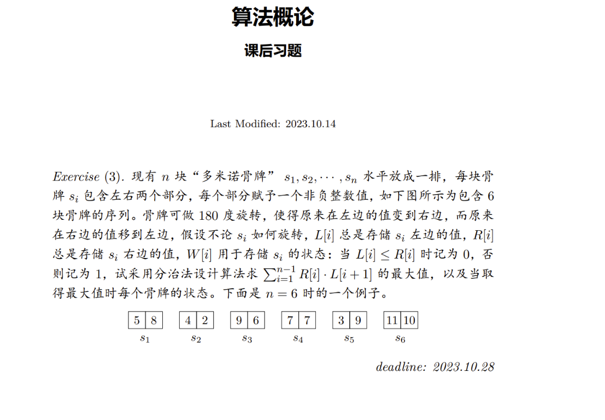

# 前言

去年遇到的一道题目，不过当时还不能完全解决。经过这段时间对算法的理解，再来试试整个解题过程。

# 正文

## 题目



## 分析

用分治法求解问题，标准步骤为：

- 分解
- 解决
- 合并

显然，问题规模 n 小于 2 时，问题无意义。

问题规模 n 等于 2 时为最小子问题，可以简单求解。（解决）

对 n 大于 2 的问题，可以分解为规模为 2 的问题进行求解。（分解）

对于两个子问题的解进行合并，这是一个重点考虑的事情。（合并）

对于合并步骤，我们假设有个函数 merge 来实现，具体实现可以先忽略。

## 代码

```js
function maxSumOfProducts(L, R) {
  function helper(L, R, left, right) {
    if (left === right) {
      // 只有一块骨牌的情况
      return { noRotate: 0, rotate: 0 }; // { 不旋转的最大值, 旋转的最大值 }
    }

    const mid = Math.floor((left + right) / 2);

    // 递归处理左右两部分
    const leftResult = helper(L, R, left, mid);
    const rightResult = helper(L, R, mid + 1, right);

    // 左右两部分不旋转和旋转的结果
    const maxLeftNoRotate = leftResult.noRotate;
    const maxLeftRotate = leftResult.rotate;
    const maxRightNoRotate = rightResult.noRotate;
    const maxRightRotate = rightResult.rotate;

    // 合并结果，计算跨越边界的最大值
    const maxNoRotate = Math.max(
      maxLeftNoRotate + R[mid] * L[mid + 1], // 左不旋转，右不旋转
      maxLeftRotate + L[mid] * L[mid + 1] // 左旋转，右不旋转
    );
    const maxRotate = Math.max(
      maxLeftNoRotate + R[mid] * R[mid + 1], // 左不旋转，右旋转
      maxLeftRotate + L[mid] * R[mid + 1] // 左旋转，右旋转
    );

    return {
      noRotate: maxNoRotate + maxRightNoRotate,
      rotate: maxRotate + maxRightRotate,
    };
  }

  const n = L.length;
  const result = helper(L, R, 0, n - 1);
  return Math.max(result.noRotate, result.rotate);
}

// 示例输入
const L = [5, 8, 4, 9, 3, 11];
const R = [8, 4, 2, 6, 9, 10];

const result = maxSumOfProducts(L, R);
console.log("最大乘积和:", result);
```
