# 一、计算机系统概述

## （一）组成部分

1.计算机硬件：CPU + MM + I/O

1）==中央处理器==（CPU，Central Processing Unit）是一块超大规模的集成电路，是一台计算机的运算核心（Core）和控制核心（ Control Unit）。
2）MM 是计算机硬件中的==主存储器==，即 Main Memory。
3）I/O==输入/输出==(Input/Output)，分为 IO 设备和 IO 接口两个部分。

2.计算机软件：系统软件+应用软件

## （二）冯·诺依曼结构

1.计算机有运算器、控制器、存储器、输入和输出设备。 2. 各基本部件的功能是：
==存储器==存放数据和指令，形式上两者没有区别，但计算机应
能区分数据还是指令；
==控制器==应能自动执行指令；
==运算器==应能进行加/减/乘/除四种算术运算和一些逻辑运算；
操作人员通过==输入、输出设备==和主机进行通信。 3. 内部以二进制表示==指令和数据==。每条指令由==操作码和地址码==两
部分组成。操作码指出操作类型，地址码指出操作数的地址。
由一串指令组成程序。 4. 采用“==存储程序==”工作方式。 将事先编好的程序和原始数据送
入主存中，然后启动执行。计算机能自动完成逐条取出指令和
执行指令的任务。

## （三）计算机发展时间节点

第一代：真空管（电子管 Vacuum Tube ）1946 ～ 57 年
第二代：晶体管 1958 ～ 64 年
第三代：SSI/MSI 1965 ～ 71 年
第四代：LSI/VLSI/ULSI 1972 ～至今

## （四）典型计算机的硬件组成

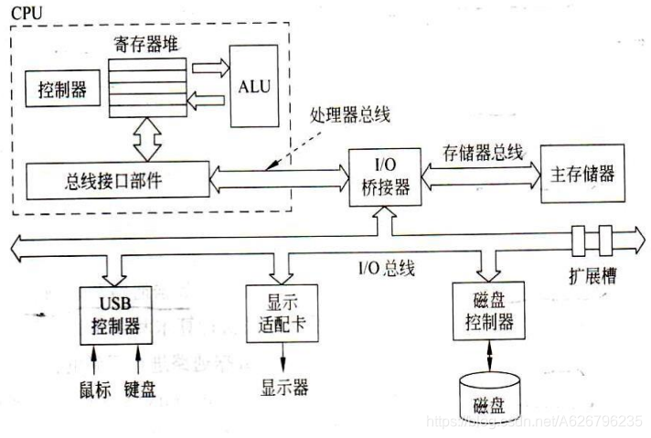
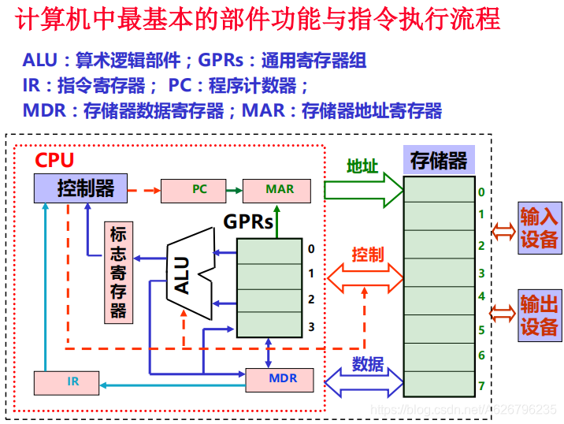

## （五）三种程序

汇编程序(Assembler)：汇编语言源程序 → 机器目标程序
编译程序(Complier)：高级语言源程序 → 汇编/机器目标程序
解释程序(Interpreter )：将高级语言语句逐条翻译成机器指令并立即执行,不生成目标文件。

# 二、计算机性能评价

## （一）评价指标

**两大分类**
Tasks per day, hour, sec, ns..
– 吞吐率（throughput）
– 带宽（bandwidth ）
Time to do the task
– 响应时间(response time)
– 执行时间、等待时间(execution time， latency)

**各项指标**

1.==CPU 执行时间==：执行程序中每条指令的时间。
意义：
一般不考虑主存磁盘输入输出开销，只考虑 CPU 的执行时间。
比较计算机的性能时，多用 CPU 执行时间来衡量。

2.==CPU 时间==：指 CPU 花在程序执行上的时间。
包括 2 部分：
==用户 CPU 时间==：运行用户代码的时间。
==系统 CPU 时间==：为了执行用户程序而需要运行操作系统程序的时间。

3.==CPI (Cycles Per Instruction)==：
CPI = 时钟周期数 /指令 (每条指令单周期或多周期)
意义：
CPI 用来衡量以下各方面的综合结果:
指令集、程序、计算机系统的设计

**其他指标**
1.==MIPS==
Million Instructions Per Second （定点指令执行速度）

2.==MFLOPS==
Million Floating-point Operations Per Second（浮点操作速度）

3.==性能评价基准程序==（Benchmarks）
• 基准测试程序是专门用来进行性能评价的一组程序
• 基准程序通过运行实际负载来反映计算机的性能
• 最好的基准程序是用户实际使用的程序或典型的简单程序

## （二）部分数值计算

**计算式**
CPI = (CPU 时间 × 时钟频率) / 指令条数 = 总时钟周期数 / 指令条数
CPU 执行时间 = CPU 时钟周期数 × 时钟周期
= CPU 时钟周期数 / 时钟频率
= 指令条数 × CPI × 时钟周期

# 三、数据的机器级表示

## （一）数值数据表示

==数值数据==：无符号整数、带符号整数、浮点数（实数）、十进制数
数值数据表示三要素：进位计数制(进制)，定点浮点表示，编码规则

**定点数的表示**

• 进位计数制
二、八、十六、十

• 定点数的二进制编码
==原码==
......
==补码==
假定补码有 n 位，则 X 的补码为：
定点整数：[X]补= 2^n^ + X （-2^n^≤X ＜ 2^n^，mod 2^n^）；
定点小数：[X]补= 2 + X （-1≤X ＜ 1，mod 2）；

一个负数的补码等于模减去该负数的绝对值。

便捷计算：
正数：符号位为 0，数值部分不变 
负数：符号位为 1，数值部分“各位取反，末位加 1”
......
==反码==
正数的反码与原码相同
负数的反码符号不变，数值位取反
......
==移码==
定义：将每一个补码数值加上一个偏置常数得到移码 。
作用：主要用来表示浮点数阶码。
• 定点整数的表示

- 无符号整数、带符号整数

**浮点数的规格化**
 ==IEEE754 浮点数标准==
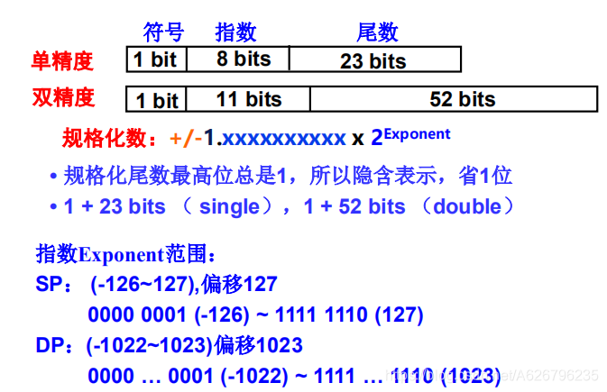
非规格化参照表格
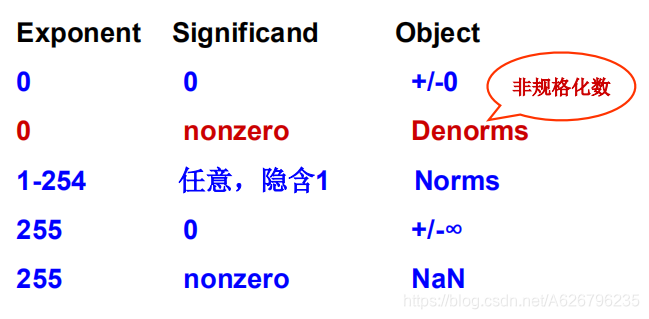

**浮点数计算注意问题**
很大的数与很小的数进行运算时，小的数将会被抹掉。
（原因，浮点数计算第一步，阶码计算时，小数移位运算，全部变成 0 了）

**十进制数表示**
用 ASCII 码或 BCD 码表示。

## （二）非数值数据表示

==非数值数据==：逻辑数（包括位串）、西文字符和汉字
**逻辑数据**
用一位表示 。
逻辑数据和数值数据在形式上并无差别，也是一串 0/1 序列，机器靠指令来别。

**西文字符**
拼音文字，用有限几个字母可拼写出所有单词；
只对有限个字母和数学符号、标点符号等辅助字符编码；
所有字符总数不超过 256 个，使用 7(或 8)个二进位可表示；
常用编码为 ASCII 码。

**汉字**
有以下几种汉字代码：
==输入码==：对汉字用按键进行编码，用于输入；

==内码==：用于在系统内存储、查找、传送等处理；

变化过程：
码表区位码(加 20H)---> GB2312 国标码(高位变 1)--->内码

解释：
码表由 94 行、94 列组成，行号为区号，列号为位号，各占 7 位；
区号和位号各自加上 32（20H），得到其“国标码”；
国标码中区号和位号各占 7 位，前面添一个 0，构成一个字节；
为与 ASCII 码区别，将国标码的两个字节的第一位置“1”得到汉字内码。

==字模点阵或轮廓描述==: 描述汉字点阵或轮廓，用于显示/打印。

## （三）数据的宽度、存储排列、纠/检错

==比特==（bit）是计算机中处理、存储、传输信息的最小单位；
==字节==(Byte)，也称“位组”。
存储器按字节编址；
字节是最小可寻址单位 (addressable unit )。
==字长==：定点运算数据通路的宽度。
字长等于 CPU 内部总线的宽度、运算器的位数、通用寄存器的宽度等。
==字==用来度量数据类型的宽度。

**储存**
ISA 设计时要考虑的两个问题：
• 大小端问题
大端方式: MSB 的地址是数的地址；
大端方式: MSB 的地址是数的地址。
• 字的边界对齐问题
按边界对齐 （假定字的宽度为 32 位，按字节编址）

- 字地址：4 的倍数(低两位为 0)
- 半字地址：2 的倍数(低位为 0)
- 字节地址：任意
  不按边界对齐
  好处：节约空间；
  坏处：可能会增加访存次数。

**纠错、检错**
元器件故障或噪音会使数据出现差错。
措施：
(1) 通过电路、布线等方面提高的抗干扰能力；
(2) 进行数据检错和校正，发现并纠正错误。

例如：
增大码距可提高检错纠错能力。

==码距==：
若干位代码组成的一个字叫==码字==（数据校验中“码字”指数据位和校验位排列得到的代码）
两个码字中不同位的个数叫它们的==距离==；
码制中所有码字间最小距离为码距，即码制的距离。

常用的数据校验码有：
==奇偶校验码==、==海明校验码==、==循环冗余校验码==。
• 奇偶校验：适应于一字节长数据的校验，如内存
• 海明校验：各组内用奇偶校验，用于内存储器数据的校验
• 循环冗余校验：用在通信和外存中，适合于大批量数据校验

# 四、运算方法及部件

## （一）高级语言和机器指令中的运算

**算术运算**
整数算术运算、浮点数算术运算
**按位运算**
用途：
对位串实现“掩码”（mask）操作或相应的其他处理
**逻辑运算**
与、或、非
与按位运算的差别

- 符号表示不同：& - && ......
- 运算过程不同：按位 - 整体
- 结果类型不同：位串 - 逻辑值
  **移位运算**
  • 用途
- 提取部分信息
- 扩大或缩小数值的 2、4、8…倍
  • 操作
- 左移：x<<k; 右移： x>>k
- 由 x 的类型决定移位的类型
- 无符号数：==逻辑移位==（逻辑移位:空位补 0；）
- 带符号整数：==算术移位==（算术左移:低位补 0;算术右移: 高位补符号。）
  右移：低位移出，高位补符号，可能发生有效数据丢失。
  **位扩展和位截断运算**
  • 用途
- 类型转换时可能需要数据扩展或截断
  • 操作
- 无专门运算符，由类型转换前后数据长短确定是扩展还是截断
- ==扩展==：短转长
  无符号数：0 扩展，前面补 0
  带符号整数：符号扩展，前面补符
- ==截断==：长转短
  强行将高位丢弃，故可能发生“溢出”

**实现 MIPS 定点和浮点运算指令的思路**：
先实现一个能进行基本算术运算（加/减）和基本逻辑运算的 ALU；
再由 ALU 和移位器实现乘、除、浮点运算器。

## （二）ALU（划重点）

话不多说，先上图：
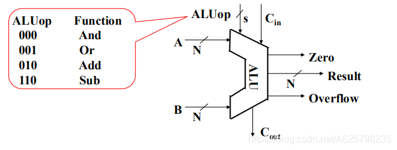
==算术逻辑单元==(arithmetic and logic unit)，简称==ALU==。
ALU 可进行加/减算术运算和逻辑运算。其核心部件是加法器。

**加法器**
半加器；
全加器；
串行进位加法器；
并行进位加法器。

==超前进位加法器==(Carry Look-Ahead)，简称==CLA==加法器。
CLA 加法器由进位生成/传递部件、CLA 部件和 求和部件 构成。
实现 Si=Pi⊕Ci 的电路称为==求和部件==

==局部（单级）CLA 加法器==
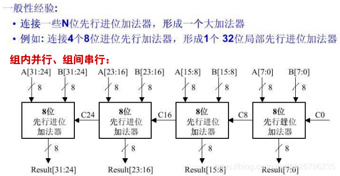
==带标志加法器==
加法器需要增加逻辑门生成标志信息。
溢出标志 OF= Cn⊕Cn-1
符号标志 SF=Fn-1
零标志 ZF
进位借位标志 CF=Cout ⊕ Cin
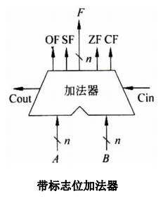
==ALU 的核心部件==是带标志位加法器。
A、B 为 n 位输入端。ALUop 操作控制端。下图中可进行与、或、加运算。
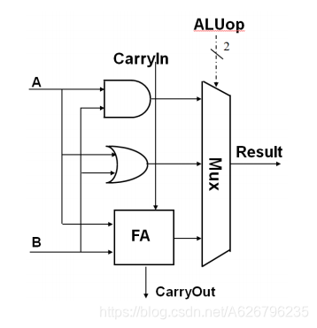

## （三） 定点数运算及其运算部件

无符号数的按位逻辑运算可用逻辑门实现；
逻辑移位可用移位器实现；
带符号数的算术移位、无符号和带符号数的位扩展和截断也可用简单电路实现。

**加减公式**
[A+B]补 = [A]补 + [B]补 ( mod 2n )
[A–B]补 = [A]补 + [–B]补 ( mod 2n )

[–B]补=[B]补取反+1
(取反时含符号位)

**标志位作用**
零标志 ZF、符号标志 SF、进/借位标志 CF、溢出标志 OF 称为==条件标志==。
条件标志在运算电路中产生，记录到专门寄存器。称为程序状态字寄存器或==标志寄存器==。

零标志 ZF=1 当 F=0；
有符号数的符号标志 SF：SF=Fn-1
(无符号数的符号位没有意义）
有符号数溢出标志 OF：OF=Cn 异或 Cn-1
(不必关心无符号数溢出，模 2n）
无符号数进位/借位标志 CF：CF=Cout 异或 Cin
(不必关心有符号数进位/借位）

**对加减运算电路认识** 1.所有算术运算都基于加法器实现； 2.加法器不知道所算的是带符号数还是无符号数； 3.加法器不判定对错，总是取低 n 位作为结果，并生成标志信息。

**原码乘法**
可用 ALU 和移位器来实现乘法。

手工乘法的特点：
① 每步计算：X×y~i~，若 y~i~ = 0，则得 0；若 y~i~ = 1，则得 X
② 把 ① 求得的各项结果 X× yi 逐次左移，表示为 X× y~i~×2^-i^
③ 对 ② 中结果求和，即 (X× y~i~×2^-i^)求和 即为两数的乘积

计算机稍作改进：
① 每次得 X×y~i~后，与前面的结果累加得到 P~i~，称之为部分积，减少了保存各次相乘结果的开销。
② 每次得 X×y~i~后，不是左移与 P~i~相加，而将 P~i~右移后与 X×y~i~相加。
因为加法运算始终对部分积中高 n 位进行，故用 n 位加法器可实现二个 n 位数相乘。
③ 对乘数中为“1”的位加并右移，对为“0”的位只右移，不加。

**补码乘法**
校正法
......
布斯算法
......

**快速乘法器**
设计快速乘法部件的必要性 ：
• 乘法运算耗时多
• 比例大，大约 1/3 是乘法运算
==快速乘法器==的实现（由特定功能的组合逻辑单元构成）
如：阵列乘法器
==阵列乘法器==是原码乘去掉符号位，即为无符号数乘法。

**除法运算**
手算除法的基本要点
① 被除数与除数相减，够减则上商为 1；不够减则上商为 0。
② 每次得到的差为中间余数，将除数右移后与上次的中间余数比较。够减则上商为 1；不够减则上商为 0。
③ 重复执行 ②，直到商的位数足够。
**带符号除法**
==原码除法==：
==恢复余数法==；
==不恢复余数法==。

==补码除法==：
==补码恢复余数法==；
==补码不恢复余数法==。

## （四） 浮点数运算及其运算部件

**浮点数运算**
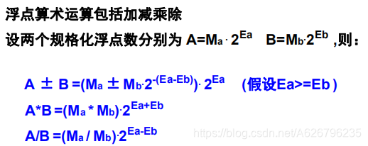
**加减法要点**
基本要点：
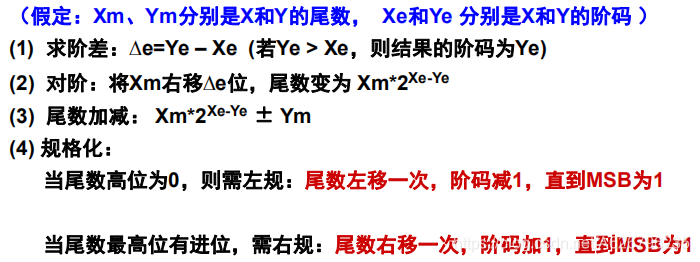
**乘除法要点**
基本要点
(1) 求阶： Xe + Ye - 127 或者 Xe - Ye + 127
(2) 尾数相乘除： Xm \*/Ym （原码乘/除）
(3) 两数符号相同结果为正；相异为负；
(4) 结果的尾数高位为 0 需左规；最高位有进位需右规。
(5) 若尾数比规定的长，则需舍入。
(6) 若尾数是 0，则阶码也置 0，结果为 0。
(7) 阶码溢出判断

# 五、指令系统

## 指令

**一条指令须包含的信息**
操作码：操作类型
(操作码长度：固定／可变)
源操作数：一个或多个源操作数的地址
(操作数来源：指令本身/寄存器/主存/I/O 端口）
目的操作数：结果存放何处
(结果地址：寄存器/主存/I/O 端口)
下一条指令地址：
(正常隐含在 PC 中，跳转时由指令给出）

## （二）指令类型和格式

指令格式的基本原则
1 应尽量短
2 操作码位数要足够
3 有唯一的解释
4 指令长度应是字节的整数倍
5 地址字段的个数应合理
6 指令尽量规整

## （三）数据类型

操作数的基本类型：
==地址==（指针）
无符号整数，用来确定主(虚)存地址
==数值数据==
定点数(整数)：用二进制补码表示
浮点数(实数)：IEEE754
==位、位串、字符和字符串==
用来表示文本、声音和图像等
==逻辑(布尔)数据==
按位操作（0-假／1-真）

这些操作数都存放在寄存器或内存单元中

## （四）操作数的寻址方式

– 立即 / 寄存器 / 寄存器间接 / 直接 / 间接 / 堆栈 / 偏移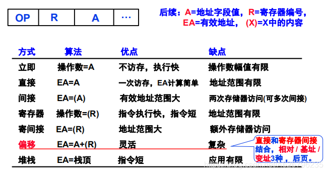
顾名思义。

## （五）操作码的编码

操作码的编码有两种方式
-- 定长操作码
-- 扩展操作码

指令字也可定长或变长
--定长指令字 -- 变长指令字

• 代码长度更重要时：变长指令字、变长操作码，存储更紧凑；
• 性能更重要时：定长指令字、定长操作码，访问和译码更快速。

指令长度与操作码长度是否可变没有绝对关系。
操作码定长不一定指令字定长；操作码变长指令字一般变长。

## （六）指令系统

**指令设计风格**
– 按操作数地址指定方式来分：
累加器型 、堆栈型 、通用寄存器型、load/store 型
– 按指令的复杂度来分：
复杂指令集计算机 CISC (Complex Instruction Set Computer)
精简指令集计算机 RISC (Reduced Instruction Set Computer)

**指令系统举例**
MIPS 特点概述：
• 所有指令都是 32 位；
• 有些指令有 26 位目标地址；有些只有 16 位。
• 所有动作在 1 个时钟周期内完成；
• 所有运算都是 32 位的，没有字节和半字的运算；
• MIPS 指令固定 4 个字节，x86 平均长度 3 个字节，所以一般二进制文件比 x86 大；
• 寻址方式：只有一种内存寻址方式，即基地址加 16 位偏移地址；
• 没有栈指令 PUSH 和 POP，对栈的操作都是统一的内存访问方式。
• 子函数的返回地址不存到栈中，而是存到$31 寄存器。

# 六、CPU

## （一）单周期数据通路的设计

**CPU 的功能**
CPU 执行指令。

每条指令都由四种基本操作实现：
主 存 --->寄存器（取指， 取数）
寄存器 --->主存（存结果）
寄存器 ---> 寄存器或者 ALU（取数，存结果）
算术或逻辑运算（运算，计算地址，PC 计算）

操作功能用==RTL(Register Transfer Language)==描述
RTL 通常规定：
（1）用 R[r]表示寄存器 r 的内容；
（2）用 M[addr]表示主存单元 addr 的内容；
（3）传送方向用“←”表示，传送源在右，传送目的在左；
（4）直接用 PC 表示其内容。

**数据通路的位置**
==数据通路==：
指令执行过程中数据经过的路径，包括路径中的部件，是执行部件。
（数据通路是由操作元件和存储元件通过总线方式或分散方式连接而成的进行数据存储、运算和传送的路径。）
==数据通路组成==：
• 组合逻辑元件（也称操作元件）
• 时序逻辑元件（也称状态元件，存储元件）
数据通路中的状态元件有两种：寄存器(组) + 存储器
==数据通路的功能==：
• 进行数据传送、运算、存储

**单周期数据通路的设计**

单总线一个时钟只传一个数据，效率低。
多总线同时传送数据，提高效率

**选择 MIPS 指令集的一个子集作为 CPU 的实现目标**

MIPS 的三种指令类型：
°R: ADD and SUB
• add rd, rs, rt
• sub rd, rs, rt
°I: OR Immediate:
• ori rt, rs, imm16
°I: LOAD and STORE
• lw rt, rs, imm16
• sw rt, rs, imm16
°I: BRANCH:
• beq rs, rt, imm16
°J: JUMP:
• j target

• 下条指令地址计算与取指令部件
30 位 PC，三路选择：顺序、Branch（结合标志 Zero）、Jump
• R 型指令的数据通路
ALU 两个操作数来自 rs 和 rt，结果写到 rd
• 访存指令的数据通路
符号扩展，数据在 rt 和主存单元中交换
• 立即数运算指令的数据通路
0 扩展后的操作数送到 ALU 的一个输入端
• 分支和跳转指令的数据通路

**综合所有指令的数据通路**

一个单周期数据路径：
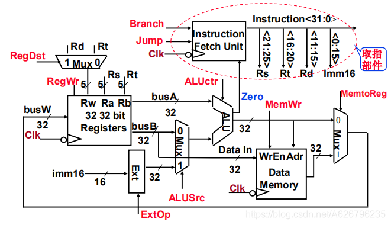

## （二）单周期控制器的设计

控制器的功能：
指令译码，生成控制信号，控制数据通路的动作，是控制部件。

**考察每条指令的执行过程和涉及到的控制信号的取值**
• 公共操作：取指令和计算下址 PC
• R-Type 指令（add / sub）
• 立即数指令 （ori）
• 访存指令（lw / sw）
• 分支指令 （beq）
• 跳转指令 （j）
**汇总各指令的控制信号取值**
• 分两类控制信号：直接送往数据通路 / 送往局部控制单元
**分析 ALU 操作对应的控制信号与 func 字段之间的关系**

**设计 ALU 局部控制单元**
局控的另一支路是 R 型指令，ALUctr 由 func 决定，需要根据 func 写出 ALUctr 的表达式

**设计主控制单元**

## （三）微程序控制器设计与异常处理

**硬连线路控制器设计的优点和缺点 **
优点：速度快，适合于简单或规整的指令系统，例如，MIPS 指令集。
缺点：结构庞杂，实现困难；修改、维护不易；灵活性差。

**微程序设计控制器的基本思想 **
基本思想：
• 仿照程序设计，为每个指令编制微程序；
• 每个微程序由若干条微指令构成，各微指令包含若干条微命令
（一条微指令相当于一个状态，一个微命令就是状态中的控制信号）
• 执行时依次取出微指令，译码产生微命令(即控制信号)。
• 存储器称为控制存储器(Control Storage)，简称控存 CS 。
特点：灵活，但速度慢。适用于复杂指令集。

**微程序、微指令、微操作和微命令的概念及其关系 **
==微程序==是一个微指令序列；
每条==微指令==是一个 0/1 序列，其中包含若干个微命令（即：控制信号）；
==微命令==控制数据通路的执行

**微指令格式设计 **
• ==微操作码==字段

- 水平微程序：不译法、字段直接编译法、字段间接编译法
- 垂直微程序：垂直编译法
  • 下条微指令地址确定方式
- 增量法（计数器法）
- 断定法（下址字段法）
  下条微指令有四种情况：
  • 取指微程序：每条指令一定先执行取指微程序。
  • 第一条微指令：取指后转到该指令的第一条微指令。
  • 顺序执行时：顺序取下条微指令。
  • 分支执行时：根据不同指令选择下条微指令。

**MIPS 指令子集的微程序控制器设计**
......

**异常和中断的处理**

° 程序执行被 “中断” 的事件有两类
• ==内部“异常”==：在 CPU 内部发生的意外事件或特殊事件
按发生原因分为硬故障中断和程序性中断两类
硬故障中断：如电源掉电、硬件线路故障等
程序性中断：执行某条指令时发生的“例外(Exception)”，如溢出、缺页、越界、非法指令、除数为 0、堆栈溢出、访问超时、断点设置、单步、系统调用等
• ==外部“中断”==：在 CPU 外部发生的特殊事件，外部中断是一种 I/O 方式，
通过“中断请求”信号向 CPU 请求处理。如实时钟、控制台、打印机缺纸、外设准备好、采样计时到、DMA 传输结束等。

内部“异常” 按处理方式分为故障、自陷和终止三类：
==故障(fault)== ：执行指令引起的异常事件，如溢出、缺页、堆栈溢出、访问超时等。
==自陷(Trap)== ：预先安排的事件，如单步跟踪、系统调用(执行访管指令)等。是一种自愿中断。
==终止系统(Abort)== ：硬故障事件，机器将“终止”，调出中断服务程序来重启操作系统。

外部中断处理： 1.关中断； 2.保护断点和程序状态； 3.识别异常事件。（软件识别（MIPS 采用）、硬件识别（中断向量）（80x86 采用））

## （四）多周期处理器

特点:
• 时钟周期短
• 不同指令所用周期数可以不同，如：

- Load： 5 cycles
- Jump： 3 cycles（前两个都一样）
  • 在一条指令中功能部件可以重复使用。如：
- Adder + ALU（多周期时只用一个 ALU，在不同周期可重复使用）
