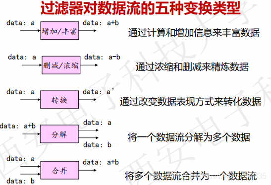

@[toc]软件体系结构

# 一、绪论

## 1、发展史

## 2、定义(组成派)

1993 年， D Garlan, M Shaw 提出软件架构包括
component、connector 和 constraint 三大要素。
**软件设计过程中的一个层次**，超越了计算过程中的算法设计和数据结构设计。
**组件 component**可以是一组代码，也可以是独立的程序；
**连接件 connector**用于表示组件之间的相互关系，可以是过程调用、管道
和消息等；
**约束 constraint**为组件连接时的条件。

# 二、软件体系结构风格

## 1、体系结构风格

“**风格**”——经过长时间的实践，被证明具有良好的工艺可行性、性能与实用性，并可直接用来遵循与模仿 (复用)。

**软件体系结构风格定义**
描述特定领域中软件系统家族的**组织方式的惯用模式**(idiomatic paradigm)，反映了领域中众多系统所共有的**结构和语义特性**，并指导如何将各个模块和子系统有效地组织成一个完整的系统。

## 2、经典的体系结构风格

# 三、数据流体系结构风格

## 1、理解

## 2、批处理体系结构风格

**定义**
➢ Components (processing steps) are independent programs (基本构件：独立的应用程序)
➢ Connectors are some type of media - traditionally tape (连接件：某种类型的媒质)
➢ Topology: Connectors define data flow graph (连接件定义了相应的数据流图，表达拓扑结构)
➢ Processing steps are independent programs（每个处理步骤是一个独立的程序）
➢ Each step runs to completion before next step starts（每一步必须在前一步结束后才能开始）
➢ Data transmitted as a whole between steps（数据必须是完整的，以整体的方式传递）

## 3、管道-过滤体系结构风格

**直观理解**
**变换**
**优点**

➢ 使构件具有良好的隐蔽性和高内聚、低耦合的特点，可将整个系统的输入/输出行为看成多个过滤器的行为的简单合成；
➢ 支持软件复用，只要提供适合在两个过滤器之间传送的数据，任何两个过滤器都可被连接起来；
➢ 系统维护和增强系统性能简单，新的过滤器可以添加到现有系统中来，旧的可以被改进的过滤器替换掉；
➢ 允许对一些如吞吐量、死锁等属性的分析;
➢ 支持并行执行：每个过滤器是作为一个单独的任务完成，因此可与其它任务并行执行。

**不足**
➢ 不适合处理交互的应用
✓ 在早期对交互应用需求不高的情况下提出
✓ 当需要增量地显示改变时，这个问题尤为严重
➢ 系统性能不高，并增加了编写过滤器的复杂性
✓ 数据传输缺乏通用标准，每个过滤器都增加了解析和合成数据的工作
✓ 绝大部分处理时间消耗在格式转换上
✓ 不适用于需要大量共享数据的应用设置
