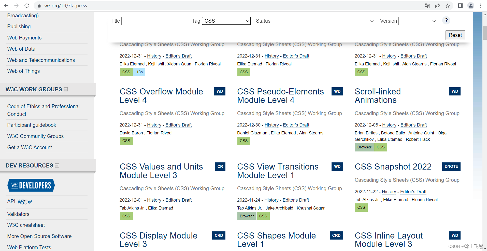
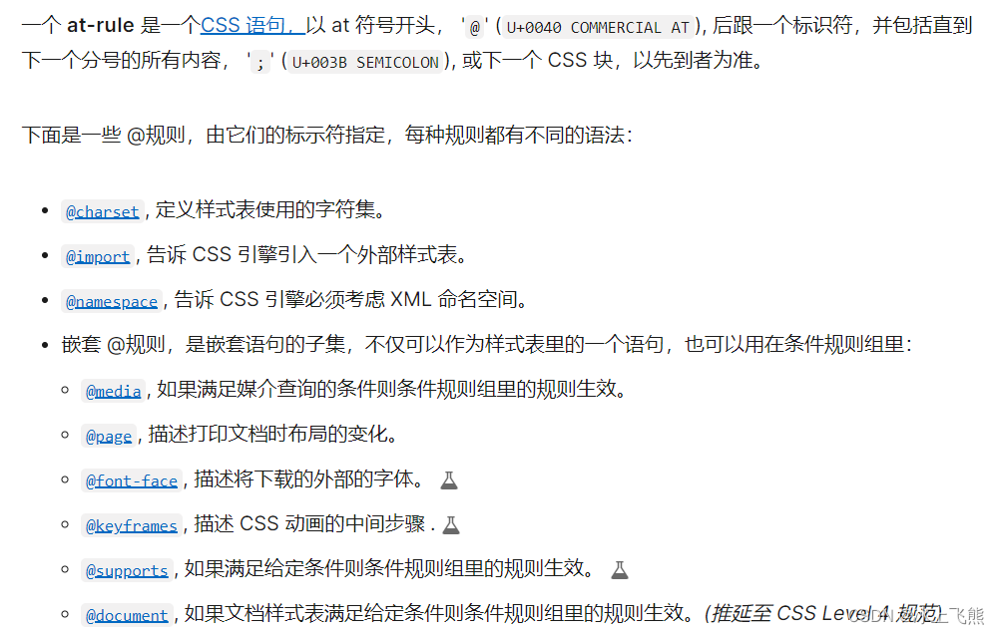
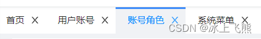
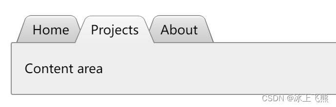
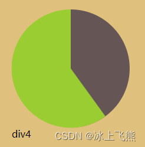
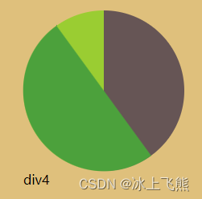
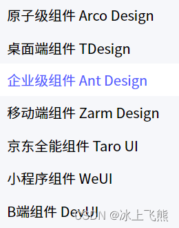

# 前言

## 作者述

众所周知啊，前端三件套是 HTML、CSS、JavaScript，浏览器只识别这三种规范，其他的任何高级技术都是先翻译（或编译）成这基础三样，再给浏览器处理的。

所以，只要把握住这三种规范，就能自然地理解新技术中到底节约了怎样的成本，也就能使用、改进、创造新的衍生技术，甚至为三件套新标准的制定建言献策。

加油吧~

## 预备知识

- 了解 HTML、CSS、JavaScript 基本语法
- 能用 CSS 实现简单样式

本文适合有一定使用经验的读者——能够在 web DevTools 中调整样式，但只是“能用而不能理解”的状态；或者能够实现并理解常用的代码功能，却对复杂要求和陌生（新规范）代码感到困惑。

## 本文目标

从历史宏观到技术细节的微观，全面提高理解力。我们将会学到：

- CSS 版本区别与历史
- 代码编写规范与技巧
- 应用实例
- 衍生技术

# CSS 历史版本

## 关于 web 标准

万维网联盟（W3C）创建于 1994 年，是 Web 技术领域最具权威和影响力的国际中立性**技术标准机构**。它以工作组的方式，把某项技术的相关各方聚集起来，最终由他们来产出标准。

其中，CSS 规范通常是由 CSS 工作组的成员来编写的。该组的成员，九成左右是来自 W3C 会员公司的成员，余下小部分是“特邀专家”和“W3C 工作人员”。

web 标准中，每项规范从最初启动到最终成熟，都会经过以下阶段：

- 编辑草案（ED）
- 首个公开工作草案（FPWD）
- 工作草案（WD）
- 候选推荐草案（CR）
- 提名推荐草案（PR）
- 正式推荐规范（REC）

在[ W3C 官网](https://www.w3.org/TR/)中可以查看到全部规范，以及他们的所处的阶段。比如 CSS 的各项规范，如下图所示：



## 关于 CSS 版本

CSS 1 的规范发表于 1996 年，大约能打印 68 页 A4 纸。

CSS 2 的规范发表于 1998 年，大约能打印 480 页 A4 纸。

CSS 2.1 纠正了 CSS 2 中的一些错误，并添加了一些已经被广泛实现的特性。

> 此时，已经不能用人脑全部记下来了。于是，查阅规范或文档就是常规操作了，这里推荐 [MDN 的 CSS 文档](https://developer.mozilla.org/zh-CN/docs/Web/CSS)，因为支持中文。如果没有解决疑问，仍建议到官网[查看规范原文](https://www.w3.org/TR/?tag=css)。

**重大转折！**

由于这门语言非常庞大，不再适合放在单个规范中，于是 CSS 工作组决定将 CSS 打散到多个不同的规范中，**每个规范独立更新版本**。

在 CSS 2.1 已有的特性，直接升级到 Level 3 这个版本号，而新添加的规范则从 Level 1 这个版本号开始。下面通过一些例子，来感受一下规范的拆分：

---

- [CSS 语法（https://www.w3.org/TR/css-syntax-3）](https://www.w3.org/TR/css-syntax-3)
- [CSS 层叠与继承（https://www.w3.org/TR/css-cascade-3）](https://www.w3.org/TR/css-cascade-3)
- [CSS 颜色（https://www.w3.org/TR/css-color-3）](https://www.w3.org/TR/css-color-3/)
- [选择符（https://www.w3.org/TR/selectors-3）](https://www.w3.org/TR/selectors-3/)
- [CSS 背景与边框（https://www.w3.org/TR/css-backgrounds-3）](https://www.w3.org/TR/css-backgrounds-3/)
- [CSS 值与单位（https://www.w3.org/TR/css-values-3）](https://www.w3.org/TR/css-values-3/)
- [CSS 文本排版（https://www.w3.org/TR/css-text-3）](https://www.w3.org/TR/css-text-3/)
- [CSS 文本装饰效果（https://www.w3.org/TR/css-text-decor-3）](https://www.w3.org/TR/css-text-decor-3/)
- [CSS 字体（https://www.w3.org/TR/css-fonts-3）](https://www.w3.org/TR/css-fonts-3/)
- [CSS 基本 UI 特性（https://www.w3.org/TR/css-ui-3）](https://www.w3.org/TR/css-ui-3/)

---

- [CSS 变形（https://www.w3.org/TR/css-transforms-1）](https://www.w3.org/TR/css-transforms-1/)
- [图像混合效果（http://www.w3.org/TR/compositing-1）](http://www.w3.org/TR/compositing-1/)
- [滤镜效果（https://www.w3.org/TR/filter-effects-1）](https://www.w3.org/TR/filter-effects-1/)
- [CSS 遮罩（https://www.w3.org/TR/css-masking-1）](https://www.w3.org/TR/css-masking-1/)
- [CSS 伸缩盒布局（https://www.w3.org/TR/css-flexbox-1）](https://www.w3.org/TR/css-flexbox-1/)
- [CSS 网格布局（https://www.w3.org/TR/css-grid-1）](https://www.w3.org/TR/css-grid-1)

---

虽然 “CSS 3” 这种说法很流行，但是它并没有在任何规范中定义过。我们提到 “CSS 3”，指的是上面这些规范（还有更多没提及的）的集合。

由于独立更新，规范的版本号从 Level 1 到 Level 3 都存在，甚至后来还有 Level 4、Level 5 的版本。不过由于约定俗成，我们并没有 CSS 4、CSS 5 这种说法了，而是用 “CSS 3” 来指代一切新的 CSS 规范。

> 现在的 CSS 3 规范（其实是各个小的规范）仍在不断更新中，“浏览器支持 CSS 3”是指支持其中的 REC 阶段的规范，能用官方写法来编写代码。
> 对某些实验阶段的规范（仍是草案阶段），浏览器想要支持，但又为了不和定稿的新规范冲突，所以采用加前缀的方法。比如 Firefox 的 -moz-，Opera 的 -o-，Safari 和 Chrome 的 -webkit-。

# CSS 代码编写

## 关于编程理念

DRY（Don't Repeat Yourself）译为“不要重复已经做过的事”。

它是一种编程理念，旨在提高代码某方面的可维护性：在改变某个参数时，做到只改尽量少的地方，最好是一处。

在使用 CSS 代码时，通常需要考虑 DRY、可维护性、灵活性、轻量级、尽量符合标准。

举例：

```css
// 视觉上，这两个总是一起改变的
font-size: 20px;
line-height: 30px;

// 新的写法，减少了修改的变量
font-size: 20px;
line-height: 1.5;
```

## 关于 @ 规则



---

应用举例：
@media （媒体查询）可以针对不同的屏幕尺寸设置不同的样式。当你重置浏览器大小的过程中，页面也会根据浏览器的宽度和高度重新渲染页面。

```html
<style>
  /* 如果浏览器窗口小于 800px, 背景将变为浅蓝色： */
  @media screen and (max-width: 800px) {
    body {
      background-color: aqua;
    }
  }
</style>
```

## 关于预处理器

> CSS 预处理器定义了一种新的语言，主要是通过用一种专门的编程语言，为 CSS 添加一些编程特性，再编译生成 CSS 文件。

> 现有流行库有 [Sass(Scss)](https://sass-lang.com/)、[Less](https://lesscss.org/)、[Stylus](https://stylus-lang.com/) 等，目前，广泛使用的是 Less 和 Sass。

关于三种 CSS 预处理器的简介，除了官网文档，还推荐查阅[_这篇文章_](https://blog.csdn.net/HH18700418030/article/details/122886403)。

# CSS 应用实例

有一个容易忽略的事情：CSS (Cascading Style Sheets)——层叠样式表，这名字怎么翻译的？该怎么去理解？

> 层叠就是浏览器对多个样式来源进行叠加，最终确定结果的过程。

> 层叠是 CSS 的核心机制，理解了它才能以最经济的方式写出最容易改动的 CSS，让文档外观在达到设计要求的同时，也给用户留下一些空间，让他们根据需要更改文档的显示效果，例如调整字号。——摘自《CSS 设计指南》

肯定有读者会说："talk is cheap, show me the code。"那么，我们用两个例子来理解这个“层叠”。

## 梯形标签页

一般的标签可能是这样的方盒子样式：



如果想要更多的表现力，一般是修改边框，比如梯形的标签。

在这个[在线示例](https://dabblet.com/gist/1345dc9399dc8e794502)中，有梯形标签页的实现参考。



先想想这样的样式怎样实现？

---

思路是：利用伪元素的 3D 旋转。

下面是逐步递进的样式实现例子，直接运行看看。

```html
<style>
  html {
    background-color: rgb(151 90 219);
    display: flex;
    justify-content: space-around;
  }

  div {
    background: #58a;
    margin: 50px;
    float: left;
  }
</style>

<style>
  .div1 {
    transform: perspective(10px) rotateX(5deg);
  }

  .div2 {
    position: relative;
    display: inline-block;
    padding: 0.5em 1em 0.35em;
    color: white;
    background: blueviolet;
  }

  .div2::before {
    content: "";
    position: absolute;
    top: 0;
    right: 0;
    bottom: 0;
    left: 0;
    z-index: -1;
    background: #58a;
    transform: perspective(0.5em) rotateX(5deg);
  }

  .div3 {
    position: relative;
    display: inline-block;
    padding: 0.5em 1em 0.35em;
    color: white;
    background: bottom;
  }

  .div3::before {
    content: "";
    position: absolute;
    top: 0;
    right: 0;
    bottom: 0;
    left: 0;
    z-index: -1;
    background: #58a;
    transform: scaleY(1.3) perspective(0.5em) rotateX(5deg);
    transform-origin: bottom;
  }

  .div4 {
    position: relative;
    display: inline-block;
    padding: 0.5em 1em 0.35em;
    background: bottom;
  }

  .div4::before {
    content: "";
    position: absolute;
    top: 0;
    right: 0;
    bottom: 0;
    left: 0;
    z-index: -1;
    background: #ccc;
    border: 1px solid rgba(0, 0, 0, 0.4);
    border-bottom: none;
    border-radius: 0.5em 0.5em 0 0;
    box-shadow: 0 0.15em white inset;
    background-image: linear-gradient(
      hsl(327deg 96% 60% / 73%),
      hsl(232deg 61% 49% / 81%)
    );
    transform: scaleY(1.3) perspective(0.5em) rotateX(5deg);
    transform-origin: bottom;
  }
</style>

<!-- 如果直接3D旋转元素，则会导致内容非预期地变化 -->
<div class="div1">DIV1SNOFLY</div>
<!-- 文本没有变形了，只是背景的旋转轴在中心，导致上面凹陷、下面突出 -->
<div class="div2">DIV2SNOFLY</div>
<!-- 改变后不再突出，已经符合基本要求了 -->
<div class="div3">SNOFLYDIV3</div>
<!-- 添加更多样式 -->
<div class="div4">SNOFLYDIV4</div>
```

利用伪元素作为背景的梯形，留下了很大的灵活性，因为方便继续修改元素本身的样式。

**各自负责一部分现在，最后再合起来一起达到目标效果。**

## 简单饼图

先看看这个图，想想要怎么去实现：



直接[打开代码](https://github.com/0110wdj/Stark-Mansion-Lab-One/blob/master/books/CSSSecrets/%E7%AC%AC3%E7%AB%A0%20%E5%BD%A2%E7%8A%B6/14_pieChart.html)运行看看，它也是分步骤去实现的，理解变化过程即可。

这里说一下思路：先用渐变画一个左绿右黑的圆，然后用**绿色伪元素挡板**绕着圆心旋转。

变个挡板颜色，看看实际的遮挡：



不一定要控制扇形图像本身，只要多层叠加起来的效果合理即可。

## 其他效果

问题很多，解决问题的办法也很多。

如果没有体会到层叠的好处，继续处理问题就好了。

推荐一个[网站](https://css-tricks.com/)，有使用技巧讲解和实现效果。

# CSS 衍生技术

前文提到的 CSS 预处理器，属于 CSS 的衍生技术之一，它是因为使用者遇到了某种困难而出现的。同样的，因为有其他困难需要面对，所以有其他衍生技术的出现。

## 主要问题

1、默认样式很丑，重新设计一套又很花时间，于是有了 **UI 框架**，基本上改改就能用。比如：bootstrap、Foundation、Less Framework、Pure、Skeleton、99lime HTML KickStart、Kube 等。

更进一步，结合 HTML 和 JS，干脆把功能封装，于是有了**UI 组件库**。比如下图所示：



2、当 CSS 代码难以维护时，可以通过编程的方式，减少代码、增加可维护性和复用性。

用 **CSS 预处理器**来写，就像用 react 来写 js 一样，易读易写，它们通常都支持“层级，mixin， 变量，循环， 函数”。

常见 CSS 预处理器：Sass（Scss）, **Less**, Stylus, Turbine, Swithch css, CSS Cacheer, DT Css。

3、为了不用手动排查 CSS 代码的浏览器兼容性问题和性能问题，于是有了自动排查和优化 CSS 代码的 **CSS 后处理器**。

后处理器例如：PostCSS，通常被视为在完成的样式表中根据 CSS 规范处理 CSS，让其更有效；目前最常做的是给 CSS 属性添加浏览器私有前缀，实现跨浏览器兼容性的问题。

另外还有 CSS 压缩工具，比如 clean-css，它可以删除 CSS 中一些无用的空格、评论以及每个选择器后面的分号等。

## LESS 介绍

以 LESS 为例，看看预处理器的使用。

- [官网文档](https://lesscss.org)
- [中文文档](https://less.bootcss.com)

中文文档首页的概述**非常建议阅读**。

这里节选了两个功能：

**导入（Importing）**：
“导入”的工作方式和你预期的一样。你可以导入一个 .less 文件，此文件中的所有变量就可以全部使用了。如果导入的文件是 .less 扩展名，则可以将扩展名省略掉：

```css
@import "library"; // library.less
@import "typo.css";
```

**嵌套（Nesting）**:
Less 提供了使用嵌套（nesting）代替层叠或与层叠结合使用的能力。假设我们有以下 CSS 代码：

```css
#header {
  color: black;
}
#header .navigation {
  font-size: 12px;
}
#header .logo {
  width: 300px;
}
```

用 Less 语言我们可以这样书写代码：

```css
#header {
  color: black;
  .navigation {
    font-size: 12px;
  }
  .logo {
    width: 300px;
  }
}
```

用 Less 书写的代码更加简洁，并且模仿了 HTML 的组织结构。

你还可以使用此方法将伪选择器（pseudo-selectors）与混合（mixins）一同使用。下面是一个经典的 clearfix 技巧，重写为一个混合（mixin） (& 表示当前选择器的父级）：

```css
.clearfix {
  display: block;
  zoom: 1;

  &::after {
    content: " ";
    display: block;
    font-size: 0;
    height: 0;
    clear: both;
    visibility: hidden;
  }
}
```

还有很多特性和使用技巧...

# 结束语

本文很少提及 HTML 和 JS 相关的内容，为了降耦合，非必要不要用 JS 去控制 CSS 代码。但是一味降耦合，会导致 CSS 代码难以维护。在实际应用中，需要权衡取舍 JS 代码的使用。
