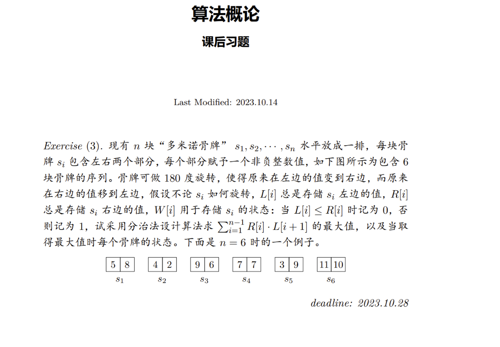

# 前言

去年遇到的一道题目，不过当时还不能完全解决。经过这个时间对算法的理解加深，再来试试整个解题过程。

# 正文

## 题目



## 分析

用分治法求解问题，标准步骤为：

- 分解
- 解决
- 合并

显然，问题规模 n 小于 2 时，问题无意义。

问题规模 n 等于 2 时为最小子问题，可以简单求解。（解决）

对 n 大于 2 的问题，可以分解为规模为 2 的问题进行求解。（分解）

对于两个字问题的解进行合并，这是一个重点考虑的事情。（合并）

对于合并步骤，我们假设有个函数 merge 来实现，具体实现可以先忽略。

## 代码模板

语言无所谓，用函数表示独立步骤的功能，就用 js 来实现了。

模板：

```js
// test case input data
const L = [5, 4, 9, 7, 3, 11];
const R = [8, 2, 6, 7, 9, 10];
const W = [0, 1, 1, 0, 0, 1];

// main function
const dominoes_divide = (L, R, W) => {
  const merge = ([ll, lr, lw], [rl, rr, rw]) => {
    return [[], [], []];
  };

  const recur = (l, r, w) => {
    if (l.length <= 1) {
      return [l, r, w];
    }
    if (l.length === 2) {
      return solute(l, r, w);
    }
    const [ll, lr, lw, rl, rr, rw] = divide(l, r, w);
    const leftMax = recur(ll, lr, lw);
    const rightMax = recur(rl, rr, rw);
    return merge(leftMax, rightMax);
  };

  return recur(L, R, W);
};

console.log(dominoes_divide(L, R, W));
// expected output data
// rL:[5, 4, 6, 7, 3, 11]
// rR:[8, 2, 9, 7, 9, 10]
// rW:[0, 1, 0, 0, 0, 1]
// rmax:227
```

显然，只需要未完成各个功能函数即可。
