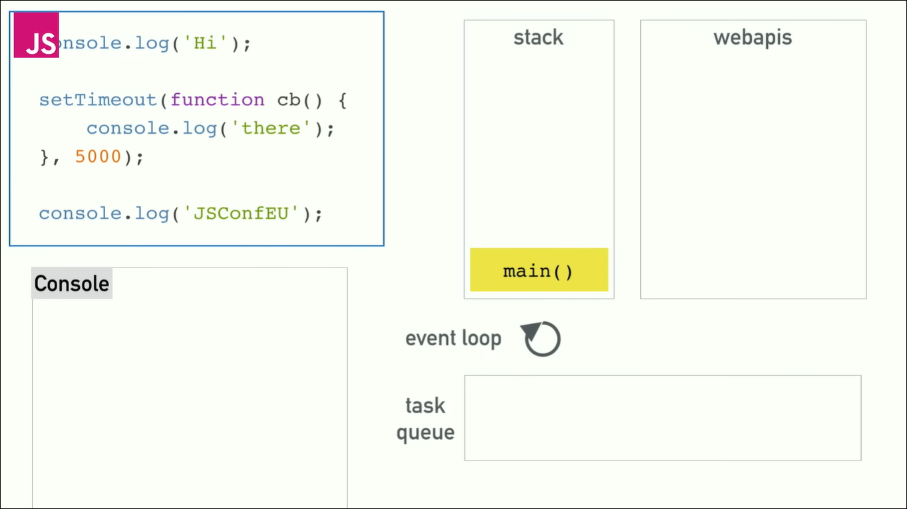

# 前言

## 作者述

笔者看了一个关于 JS 事件循环的视频——[菲利普·罗伯茨：到底什么是 Event Loop 呢？ | 欧洲 JSConf 2014](https://www.youtube.com/watch?v=8aGhZQkoFbQ) 。观后深有感悟，结合另一篇文章——[浏览器是如何工作的：Chrome V8 让你更懂 JavaScript](https://segmentfault.com/a/1190000037435824)，整理思路、输出本文。

## 预备知识

- 具备 JS 基础理解
- 了解 JS 异步队列

注意：本文不适合零基础的读者。

## 本文目标

通过观察 JavaScript 代码在浏览器中的执行过程，理解 event loop ，顺便了解一下 JS 引擎的设计思路。

# JS 引擎与 JS 代码

## JS 引擎

众所周知啊，计算机的 CPU 只能执行其指令集所包含的机器指令或汇编指令，所以高级语言到机器语言的编译过程是不能省去的。

指令集的差异是客观存在的，为了使 JS 代码在不同环境中执行，就有了 JS 引擎去兼容各种指令集，然后编译出相应的汇编代码。

## Google V8

浏览器中包含了渲染引擎和 JS 引擎，因为浏览器厂商很多，所以 JS 引擎也多种多样。

当然，优秀的技术和设计总是趋同的，这里介绍一款 JS 引擎：Google V8 。

> V8 (Google)，用 C++ 编写，开放源代码，由 Google 丹麦开发，是 Google Chrome 的一部分，也用于 Node.js。

> V8 最早被开发用以嵌入到 Google 的开源浏览器 Chrome 中，第一个版本随着第一版 Chrome 于 2008 年 9 月 2 日发布。

> V8 率先引入了即时编译（JIT）的双轮驱动的设计（混合使用编译器和解释器的技术），这是一种权衡策略，混合编译执行和解释执行这两种手段，给 JavaScript 的执行速度带来了极大的提升。

为了优化 JS 代码的执行，V8 中还设计了更多的机制。感兴趣可以查看本文首段的那篇文章。

## 解释型语言

先引用《百度百科》的一段话：

> 解释型语言：程序不需要编译，程序在运行时才翻译成机器语言，每执行一次都要翻译一次。

> 相对于编译型语言存在的，源代码不是直接翻译成机器语言，而是先翻译成中间代码，再由解释器对中间代码进行解释运行。比如 Python/JavaScript / Perl /Shell 等都是解释型语言。

这种说法是很模糊的，举个例子：

对 JS 代码中的函数，V8 只会在函数调用时，编译一次函数然后执行。如果这个函数被多次调用，那么 V8 会缓存编译结果，以后就不用再编译了。

可以说，现代的 JS 均衡地混合了解释型语言和编译型语言的特点。

# event loop

## 单线程

JavaScript 是单线程语言，它是不支持多线程并行执行代码的。

我们看到的异步代码的执行，比如处理 http 请求的同时执行其他代码，这个过程似乎是多线程的并行执行。

实际上不是的，因为支持多线程的是浏览器，而不是 JS 引擎。

JS 引擎只是依次处理执行栈中的帧，这个栈帧可能来自 JS 代码，也可能来自任务队列。


(图片来自[另一篇文章](https://blog.sessionstack.com/how-javascript-works-event-loop-and-the-rise-of-async-programming-5-ways-to-better-coding-with-2f077c4438b5)，其描述的事件循环过程和前文视频中相同。也可以看看[这篇译文](https://juejin.cn/post/6844903518319411207)。)

## 执行过程

一个有趣的事情：

> setTimeout() 方法不是 ecmascript 规范定义的内容，而是属于 BOM 提供的功能。

我们可以在浏览器控制台中直接使用 setTimeout() 。

下面描述了一段示例代码的执行过程：（建议查看[视频](https://www.youtube.com/watch?v=8aGhZQkoFbQ)的第 12 分 40 秒）

1、开始执行：


2、入栈当前任务(假设是 main )：



3、入栈第一句代码，执行、出栈：


4、入栈第二句代码，执行：


5、第二句代码主体执行完成，定时器给 webapi 执行：


6、第二句代码出栈：


7、第三句代码入栈，执行、出栈：


8、当前任务执行完成，main() 出栈：


9、计时器执行完成，回调函数转入任务队列：


10、计时器函数清除：


11、当前任务——回调函数 cb 入栈：


12、第一句代码入栈，执行、出栈：


13、当前任务 cb 执行完成，出栈：


## 优先级考虑

上面的步骤就是这段代码的执行过程了。其中，值得注意的地方有：

1、定时器是 webapi 处理的，也就是说，定时器的等待时间是指 cb 在 webapi 中的等待时间，而 cb 再回到栈中执行的时间是不确定的。

2、当 main() 执行完成时，先查询任务队列。此时任务队列为空，于是 JS 引擎会再去取新的任务(比如 main2())执行。

3、当栈为空，且任务队列中有等待执行的任务时，会取任务队列中的任务入栈执行。

4、任务队列内部的任务，存在优先级（也就是插队）的机制。

## 宏任务和微任务

### 理论

JS 中的任务可以分为同步和异步。按照上图，同步代码会先于异步代码执行，栈空之后，才有可能执行异步代码。

这里有个问题：如果有段异步代码在 webpai 中处理很慢，但是它很重要，处理完后需要优先执行，于是就需要插队。

目前的设计是：将任务队列就分为两个子队列，分别存放需要优先执行的任务(微任务)，和不需要优先执行的任务(宏任务)。

这两个队列就是微任务队列和宏任务队列，只有微任务队列清空时，才会执行宏任务队列。

这样，就能更细粒度地控制任务队列的执行顺序。

> 常见的划分：
> 宏任务:常见的定时器,用户交互事件等。
> 微任务:Promise 相关任务, MutationObserver 等。

### 代码

结合上面的理论，下面看一段代码的执行顺序。

```js
function app() {
  setTimeout(() => {
    console.log("1-1");
    Promise.resolve().then(() => {
      console.log("2-1");
    });
  });
  console.log("1-2");
  Promise.resolve().then(() => {
    console.log("1-3");
    setTimeout(() => {
      console.log("3-1");
    });
  });
}
app();
```

它的输出是：

```
1-2
1-3
1-1
2-1
3-1
```

可以自己推导一下。

下面笔者推导一下执行过程：

1、执行同步代码，打印 1-2；

2、检查到同步代码全部执行完毕，开始访问任务队列。

3、优先访问微任务队列，发现有一个任务。

4、微任务入栈，开始执行。

5、微任务执行第一句，打印 1-3；

6、微任务执行第二句，创建计时器，给 webapi；

7、微任务执行完成，再次访问任务队列。

8、优先访问微任务队列，为空。

9、最后访问宏任务队列，存在两个宏任务。

10、第一个宏任务入栈，开始执行。

11、执行宏任务第一句，打印 1-1；

12、执行宏任务第二句，创建一个微任务给 webapi 。

13、该宏任务执行完成再次访问任务队列。

14、优先访问微任务队列，发现有一个任务。

15、微任务入栈，开始执行。

16、执行微任务第一句，打印 2-1 。

17、该微任务执行完成，再次访问任务队列。

18、优先访问微任务队列，为空。

19、最后访问宏任务队列，发现有一个任务。

20、该宏任务入栈，开始执行。

21、执行宏任务第一句，打印 3-1 。

22、该宏任务执行完成，再次访问任务队列。

23、任务队列为空，持续等待新任务。

到此，当前代码全部执行完成。

# 结束语

技术更迭日新月异，希望本文能对你有所帮助。

如果谬误，欢迎指正。
