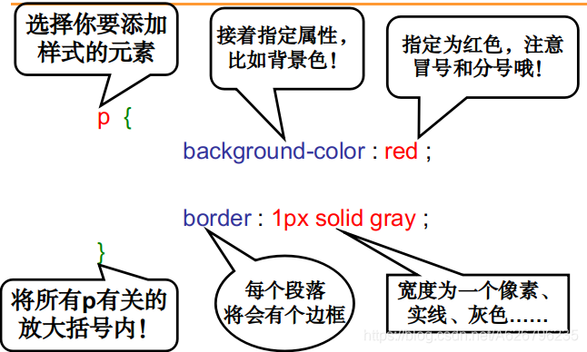
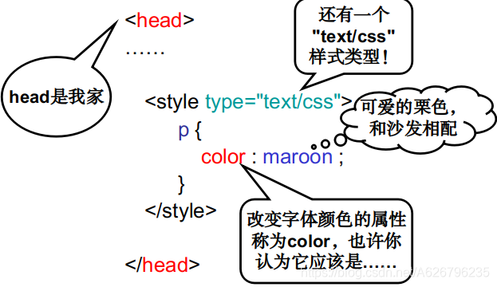
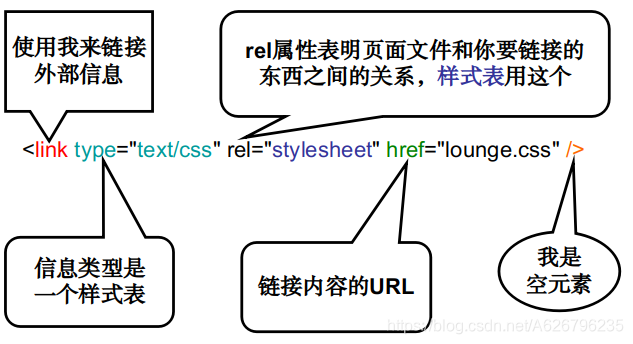
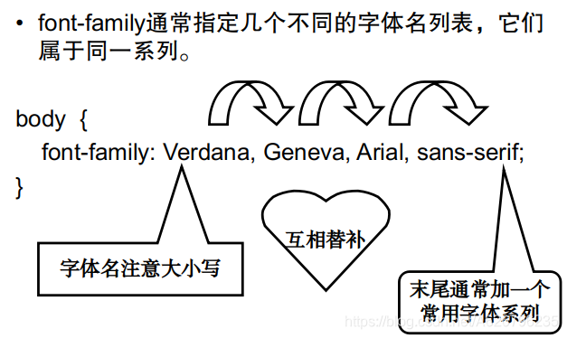
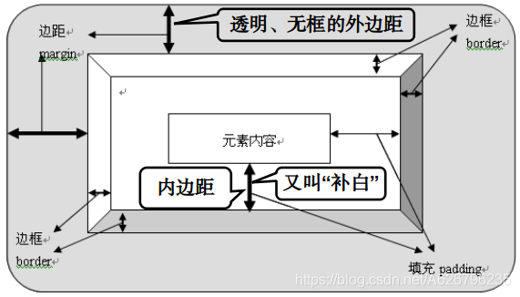

# CSS 语法

## CSS 结构

格式：
镶嵌：

## CSS 属性

**background-color**指定背景色

**border**段落边框

**color**改变字体颜色属性

**font-family**设置字体

**border-bottom**设置下边框

**font-size**字体大小

**font-weight**字体粗细

**text-decoration**更多样式

**line-height**行距

## 高级用法

### link 外部链接

link 元素用来引入外部样式表

### 创建 first.css 文件

独立出 html，方便使用。

### 使用 class

用 class 属性将一个元素加入类中。
使用“.”符号来选择类里的某个元素。

### text-decoration

**none**取消文本修饰

**line-through**中划线

**underline**下划线

**overline**上划线

两个包含语义和文本修饰的 HTML 元素

**ins**插入内容，下划线。

**del**删除内容，中划线。

### 字体设置

# 盒模式

盒模式：CSS 控制元素显示的方式
内容区、补白、边框、外边距

背景图片可以在内容和补白底下显示
但是不能越过边框

设置补白、边框和外边距时
可以分别设置各个侧面的属性
left, right, top, bottom

id 元素给元素设置页面唯一的名字
使用“#”号选择 id 中的元素

## 页面

页面元素的结构化：**div**和**span**
div 和 span 可以构建一些严格的支持结构
**text-align**：center 居中对齐

## 浮动布局设计

### 流

浏览器会一边走读文档，一边把路过的元素从左向右、从上向下放到合适位置。

内联元素：从左至右
块元素：从上至下

**display**:none 把元素隐藏
