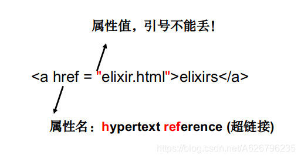
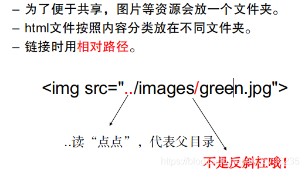
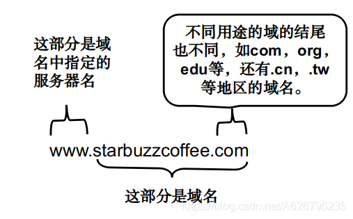
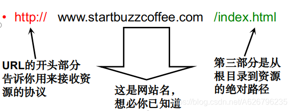

# HTML 语法

## HTML 结构

### 理解 1

用包围文本的成对标记告诉浏览器网页的结构。

整个语句称为一个元素。

我们也称一对开始标记和结束标记为匹配标记。

元素=开始标记+内容+结束标记

### 理解 2

有的网页上只有开始标记，没有结束标记

```html

```

这是只用一个标记作为速记符号的元素

### 理解 3

CSS 指层叠样式表 (Cascading Style Sheets)
样式定义如何显示 HTML 元素
把样式添加到 HTML 4.0 中，是为了解决内容与表现分离的问题

### 理解 4

HTML 和 CSS 是用来创建网页的语言

HTML 用来标记网页结构，CSS 指定显示样式

网页通常应该有一个 html 元素，下面有一个 head 和一个 body 元素

### 理解 5

用块元素来创建网页，然后用内联元素修饰。

### 理解 6

使用 bgsound 标记只能添加声音文件，而且也不能显示和调整播放软件的控制面板。
使用 embed 标记则可以插入各种各样的多媒体。

## HTML 标签

**注释<!--...--> 标签** !- - 内容 - -

**head**标签用于定义文档的头部，它是所有头部元素的容器。

**body** 元素定义文档的主体。

**title** 元素可定义文档的标题。
浏览器通常把它放置在浏览器窗口的标题栏或状态栏上。
当把文档加入用户的链接列表或者收藏夹或书签列表时，标题将成为该文档链接的默认名称。

**h1- h6** 标签可定义标题。
h1 定义最大的标题。
h6 定义最小的标题。

**p** 标签定义段落。
p 元素会自动在其前后创建一些空白。

**img** 元素向网页中嵌入一幅图像。
img 标签从网页上链接图像。
img 标签创建的是被引用图像的占位空间。
src 属性的值是文件的路径，即 URL。

**style** 标签用于为 HTML 文档定义样式信息。
在 style 中，您可以规定在浏览器中如何呈现 HTML 文档。
style 元素位于 head 元素中。

**style**标签可选的属性，定义 style 元素的内容。唯一可能的值是 "text/css"，表示 CSS。

**a**元素的内容是链接的标签，浏览器也有默认样式。
内容可以是文字或图像。
“两点”表示父目录，一般站内链接用相对路径，站外用网址。

**0l**或者**ul**里面嵌套**li**标签可以表示分句
ordered list 有序列表
unordered list 无序列表

**br**表示换行，可以单独使用，不需要对应的斜线标签。
概念：空元素("void")

**q**元素，用来标记网页中的“引用”

**blockquote>**块引用
注意：块引用也会被看成一个段落，所以，要放在 p 的外面。

**dl** **dt**和**dd**标签
自定义列表

**bgsound**背景音乐--设置背景音乐的标记
语法格式 ：
bgsound src="url" loop=" "
src 指定声音文件的 URL 来源，即其路径，为必选属性；
loop 指定声音文件的循环播放次数，其值为正整数可指定播放次数，值为-1 或 infinite 指定循环播放无限次

对比
**embed**
embed src=" url" loop="" width=" " height=" " autostart="" type="" pluginspage=""
**src**：指定多媒体文件的 URL 来源，即其路径，为必选属性；
**loop**指定声音文件的循环播放次数，值为 true 可循环播放无限次，值为 false 只播放一次，false 为默认值
**autostart**指定对媒体文件在下载完后是否自动播放；
**width**和**height**分别指定多媒体窗口的宽和高。值都为 0 时，类似背景音乐可隐藏面板；
**type**指定多媒体的播放类型；
**pluginspage**指定插件页面。

## HTML 标签属性

HTML 标签可以拥有属性。属性提供了有关 HTML 元素的更多的信息。

属性总是以名称/值对的形式出现，比如：name="value"。

属性总是在 HTML 元素的开始标签中规定。

## HTML 超链接

"Markup"
标记。
“hypertext”
超链接。


属性：关于内容的附加信息
也叫元信息（meta-information）



## 网页中的字符表示

如 <
表示为 &/lt;(同样，中间的斜线不要在意)

# HTML 协议



## 理解 1

一个域名下可以有多个网站

## URL

URL: Uniform Resource Locators
统一资源定位符


## http 协议

HTTP: HyperText Transfer Protocol
超文本传输协议

HTTP 是一个简单的 “请求—响应” 协议就是通过 URL 帮助你寻找服务器上的资源，响应完成就立即断开连接，不保持连接状态。
资源：如 HTML 文件、图片等。

使用 a 元素创建登陆点：三步曲
找到网页中需要创建登陆点的地方
用 a 元素把他围起来
使用 a 元素的 id 属性定义登陆点的标识名

链接到一个新窗口
使用**target**属性
取值为"\_blank"：每次都打开新窗口。

# 严格的 HTML

HTML：必不可少的元素！

记得使用 head 和 body

head 里没有 title

body 里只有块元素

块元素不嵌入内联元素
块元素不嵌入 p 元素

列表只能包括列表项
列表项可以是任何内容

blockquote 里面必须是块元素
