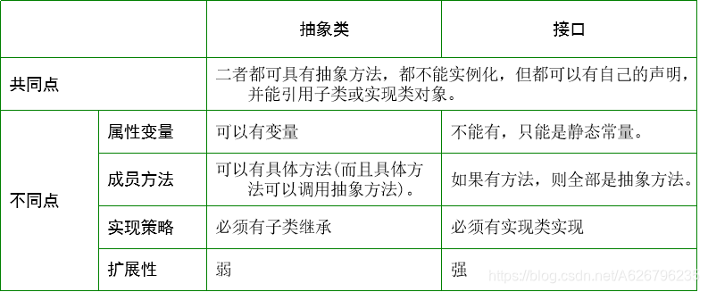
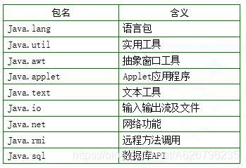

# 词语理解记录

## JVM

2019/2/22
Java 虚拟机，为 Java 程序在各个平台使用运行提供一个中介。
2022/7/28
JVM: Java Virtual Machine, Java 虚拟机。对 java 程序员屏蔽了不同结构计算机之间的差异，使得 java 代码的编译和运行，经过 JVM 的转换，再到具体机器上。

## 计算机

2019/9/6
计算机是纯粹的工具，来源于生活，需要和其他东西结合起来才有用。
2022/7/28
(上文说的好，他和算盘没什么本质区别。)

## 框架

2020/9/24
为实际应用开发带来方便和规范的辅助程序。
2022/7/28
框架是指一个可用的应用，它几乎只有打开和关闭这样的简单功能，但是开发者可以方便地在其上添加需要的业务功能，而不用从零开始配置整个技术链。

## 数据类型

_标识符_
_保留字（reserved word）_
_基本类型_
······整数类型：byte，short，int，long；（分别占位 8,16,32,64 位；都是有符号类型）
······浮点类型：float，double；
······字符类型：char（16 位，使用 Unicode 字符集）；
······布尔类型：boolean；
_复合数据类型_
······class（类）；
······interface（接口）；
······数组；
_常量_
······用保留字 final 来实现；
_变量_
······作用域；
变量的作用域可分为：局部变量、类属性变量、方法参数和异常处理参数。
在一个确定的域中，变量名应该是唯一的。

## 数据类型注意点

1.Java 中不允许将数字转化为布尔值，所以

```
for(x = y) {}
```

编译报错。
2.Unicode 编码中的胆英豪必须使用半角输入法中的引号。

```
\\ 	'\b' 对应 '\u0008'
```

3.两个整数相加，结果会默认的转换为 int 型变量，注意使用 byte 和 short 进行运算时的类型转换问题。还有，注意加法溢出问题。

4.在十进制和科学计数法常熟后面可以跟 F 或 f 标识 float 类型，跟 D 或 d 标识 double 类型；如果没有跟任何修饰，那么默认为为双精度类型。

5.字符串变量用 String 标识，而 String 是类（class）。

6.关于包装类：
_Java 提供与基本数据类型对应的包装类；_
_引入包装类的目的：_
_基本数据类型不是类，在一些场合不能直接使用；_
_包装类的一些静态方法可以实现不同数据类型的转化；_
_包装类的静态属性中含有相应数据类型的范围。_
API Doc：http://docs.oracle.com/javase/6/docs/api/overview-summary.html

## 表达式

_1.算术表达式_
\+ \- \* \/ \% \+\+ -\- \-(取反)
补充：
整数和浮点数都能进行取余运算，9%2=1,3.14%2=1.14000001；
_2.关系表达式_
\*\* \!= \> \< \>= \<=
_3.逻辑表达式_
\& \| \! \^(异或) \&& \||
_4.赋值表达式_
\= \+= \-= \*= \/= \%= \^= \&= \|= \<<= \>>= \>>>=
\<<(左移，右补 0) \>>(右移，左按符号位补 0 或 1)
\>>>(右移，左补 1)
_5.条件表达式_
布尔表达式 1 ? 表达式 2 : 表达式 3
补充：

```java
public class b2_6 {
    public static void main(String[] args){
        float sum=1.5f;
        int num=2;
        System.out.println((sum<2 ? 1 : num/sum));
		int num1=3,sum1=2;
		System.out.println((sum1<3 ? 1 : num1/sum1));
		int num12=3,sum12=2;
        System.out.println((sum12<3 ? 1.0 : num12/sum12));
    }
}
发生隐式类型转换，最后结果为
1.0
1
1.0
```

_6.运算符优先级_
域运算"." > 数组下记“[]” > 分组括号“()” > 单目 > 双目 > 三目 > 赋值

## 控制语句

1.分支语句
if-else
注意 if 括号中应为布尔值，这里与 C 语言的区别。
switch
注意 switch(expression) 中的表达式 expression 返回值类型只能是 byte、shout、int、char 之一。 2.循环语句
while
do-while
for
同样注意条件表达式中的结果应为布尔值。 3.跳转语句
break;
break lab;
countinue;
countnue lab;
标号 lab 的用意是完成多重循环的跳转。
return;
return expression;
注意 return 语句后面的语句可能成为死鱼(永远无法执行)，然后编译器就会报错。 4.异常处理语句
try-catch-finally
throw 5.注释语句：//，/\* \*/， /_\*\* _/

## 数组

分类 1：
基本数据类型数组、对象数组。
分类 2：
一维数组声明、定义、初始化

```
int a[10];a=new int[10];
int[10] b=new int[10];
int c[]={3,4,5};
String[] s=new String[]{"ab","cd"};

```

二维数组声明、定义、初始化

```
int arr[][];	arr = new int[3][4];
int[][] brr;
brr = new int[2][];
brr[0] = new int[2];
brr[1] = new int[5];
```

## 小思考

**Java for 循环简便写法**

```java
int[] a = {1,2,3,4};
for (int i : a) {
System.out.println(i);
}
```

**基本数据类型相对包装类的优点**
占空间小。

# Java 程序工程规范

## Java 程序编程规范

1.有多个 import 语句时，先写 Java 包（都是 Java 包时，依照字母先后顺序排序），后写 javax，最后写其他公司的包和自己定义的包。 2.命名规则：
**包名**中字母一律小写，如 xxxyyyzzz。
**类名、接口名**每个单词首字母大写，如 XxxYyyZzz。（接口名加上大写“i”前缀）
**方法名**第一个单词的字母小写，后面每个单词的首字母大写，如 xxxYyyZzz。
**常量**中的每个字母大写，如 XXXYYYZZZ。 3.程序{}强调匹配的同时，要保持适当的缩进，以便于阅读。 4.必要时要有一定的程序注释量（20%~50%），注释内容有：
程序头说明，属性说明，方法说明。

## 关于帮助文档

**帮助文档一般的格式信息：**
类的继承层次；
类和类的一般目的描述；
成员变量列表；
构造方法列表；
方法列表；
变量详细列表及目的和用途的描述；
构造方法详细列表及描述；
方法详细列表及描述。

# 面向对象基础

## 抽象

**书上的原话：**
抽象是从被研究对象中舍弃个别的、非本质的或与研究主旨无关的次要特征，而抽取与研究有关的共性内容加以考察，形成对研究问题正确、简明扼要的认识。
**我的理解**
抽象是动词；抽象是舍末逐本的方法；抽象是相对的。

## 类与对象

**定义：**
对象是对客观事物的抽象，类是对对象的抽象。

```
class 类名{}
```

**关系：**
对象是类的实例，类是对象的模板。

## 类的域和方法

**定义：**
域（也称属性或数据员）是对事物静态特征的抽象。

```
类型 域变量名
```

方法（也成操作或成员方法）是事物动态特征的抽象。

```
[修饰] 返回值类型 方法名(参数类型 参数1，[参数类型 参数2]...){方法体}
```

**关系：** 1.类中定义的域变量可以被类中的所有方法访问。 2.方法中的形式参数和定义的局部变量的作用域仅限于方法；
局部变量在使用前必须初始化；
如果局部变量和类中的域变量重名，则在方法中对同名变量的改变只作用在局部变量上； 3.类中定义的方法可以进行递归调用。

## 对象详解

**对象的创建**

```java
FighterPlane fp;//声明对象引用
fp = new FighterPlane();//创建对象，并与对象引用fp关联
```

**static 关键字**
类中被 static 修饰的方法属于类，不被复制到对象中；
可以说，static 修饰的方法（属性）是类方法（属性）。
**堆栈内存分布**
堆在应用程序生命周期内一直存在，栈在方法调用完毕后就释放；
类和对象被分配到堆中，方法执行时用得局部变量和参数放到栈中；
**所以，方法调用中产生的对象不会因调用结束而被释放掉。**
声明能引用对象的实质是对象引用在栈中保留了堆中对象的实际地址。
**对象参数**
对象是引用传递，当对象作为参数传递时，传递的是对象的地址。
**也就是说，对象只有一个，不生成副本**
基本数据类型作为参数在方法中的传递是值传递。
**对象数组**
建立

```java
MyClass [] mc = new MyClass[10];//产生一个MyClass数组对象mc
//mc可以容纳10个MyClass对象引用，每个单元初始值都为NULL
for(int i = 0 ; i < mc.length ; i++){
	mc[i] = new MyClass();
}//为每个单元赋值，即关联对象
```

特点

```java
float f1[],f2[];
f1=new float[10];
f2 = f1;//f1和f2拥有相同的数组成员
```

一维数组
数组名.length 可以得到单元个数
二位数组
数组名.length 可以得到行数
数组名[0].length 可以得到第一行的列数
n 维数组
......类推

**简便方法**
System.arraycopy()方法可以复制数组；
Java 集合类可以调用相应的方法返回对象数组引用（见 JDK 文档）；
Java 中有的类的方法可以针对某些基本数据类型进行排序（见 JDK 文档）；

## 构造方法

**概念与特征**
构造方法属于类，不属于任何对象；
构造方法与类同名，且不能指定类型（其隐含的返回值由系统内部使用）；
构造方法具有多态性；
系统有一个默认的无参数的构造方法；
**用 this 区分同名变量**
当构造方法中的参数与域变量名相同时，此时在构造方法中需要使用 this 关键字来加以区分；
**垃圾回收机制**
垃圾定义：没有任何引用的对象；
析构：finalize 方法 ；
回收机制：系统在资源不够的情况下可能进行释放；
　　　　　可以用 System.gc()方法“提醒”系统进行垃圾释放；
　　　　　进行垃圾回收的线程级别很低，只有系统不忙时才会理睬提醒；
何时调用析构函数？
堆栈上的对象（系统自动）
堆上的对象（delete 语句）
**创建对象时的初始化顺序** 1.系统会对数据成员进行默认初始化 2.执行数据成员定义处的初始化语句 3.调用构造方法为数据成员指定初值

## 类成员属性与方法的非访问修饰符

**static**
用**static 修饰的域变量**专属于类，保存在类的内存区（堆中）的公共存储单元中。因此,一个类的任何对象访问它时，存取到的都是相同的数值。
用**static 修饰的方法**称为静态方法，属于类方法，不属于类的任何对象。（main 方法属于特殊的静态方法）


静态代码块
当类被装载时，静态代码块被执行，且仅执行一次。

```java
class StaticCodeBlock{
  static int value ;
  static{
    value = 3;
    System.out.println("value="+value);
  }
  public static void main(String[] args){
  }
}
```

**abstract**
（以后补充）
**final**
final 修饰的类属性为常量；
final 修饰的类方法为最终方法，在子类当中不能被覆盖。
**native**
native 修饰的方法称为本地方法，此方法的使用的目的是调用其他语言编写的代码块。
缺点：Java 程序的跨平台性能受到限制或破坏。
（暂时不明白工作原理）

## 包（package）

包是对 Java 类进行组织与管理的一种机制。

# 面向对象之封装、继承与多态

封装 （encapsulation）： 类与对象
继承 （inheritance） ： 基类与派生类
多态 （Polymorphism）： 抽象类与接口

## 封装

**定义**：利用抽象数据类型将数据和基于数据的操作绑定在一起，数据被保存在抽象数据类型内部，系统只有通过被授权的操作方法才能够访问数据。
**特点**：（1）数据和基于数据的方法构成一个统一体；
（2）隐藏实现细节，只通过操作接口名称进行调用，操作内部的变动不会影响接口的使用。
**访问控制符**：
public（接口访问权限）
protected（包访问权限、继承访问权限）
“默认”（包访问权限）
private（无法直接访问）
**这些修饰符可以用于**
修饰类  
修饰类的属性成员（域）
修饰类的成员方法
**访问权限**：


访问权限首先看类前的修饰符，当类的修饰符为 public 时，
则类可以被所有的类所访问（可以 import），当为默认时，
则只能为包中的类所访问。
在此前提下，再看属性和方法前的修饰符。
类前修饰符为 public 时，
当属性和方法前的修饰符为 public 时，则该属性可以被所有类访问；
当属性和方法前为 protected 修饰时，对于类定义而言，可以被同包中的类和所有子类访问（子类和父类可以不在同一个包中），但对于对象而言，只能被同一个包的类对象所访问；
当为默认时，只能被同包中的类所访问（比 protected 访问权限小）；当为 private 时，只能被本类内部所访问 。
**面向对象程序 = 对象+ 消息**
消息的实质就是引用向对象发出的服务请求，是对数据成员和成员方法的调用。
**能否发送消息取决于**
引用必须引用了特定的对象，否则会在运行时抛出 NullPointerException 异常。
对象必须定义了相应的属性或方法，否则编译不会通过。
被访问的属性或方法必须具有可访问的权限。

## 继承

1.通过 extends 关键字实现； 2.单一继承； 3.子类继承了父类的所有属性和方法， 但只有 public、protected 的属性和方法在子类是可见的；
4.Object 类是所有类的共同祖先，即使定义类时没有写 extents Object 。
 5.继承设计用途：功能复用；为引用带来新特点。
组合设计用途：功能复用，同时不增加类之间的耦合性。
6.final 为最终类，不能有子类。

## 多态

1.多态是指一个程序中同名的不同方法共存的情况；
2.Java 中提供两种多态的机制：重载（overloading）与覆盖（overriding）； 3.覆盖与重载的区别：
覆盖：方法名称相同，参数相同，返回类型相同；
重载：方法名称相同，参数类型或个数不同，返回类型相同； 4.覆盖注意：
1）子类的访问修饰符权限应等于或大于父类；
2）同名的 static 方法和非 static 方法不能相互覆盖；
3）方法前有 final 修饰符，此方法不能在子类方法中进行覆盖；
4）在 JDK 中，很多父类的方法被子类重新覆盖，赋予了不同的含义，如 Object 类中的 boolean equals(Object obj)方法；
5）抽象类中如果存在抽象方法，则具体子类必须对抽象方法进行覆盖； 5.多态设计用途：
功能复用，功能扩充。

# 面向对象之抽象类与接口思想

## this，super 用法

**this 用法：** 1.表示当前对象引用，使用 this.成员名表示当前对象的成员；（常用于形参或局部变量与类的成员变量同名的情形） 2.指代当前对象； 3.调用当前类的构造方法；
**super**
super 访问当前类的直接父类。
主要应用场合：
1.super.数据成员；super.成员方法
2.super(参数) , 表示调用父类构造方法

## 构造方法的多态

**构造方法的重载** 1.一个类的若干个重载的构造方法之间可以相互调用。 2.当一个构造方法需要调用另一个构造方法时，可以使用关键字 this，同时这个调用语句应该（必须？）是整个构造方法的第一个可执行语句。 3.使用关键字 this 来调用同类的其它构造方法，优点同样是以最大限度地提高对已有代码的利用程度，减少程序的维护工作量。 4.父类含参构造方法，子类可以在自己的构造方法中使用 super 来显式调用，但必须是子类构造方法的第一个可执行语句。 5.若子类构造方法中没有显式调用父类构造方法，则在产生子类的对象时，系统在调用子类构造方法的同时，默认调用父类无参构造方法。 4.子类的构造方法必定调用父类的构造方法。

**子类对象实例化过程** 1.为对象分配内存空间，对成员变量进行默认的初始化 ； 2.绑定构造方法，将 new 中的参数传递给构造方法的形式参数； 3.调用 this 或 super 语句(二者必居其一,不能同时存在)，执行流程如图所示:
 4.进行实例变量的显式初始化操作， 如：

```java
     public class A{
         int value=4;       //显式初始化
         B b = new B();   //显式初始化，注：B为另一个类
      }
```

5.执行当前构造方法的方法体中的程序代码。

## 抽象类

**抽象类形成的思维过程：客观事物—>对象—>类—>抽象类。**

**抽象类的概念：**
用 abstract 修饰的类称为抽象类，用 abstract 修饰的成员方法称为抽象方法。
**理解抽象类** 1.抽象类和具体类的关系就是一般类和特殊类之间的关系，是继承和被继承的关系。 2.抽象类中可以有零个或多个抽象方法，也可以包含非抽象方法。只要有一个抽象方法，类前就必须有 abstract 修饰。 3.抽象类不能创建对象，创建对象由具体子类来实现，但可以有声明，声明能引用所有具体子类的对象。  
4.对于抽象方法，在抽象类中只指定方法名及类型，而不写实现代码。抽象类必定要派生子类，若派生的子类是具体类，则具体子类中必须实现抽象类中定义的所有抽象方法（覆盖）。 5.在抽象类中，非抽象方法可以调用抽象方法。
6.abstract 不能与 final 并列修饰同一个类（产生逻辑矛盾）；abstract 不能与 private ,static（因为 static 修饰的方法必然被直接调用）,final 或 native 并列修饰同一个方法。
**抽象类设计用途** 1.在继承方面：
简化子类定义，增加系统结构关系的清晰度。 2.在引用具体子类对象方面：
其声明可以引用所有具体子类的对象。
**设计注意事项** 1.在设计抽象类的具体子类时，追求它们在实现抽象方法方面所表现的不同性。 2.在确定抽象类的抽象方法时，一定要确保这些抽象方法就是同类对象共同行为的抽取。 3.抽象类中的信息应尽可能和研究对象的本质相关。

## 接口（interface）

**接口扮演将实现者和使用者有机联系到一起的角色**

**接口的两种含义：** 1.可以被引用调用的方法（public 方法或同包中的 protected 方法或默认方法）； 2.另一种是同“类”概念地位相当的专有概念 interface， interface 是方法说明的集合。
**interface 声明**

```java
  [public] interface 接口名［extends 父接口名列表］
  {
     //静态常量数据成员声明
     [public][static][final] 域类型 域名 = 常量值
　 //抽象方法声明
     [public][abstract]返回值 方法名(参数列表)[throw 异常列表]
  }
```

**定义接口注意事项** 1.接口定义用关键字 interface，而不是用 class，interface 前的修饰符要么为 public，要么为缺省。 2.接口定义的数据成员全是 public final static(静态常量)。即使没有修饰符。 3.接口中没有构造方法；所有成员方法都是 public abstract 方法（与抽象类有所不同）。即使没有修饰符，其效果完全等效。注：方法前不能修饰为 final。 4.接口具有继承性，可通过 extends 关键字声明接口的父接口。 5.不能有实例对象。

**接口的设计用途：**
通用可扩展代码，体现多态。

**实现接口注意事项** 1.在类中，用 implements 关键字来实现接口。一个类可以实现多个接口，在 implements 后用逗号隔开多个接口的名字。一个接口也可被多个类来实现。 2.接口中的字段（域）的值存储在该接口的静态存储区域内，使用接口名.字段或实现类.字段均可访问。 3.如果实现某接口的类不是 abstract 修饰的抽象类，则在类的定义部分必须实现接口的所有抽象方法，而且方法头部分应该与接口中的定义完全一致。 4.如果实现接口的类是 abstract 类，则它可以不实现该接口的所有方法。但对于抽象类的任何一个非抽象的子类而言，接口中的所有抽象方法都必须实现。 5.类在实现接口的抽象方法时，必须显式使用 public 修饰符，否则将被警告为缩小了接口中定义的方法的访问控制范围。

## 抽象类与接口的比较



## 引用

**引用形成**
先声明，后初始化（将对象赋给引用）
//先声明，赋予对象后声明变为引用

**抽象类声明引用的特点**
抽象类声明可以引用所有具体子类对象，此概念可以推广到所有具有父子关系的类，以及接口和实现类。

**引用替规则**
父类引用可以指向子类对象，子类声明不能引用平行级别的其它类的对象,也不能引用父类对象。

**父类声明和子类声明都引用同一个子类对象的区别**
父类声明是从父类的角度去引用对象，子类声明是从子类角度引用对象。
父类引用子类对象时，可以经过显式的转化赋给子类的声明，但子类的引用赋值给父类的声明则不需要。

**引用比较**
1.equals 方法比较
equals 方法是 Object 类的方法，比较本引用和参数指明的某个引用是否相等，即是否指向同一对象。返回 true 或 false。

```
class A{} class B{}
A a=new A();
B b=new B();
if( a.equals(b) ) {System.out.println("a与b相同");}
else {System.out.println("a与b不相");}
```

2.使用 " ** " 进行比较
如果两边是对象引用则比较的是它们的引用是否相同；
如果两边是数值，则比较的是它们的值(如果值类型不同，有可能发生类型转化，例如 10**10.0 将返回 true)；
如果一边是引用，一边是值，则编译错误。

3.使用 instanceof 比较引用类型

```
class A{} class B{}
A a=new A();
B b=new B();
boolen result = a instanceof A;//result为true
boolen result = b instanceof A;//result为false
```

## 类的其他相关内容

**类的完整定义形式**

```
[修饰符] class 类名 [extends 父类]
                               [implements 接口名1,接口2]
{  类成员变量；
   类方法；}
注：其中修饰符为：public、缺省、abstract、final
                                外部类不能被private、protected所修饰。
```

**内部类定义**
定义在某个类 A 中的类 B，（可以是抽象类，也可以是静态类）。
相应的，A 就称为外部类。

**内部类相关要点** 1.内部类可以直接访问外部类中的所有属性；
外部内无法直接访问内部类。 2.内部类对象产生方法：

```
class Outer{public class Inner{}}//public修饰内部类
Outer outer = new Outer();
Outer.Inner inner = outer.new Inner();
```

```
class Outer{
	private class Inner{}//不是public修饰内部类
	Inner getInner(){return new Inner();}
}
Outer outer = new Outer();
Outer.Inner inner = outer.getInner();
```

```
class Outer{static class Inner{}}//static修饰内部类
Outer.Inner inner = new Outer.Inner();
```

3.static 修饰的内部类：
相当于外部类的一个静态属性，其内部可以有静态方法或属性。
不能使用外部类的非静态属性或方法。

4.内部类定义在方法体中时
只能访问方法体内的常量，不能访问方法体内的局部变量；
此时内部类前不能有修饰符。

**匿名内部类与匿名对象** 1.匿名对象就是在产生对象时没有显式地为这个对象建立引用。 2.匿名对象在两种情况下经常使用：
如果对一个对象只需要进行一次方法调用。
将匿名对象作为参数传递给一个函数调用。 3.匿名内部类使用规则：
不能有构造方法；
不能定以任何静态成员和方法；
不能被 public、protected、private、static 修饰；
只能创建一个实例。

## Class 类

1.在 java.lang 包中有一个特殊的类——Class(注：同关键字 class 区别的地方是首字母大写)，它也继承 Object 类。 2.通过调用对象方法 getClass 而得到 Class 对象，进而我们可以知道类的相关的一些特性，如：类的名称、类的包、类的方法、类的父类等待。

# 异常

## 异常含义

正常情况以外的事件，具有不确定性。遇到异常后程序不能正常向下执行。

例如：用户输入错误、除数为 0，需要的文件不存在或打不开、数组下标越界、传入参数为空或不符合指定范围。

## 异常分类


（暂时也看不懂）

## 异常处理


**隐式异常抛出**
特点：
异常类型是 RuntimeException 或是子类时，程序方法可对异常不作任何声明抛出或处理，直接交给调用该方法的地方处理；
程序能编译通过，不会给可能产生错误的代码行给出提示。
**显式声明抛出**
通过 throws 实现
例如：

```
public class A{
	//public static void main(Sting[] args){}改为如下：
	public static void main(Sting[] args) throws IOException{}
	//发生IO异常时，main不负责处理，由调用main方法的地方处理异常
	//即Java虚拟机。
}
```

**注意：**
当子类覆盖父类的方法时，子类抛出的异常类应和父类抛出的相同，或为其子类，不能为其父类。

**捕获处理** 1.异常处理是由 try －catch 组成的一个异常处理块结构；
最为完整的方式是 try-catch-finally 语句

2.多 catch 情况：
异常类由上到下排布规则：由子到父，由具体到抽象，或为并列关系。
执行过程类似于 switch case（但一个执行，其它不执行）。
若无异常发生，则都不执行。
有时不需要对异常进行细致分类处理，则可统一为 catch(Exception e){}。

3.finally：
是这个组合语句的统一出口，一般用来进行一些“善后”操作，例如释放资源、关闭文件等。它是可选的部分，但一旦选定，必定执行。

4.显式异常抛出和程序异常捕获处理的关系
（不好描述）

**嵌套处理**
（顾名思义）
注意：最内层的 try 产生的异常对象，如果不能被对应的 catch 异常类声明引用，则转交给外层的 catch 去处理。

## 自定义异常

异常对象大部分由系统产生；
在编程时也可以主动产生异常，相应的语句为：
　　　 throw new 异常类；
new 后面的异常类可以是 JDK 中定义好的异常，也可以是自定义异常（继承某个异常类的自制异常类）。

**用途**
根据程序的需要而定义流程的跳转。
（汇编语言中的断点）

# Java 常用类库与工具

## Java 类库概述


java.lang 包中的类不需要 import 就可以使用。

## String 与 StringBuffer

**Stirng**

定义：
String 不是简单类型，而是一个类，它被用来表示字符序列。
字符本身符合 Unicode 标准，其基本的初始化方式如下：

```
方式一：String s1 = “abc";
       等价于
             char data[] = {'a', 'b', 'c'};  String s1 = new String(data);

方式二: String s2 = new String(“abc");
        等价于
       String s = “abc"; String s2 = new String(s);
```

对象特点：
String 对象是不可变的，在 String 类中每一个看起来会修改 String 对象内容的方法，实质都是创建了一个全新的 String 对象。

```
//字符串比较
    String s1 = "abc";
    String s3 = "abc";
    System.out.println(s1**s3); // true
    String s2 = new String(“abc");
    String s4 = new String(“abc");
    System.out.println(s2===s4); // false
    System.out.println(s2.equals(s4)); // true
//String类对eqauls方法进行了覆盖，比较两个字符串对象的内容是否相同
```

作为参数传递的特点：
尽管是传引用，但通过形参引用并未改变实参指向的字符串内容。
优点：
兼顾效率与安全

**StirngBuffer**
StringBuffer 是一个具有对象引用传递特点的字符串对象。

StringBuffer 对象的值是可变的，对字符串的增加、插入、修改、删除等操作比 String 高效（不需多次创建新的对象）

**String、StringBuffer、StringBuilder 不同之处**
1、String 内部实现基于常量字符数组，内容不可变；
StringBuffer、StringBuilder 基于普通字符数组，数组 大小可根据  
 字符串的实际长度自动扩容，内容可变
2、性能方面，对于字符串的处理，相对来说
StringBuilder >StringBuffer>String
3、StringBuffer 线程安全；StringBuilder 非线程安全

## 系统类与时间类

System 和 Runtime 两个类封装了对系统进行的一些操作；
Date 和 Calendar 封装了对日期和时间进行的操作。
**System**
不能实例化；有 in，out，err 三个域；类成员方法都是静态的。
**Runtime**
每一个 Java 应用程序都有一个 Runtime 类的实例，允许应用程序与其运行的环境进行交互。
要得到该类的实例，不能用 new 的方法产生，只能调用该类的 getRuntime 方法。
**Date**
JDK 当中有两个同名的 Date，一个存在与 java.util 包中，一个存在于 java.sql 包中。前者在 JDK1.0 中就出现，但是逐渐被弃用（被 Calendar 所取代）；而后者是前者的子类，用来描述数据库中的时间字段。
**Calendar**
Calendar 类是对时间操作的主要类。要得到其对象引用，不能使用 new，而要调用其静态方法 getInstance，之后利用相应的对象方法。

## 格式化类

格式化数字：NumberFormat 和 DecimalFormat
格式化日期：SimpleDateFormat 对象的 format 方法是将 Date 转为 String，而 parse 方法是将 String 转为 Date

# Java 高级特性之线程

## 线程概念

**进程**
一个进程就是一个执行中的程序；
每一个进程都有自己独立的一块内存空间、一组系统资源；
每一个进程的内部数据和状态都是完全独立的。
**线程**
Java 程序执行中的单个顺序的流控制称为线程；
多线程则指一个进程中可以同时运行多个不同的线程，执行不同的任务。
**区别比较**
同类的多个线程共享一块内存空间和一组系统资源，而线程本身的数据通常只有微处理器的寄存器数据，以及一个供程序执行时使用的堆栈。
所以系统在产生一个线程，或者在各个线程之间切换时，负担要比进程小的多 。
**线程意义**
提高 CPU 利用率，即提高系统性能。

## 线程创建

**方式一**
通过继承 Thread 类创建线程，类 MyThread 声明为 Thread 的子类 。

```java
public class MyThread extends Thread {
    public static void main ( String args[] ) {
        Thread a = new MyThread();
        a.start();
        System.out.println("This is main thread.");
    }
    public void run() {
        System.out.println("This is another thread.");
    }
}
```

**方式二**
利用 Runnable 接口产生线程 。

```java
public class MyThread implements Runnable {
    public static void main ( String args[] ) {
        MyThread my = new MyThread();
        Thread a = new Thread(my);
        a.start();
        System.out.println("This is main thread.");
    }
    public void run() {
        System.out.println("This is another thread.");
    }
}
```

**注意** 1.要用 start() 来启动线程.

```java
new MyThread().run();//没有新建线程
/*private Runnable target;
 *public void run() {
 *        if (target != null) {
 *            target.run();
 *        }
 *    }
 */
new MyThread().start();
```

2.子类应该覆盖 run()方法。

## 线程控制与调度

**并发特性：可见性；有序性；原子性。**

**1.线程的生命周期和状态的改变**

**2.常用方法**
_join_
thread.Join 把指定的线程加入到当前线程，可以将两个交替执行的线程合并为顺序执行的线程。
比如在线程 B 中调用了线程 A 的 Join()方法，直到线程 A 执行完毕后，才会继续执行线程 B。
t.join(); //调用 join 方法，等待线程 t 执行完毕
t.join(1000); //等待 t 线程，等待时间是 1000 毫秒。
**3.调度**
线程调度：
当有多个线程处于就绪状态时，线程调度程序根据调度策略安排线程的执行。
调度策略：
抢占式调度(preemptive): 支持基于固定优先级的调度算法，高优先级线程抢占低优先级线程执行;
时间片轮转调度(round-robin)：对于同等优先级的线程，轮流分享 CPU 时间运行。
**4.优先级**
线程优先级：
public static final int NORM_PRIORITY = 5;
public static final int MIN_PRIORITY = 1;
public static final int MAX_PRIORITY = 10;
可以用下面方法设置和返回线程的优先级。

```java
   public final void setPriority(int newPriority); // 设置线程的优先级。
   public final int getPriority();  // 返回线程的优先级。
```

**5.局限**
Java 中，优先级高的线程只是比优先级低的线程更有机会执行，具体的执行情况还依赖于操作系统的支持，执行顺序并不是确定的。
**6.volatile**
用法：

```
volatile  public int i;
```

作用：为解决缓存不一致，禁止编译优化，只读写主存。
问题：仍不能解决多线程并发中的安全问题。

## 线程同步机制

未解决同步问题，设置对象监视器，即锁。
**一个对象只有一个锁**
对象监视器（monitor）与关键字 synchronized

Synchronized 的三种用法：

synchronized 代码块：监视器就是指定的对象。

```
class A {
	void put(int i){
	 	while(ture){
	 		synchronized (this){
	 			if(ture) {...}
	 		}
	 	}
	}
}
```

synchronized 方法：监视器就是 this 对象。

```
class A { synchronized void put(int i){...} }
```

synchronized 静态方法：监视器就是相应的 Class 对象。

**死锁（deadlock）**

```
方法一：{
synchronized(A) {
     ….
    synchronized(B) {
        ….
    }
}
}
```

```
方法二：{
synchronized(B) {
     ….
    synchronized(A) {
        ….
    }
}
}
```

一般解决办法：CUP 老大站出来，kill 掉一个。

## 线程间的同步通信

使用 wait 和 notifyAll 实现线程间同步通信

《notify 和 notifyAll 的区别》
原文：https://blog.csdn.net/u014658905/article/details/81035870

调用 notify 时，只有一个等待线程会被唤醒而且它不能保证哪个线程会被唤醒，这取决于线程调度器。虽然如果你调用 notifyAll 方法，那么等待该锁的所有线程都会被唤醒，但是在执行剩余的代码之前，所有被唤醒的线程都将争夺锁定，这就是为什么在循环上调用 wait，因为如果多个线程被唤醒，那么线程是将获得锁定将首先执行，它可能会重置等待条件，这将迫使后续线程等待。因此，notify 和 notifyAll 之间的关键区别在于 notify（）只会唤醒一个线程，而 notifyAll 方法将唤醒所有线程。
