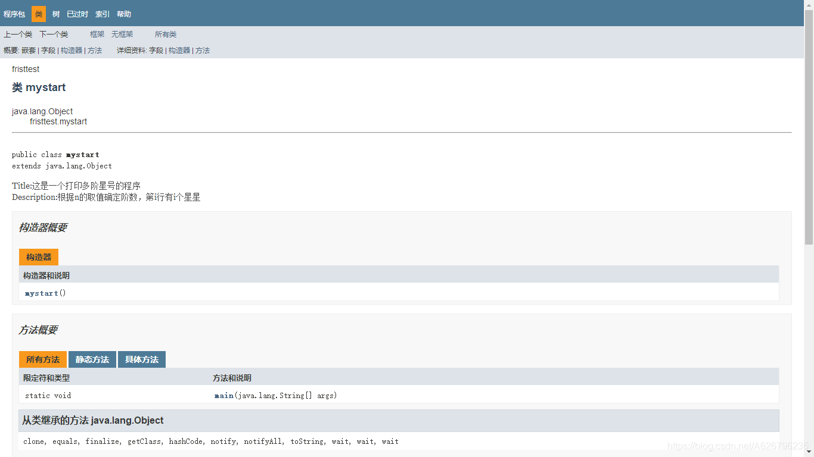
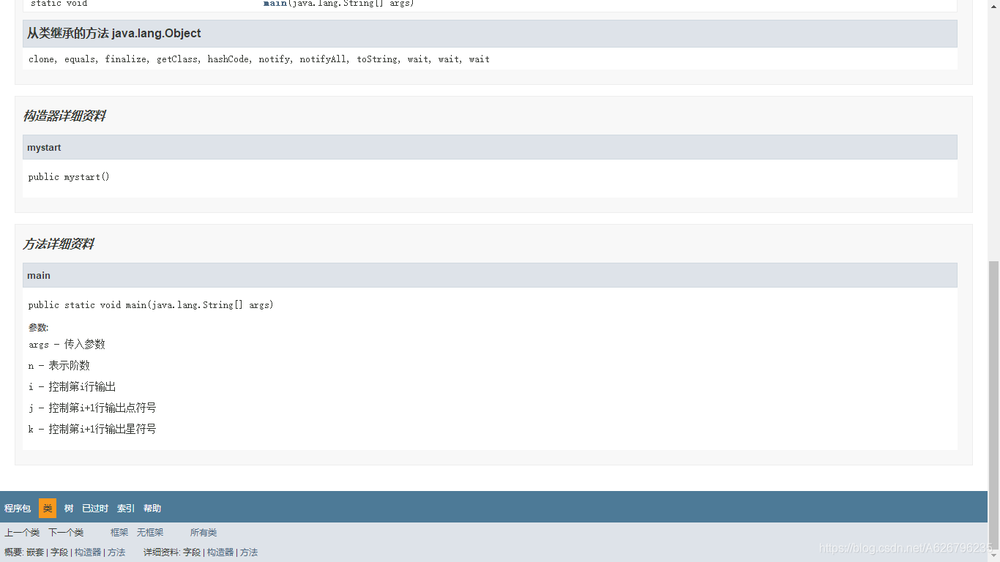
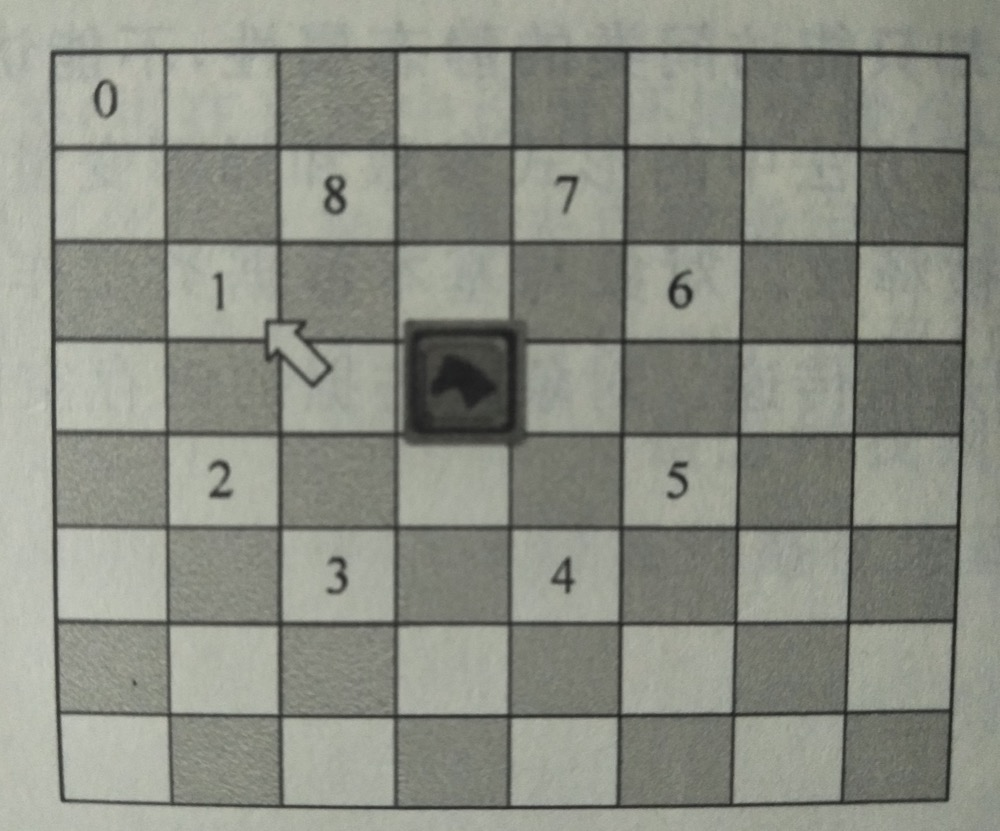
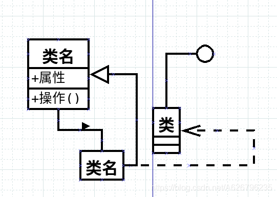

# 版本

《Java 面向对象程序设计》（第 2 版）袁绍欣 安毅生 赵祥模 葛玮 编著
清华大学出版社

# 声明

我自己写的答案，公布出来的用意在于方便与同学，与大家交流学习。我不希望这里出现那种只会抄作业的人，抄作业行为没有长远意义。

2021.02.20 回顾补充：
没想到原来没完成的文章又有了动力去完成，只感叹时光如梭啊。这次重新学习，温故知新，或许有更多的体会，以及对细节的把握、对思想的理解。

2022.05.21 回顾补充：
如果读者是学生，这篇文章可能会对你产生误导，因为这是一个缺乏工程应用经验的学生写的，过于偏重理论知识，但又说不清楚某个技术存在的意义是什么。建议对 Java 感兴趣的人去找经典书籍阅读。

# 第一章

## 1.Java 语言有哪些特点？

答：简单、面向对象、分布式、解释型、健壮、安全、与体系结构无关、可移植、高性能、多线程和动态执行。

Sun 公司对 Java 的定义：
A simple, object-oriented, distributed, interpreted, robust, secure, architecture-neutral, portable, high-performance, multi-threaded, and dynamic language.

## 2.下载一个 JDK 和一个 JRE 版本，进行安装，并配置环境变量，建立编译和运行环境。

我遇到了问题，之后写了个问题总结。(链接失效)

（我直接下载的 jdk-11.0.2 版本，自带 jre。）

## 3.Java 平台分成几类？他们的适用范围各是什么？

答：目前 Java 平台分为 J2EE、J2SE、J2ME 三个平台。
J2EE 主要目的是为==企业==计算提供一个应用服务运行和开发平台。
J2SE 主要目的是为==台式机和工作站==提供一个开发和运行的平台。
J2ME 主要面向==消费电子产品==，为消费电子产品提供一个 Java 的运行平台。

## 4.分别编写 Application 和 Applet 程序，输出字符串“My frist Java!”。请记下编译和执行过程出现的问题。

**Appliction 的 Java 程序**

```java
public class MyJava {
	public static void main(String args[]){
		system.out.println("My frist Java!");
	}
}
```

**Applet 的 Java 程序**

```java
import java.awt.*;
//java.awt包含用于创建用户界面和绘制图形图像的所有分类
import java.applet.*;
public class MyJavaApplet extends Applet {
	public void init(){
	}
    public void paint(Graphics g){
		g.drawString("My frist Java!",25,25);
	}
}
```

**对应的 html 代码**

```html
<applet code="MyJavaApplet" width="150" height="100"> </applet>
```

**主要问题**
文件命名是的统一关系；
java 环境配置的相关问题；
不会用浏览器运行小程序。

补充：因为历史原因，applet 在各种浏览器中支持是不同的，所以新手容易产生疑惑。背后的故事很有趣，可以了解一下 Applet 和 ActiveX 的发展历史。

## 5.改造第 4 题的程序，将两程序合为一个程序，既能作为 Application 执行，又能作为 Applet 程序执行。

目前不会。
更新补充：
成功合并且运行的代码：

```java
import java.awt.*;
import java.applet.*;
public class HelloWorldApplet extends Applet{
	public void init(){
	}
	public static void main(String args[]){
		System.out.println("Hello World!");
	}
	public void paint(Graphics g){
		g.drawString("Hello World!",25,25);
	}
}
```

_问题笔记_
将 main()那一部分合并在同一个 class 类里就可以了（外层只保留了一个类），注意名称。

# 第二章

## 1.下面那些标识符是合法的？ （D）。

A. 8ID 　　 S#160 　　 B. -MU 　　 C. SY#　　 D. \_S9

（标识符是以字母、下划线 “\_” 、美元符 “\$” 开始的一个字符序列，后面可以接字母、下划线 “\_” 、美元符 “\$” 、数字。）

## 2.那些数据类型可以充当 swith 语句的条件？

必须是一下四种基本数据类型（不能是包装类）：
byte 、short 、int 、char 。

## 3.下面片段的执行结果是**\_\_**。

```java
int x = 3;
int y = 1;
if(x = y){
	System.out.println("x = " + x);
}
```

A. x = 1 　　 B. x = 3 　　 C. 编译失败　　 D. 无输出

选 C，我猜的。

补充：答案选择 C。if 括号中只能是布尔型数据。

再补充：x = y 是赋值语句，结果类型是 int 类型，不是 boolean 类型。如果 x 和 y 本身就是 boolean 类型，那么 x=y 结果就为 boolean 类型，可以编译通过。

## 4.定义一个浮点变量 s ，写成“Float s = 2.3;” ，错在什么地方？如何修改正确？

用 2.3 赋值变量 s 时，默认产生的应该是 double 类型变量，于是类型错误。改正方法：

```java
float s = 2.3f;//增加后缀
float s2 =(float)2.3;//类型强制转换

补充：
double s3 = 2.3f 这种“小变量赋值大变量“写法是允许的。
```

## 5.下面程序片段的执行结果是**\_\_**。

```java
int i = 0, j = 1;
if((i++ == 1) && (j++ == 2)){
	i = 42;
}
System.out.println("i = " + i + ",j = " + j);
```

A. i = 1, j = 2 　　 B. i = 1, j = 1
C. i = 42, j = 2 　 D. i = 42, j = 1
我选 A，就是个前后++问题。

补充：
这里考虑的有两点：++运算符的前后缀；&&的判断机制与&的判断机制不同。

## 6.定义一个一维数组有几种方法？

一维数组声明有两种形式：

```java
//类型标识符 数组名[];
type name [];
//类型标识符[] 数组名;
type [] name;
```

一维数组初始化有三种方式：

```java
1、使用关键字new进行定义//未手动赋值，系统默认赋值
type name[] = new type[length];
type[] name = new type[length];
2、直接在声明的时候初始化//注意只能写在同一行代码中
String[] s = {"ab","bc","cd"};
int[] a = {3,4,5,6};
3、结合的方法
float f4[] = new float[]{1.0f,2.0f,3.2f};
String[] dogs = new String[]{
	new String("大黄"), new String("二黑")};
```

特别补充：
声明和定义的区别在于是否建立变量空间：
把建立空间的称为“定义”；
把不需要建立存储空间的称为“声明”。

基本数据类型变量的声明和定义(默认初始化)是同时产生的；
而对于类对象来说，声明和定义是分开的。

## 7.编写 JavaApplication，求出 e=1+1/1!+1/2!+1/3!+···+1/n!···的近似值，要求误差小于 0.00001。

```java
public class fore(){
	public static void main(String[] args){
        double e=1.0,t=1.0;
        int i;
        //指数-6、-7也可，但没必要
        for(i=1;t>1e-5;++i){
        	t*=1.0/i;
            e+=t;
        }
        System.out.print(e);
    }
}
```

## 8.利用可变列数组实现乘法口诀打印。

样例：
1 X 1 = 1
2 X 1 = 2 　 2 X 2 = 4
... ...
_运行成功的代码_

```java
public class MultiplicationTable{
    public static void main(String[] args) {
        //确定每一行的列数
        String [][] arra;
        arra = new String[9][];
        for(int i=0;i < 9; i++) {
            arra[i]=new String[i+1];
        }
        //根据数组下标长度，直接打印，没必要存储
        for(int i = 0 ; i < 9 ; i++) {
            for(int j = 0 ; j < i + 1 ;j++) {
                int ji;
                ji = ++i*++j;//注意数组下标从0开始
                System.out.print(i + " " + "x" + " " + j + " = " + ji + "\t");
                i--;j--;
            }
            System.out.println("");
        }
    }
}
```

## 9.编程输出。

样例： \*
\*.\*.
\*. .\*. .\*. .
\*...\*...\*...\*...
(各个符号之间没有空格，求输出八阶图形，即共有 8 行输出)

_运行成功的代码_

```java
public class mystart {
    public static void main(String[] args){
        int n = 8;//阶数控制
        System.out.println("*");
        for(int i = 1 ; i < n ; i++) {
            for(int k = i+1;k > 0;k--){
                System.out.print("*");
                for(int j = 1 ; j < i + 1 ;j++) {
                    System.out.print(".");
                }
            }
            System.out.println("");
        }
    }
}
```

补充说明：
这里对 i=0 的情况单独处理的，逻辑上没问题，但是代码不够美观。

精修一下代码：

```java
public class mystart {
    public static void main(String[] args){
        int n = 8;//阶数控制
        for(int i = 0 ; i < n ; i++) {
            for(int k = i+1;k > 0;k--){
                System.out.print("*");
                for(int j = 1 ; j < i + 1 ;j++) {
                    System.out.print(".");
                }
            }
            System.out.println("");
        }
    }
}//原来我以前写的代码还是挺好的嘛
```

# 第三章

## 1.编写程序为什么要写注释？

~~因为我高兴呀~~
提高程序的可读性以及管理上的方便。

（2021 的我：“19 年的我挺皮的。”）

## 2.Java 都有哪些命名规范？

1.包名中的字母一律小写； 2.类名、接口名的每一个单词的首字母大写； 3.方法名中第一个单词首字母小写，其他单词首字母大写； 4.常量中的每一个字母都大写。

注：这些要求过于基础，我自己想跟着阿里的 java 开放规范来写程序。

## 3.Javadoc 生成帮助文档的时候，都有哪些命令行开关，他们的作用是什么？

以 javadoc 开头 :
-d 文件存储位置  
 -head 文件头部名称  
 -version 显示文件版本  
 -author 显示作者  
 xxx.java 处理的 java 源文件

## 4.选择前两章的一道练习题，加上适当的注释，并帮助其产生文档。

第二章第 9 题，改写后得到的效果：



# 第四章

## 1.名词解释：构造方法、抽象。

1.构造方法是一个与类名相同的类方法。
构造方法属于类，不属于任何对象；
构造方法与类同名，且不能指定任何返回值类型（其隐含的返回值由系统内部使用），包括 void；
系统有一个默认的无参数的构造方法，可以覆盖。

用途是，每当使用 new 关键字创建一个对象时，为新建对象开辟了内存空间之后，Java 系统将自动调用构造方法初始化这个对象。（不管有没有对象引用）

2.抽象：抽象是从被研究对象中舍弃个别的、非本质的或与研究主旨无关的次要特征，而抽取与研究有关的共性内容加以考察，形成对研究问题正确、简明扼要的认识。

## 2.对象位于内存何处？声明能引用对象的实质是什么？

对象在堆内存上；
实质：对象引用在方法栈中保留了堆中对象的实际地址。

## 3.对象和基本数据类型作为参数传递时，有什么不同？

对象作为参数在方法中的传递是是引用传递，传递的是对象的地址；
基本数据类型作为参数在方法中的传递是值传递，传递的是拷贝的值。

## 4.在自定义对象中写 finalize 方法，看看什么情况下 finalize 被调用。

当该对象成为垃圾之后，且系统 GC 机制触发，调用 finalize 方法释放资源。

## 5.对象在什么条件下成为垃圾？什么情况下释放垃圾对象，如何证明一个对象被释放了？

1.对象在没有任何引用的时候成为垃圾； 2.系统在资源不够的情况下可能进行释放，也可以用 System.gc()方法“提醒”系统进行垃圾释放，但是进行垃圾回收的线程级别很低，只有系统不忙时才会理睬提醒； 3.该对象占用的资源（对象在堆中占用的空间、对其他设备等资源的占用）被释放时。

## 6.final 修饰符都有什么作用？

final 修饰的类属性为常量，相比于直接使用常量数值，起着助记符的作用；
final 修饰的类方法在子类当中不能被覆盖，作为最终方法，可以保证程序的安全性和正确性。

## 7.static 修饰的属性和方法有什么特点？

用 static 修饰的域变量专属于类，保存在类的内存区（堆中）的公共存储单元中。
用 static 修饰的方法称为静态方法，属于类方法，不属于类的任何对象。

## 8.Application 程序执行时为什么不能带后缀名？

~~因为这是规定~~
_网络引用答案如下：_
若写 java xxx.yyy
是代表要运行 package xxx 中的 class yyy 里面的 main(String[])
所以当你写 java xxx.class 时, 它会以为要找一个叫 xxx 的 package 里面的一个叫 class 的 class 。

## 9.下面的代码中，Vector 是 java.util 包中的一个类，关于此类哪个叙述是正确的？（）

1）public void create(){
2）Vector myVect;
3）myVect = new Vector();
4）}
A. 第二行的声明不会为变量 myVector 分配内存空间。
B. 第二行的声明分配了一个 Vector 对象内存空间。
C. 第二行语句创建一个 Vector 类对象。
D. 第三行语句创建一个 Vector 类对象。
E. 第三行语句为一个 Vector 类对象分配内存空间。

我选 D，暂时解释不清。

补充：DE 仍有不清晰的地方。
补充解析：
A 选项，变量 myVector 是有一定大小的，因为里面要存放将来引用的对象在堆中的地址。
B 选项，未分配。Java 中，需要 new 关键字来分配。
C 选项，只是声明，还不存在对象。
D 选项，我的理解第三行作用，创建 Vector 对象并将对象赋予声明 myVector。
E 选项，对象在创建的同时就在堆上分配空间了。

## 10.请在 display 函数中用递归方式输出如下图形。

n n n … n
…
3 3 3
2 2
1
void display(n){…}
代码如下：

```java
public class display{
    static void display(int n){
        if (n >= 1){
            for (int i = 0; i < n; i++){
                System.out.print(n + " ");
            }
            System.out.println();
            display(n - 1);
        }else{
            return ;
        }
    }
    public static void main(String[] args){
        display(5);
    }
}
```

## 11.象棋跳马。

国际象棋中，马的规则是每步棋先横走或直走一格，然后再斜走一格。在下图中根据马的当前位置，其可以走的位置共有 8 种，分别用 1 到 8 来表示。如果马以 0 方格为起点开始起跳，则跳满棋盘中所有位置为一趟，请问共有多少趟（种）跳法？请分别显示每趟跳法的轨迹。


这一题的代码，是我参考了同学的思路，简单改改得到的。
最后没有完全解决问题。

文章链接
https://blog.csdn.net/weixin_44728197/article/details/88624747

```java
//格式控制
import java.text.DecimalFormat;
public class test {
    static DecimalFormat df = new DecimalFormat("00");
    void printchess(test my)
    {
        int a,b;
        for(a=2;a<=9;a++)
        {
            for(b=2;b<=9;b++)
            {
                if(my.chessboard[a][b]!=0)
                System.out.print( df.format(my.chessboard[a][b])+" ");
                else{
                    System.out.print( "   ");
                }
            }
            System.out.println();
        }
    }
    int horse(test my,int x,int y)
    {
        int i;
        for(i=0;i<8;i++)
        {
            if(my.chessboard[x+my.move[i][0]][y+my.move[i][1]]==0)
            {
                if(my.chessboard[4][3]!=0 && my.chessboard[3][4]!=0
                && my.chessboard[6][3]!=0&& my.chessboard[3][6]!=0
                && my.chessboard[4][7]!=0&& my.chessboard[7][4]!=0
                && my.chessboard[7][6]!=0&& my.chessboard[6][7]!=0 )
                {
                    return 1;//八个格子跳完，返回1，sum加1
                }
                my.chessboard[x+my.move[i][0]][y+my.move[i][1]]=++my.cnt;//标记走了这一格
                my.horse(my,x+my.move[i][0],y+my.move[i][1]);//递归
            }
        }
        return 0;//中途断掉，sum不加
    }
    int[][] chessboard = new int[12][12];
    int cnt = 0;//标记马已走的方格数
    //int sum = 0;//标记马走完全程的具体方案数
    int[][] move = {{2,1},{1,2},{-1,2},{-2,1},{-2,-1},{-1,-2},{1,-2},{2,-1},};
    //每一种走法都可以中途变化，而不是move中按照固定顺序来，直到第一种走不通才会走下一步
    //每个马有8个位置可以跳，这是8中情况下x,y的偏移量
    public static void main(String[] args) {
        int sum=0;
        int control=0;
        while(control!=-1){
            test my = new test();
            int a,b;
            for(a=0;a<12;a++)
            {
                for(b=0;b<12;b++)
                {
                    my.chessboard[a][b]=0;
                }
            }
            for(a=0;a<12;a++)
            {
                for(b=0;b<12;b++)
                {
                    if(a==0||a==1||a==10||a==11||b==0||b==1||b==10||b==11)
                    {
                        my.chessboard[a][b]=-1;
                        //在8x8棋盘外面加两层，使得每个位置都有8种跳法，只不过这些多出来的位置标记为已跳
                    }
                }
            }
            my.chessboard[2][2]=++my.cnt;//开始位置为第一个已跳位置
            sum+=my.horse(my,2, 2);
            my.printchess(my);

            //while(control<(8*8*8*8*8*8*8*8))
            //一个简单但是效率极低的思路：
            //改变move数组，循环得到全部的解，中途每得到一个解，就对sum加1
            //control控制循环次数，即move排列组合的情况,循环次数为16777216次
            //然后就不用写了，我的计算机说它还想多活两年
            control=-1;//通过简单转变，控制循环次数
        }
        //System.out.println(sum);
    }
}
```

补充：
这题目条件没有表达清楚。
1、能否跳在已经跳过的格子？
只能默认为不能，这样问题的解才有限。

2、跳满所有位置，是指 64 个格子还是 8 个格子？
“8 个位置”这句话和“跳满”这句话是分开的两句话，前者更像是用于说明马的走法的。我选择默认为要求 8 个格子，反正解法都相当的。

3、跳马的规则描述是，先直走再斜着走，这个和中国象棋的走法是否不同？国际象棋跳一次马是经过了一个还是两个格子？
我默认为只经过一个格子。

补充的（我认为）完整的解法：

```java
// 沿着上述代码的单次结题思路，这里增加多次控制即可
coding
```

# 第五章

## 1.面向对象的主要特征是什么？

（抽象、）封装、继承和多态。

补充：注意这里的表述，是**主要特征**。

## 2.封装是如何实现的？

java 封装类通过三个步骤实现：
（1）修改属性的可见性，限制访问。
（2）设置属性的读取方法。
（3）在读取属性的方法中，添加对属性读取的限制。

补充：书中原文为，“封装是通过访问控制符实现的。”

## 3.对象之间如何相互作用？作用的条件是什么？

通过对象引用、继承访问成员属性和方法；

作用条件：拥有合法访问权限。

## 4.protected 修饰符有何特点？

对 public 类中的 protected 属性和方法：
1）可以被子类（复制属性）直接访问；
2）可以被包内的所有类访问；

对默认（即 default，省却）类中的 protected 属性和方法：
只能被包内的所有类访问。

（原答案有误，已删除。）

## 5.Object 都有哪些方法？

```java
// 1 这个方法涉及到底层思想了，比较复杂。下面给出参考文章地址 https://blog.csdn.net/Saintyyu/article/details/90452826#commentBox
registerNatives()
// 2 返回此 Object 的运行类。
getClass()
// 3 用于获取对象的哈希值，对象的唯一编号，类似于人的身份证号。
hashCode()
// 4 用于确认两个对象是否“相同”。（String、包装类、URL、File 类中覆盖本方法后，多用于比较值而不是对象的异同）
equals(Object obj)
// 5 创建并返回此对象的一个副本。
clone()
// 6 返回该对象的字符串表示。
toString()
// 7 唤醒在此对象监视器上等待的单个线程。
notify()
// 8 唤醒在此对象监视器上等待的所有线程。
notifyAll()
// 9 直到其他线程调用此对象的 notify() 方法或 notifyAll() 方法，或者超过指定的时间量前，导致当前线程等待。
wait(long timeoutMillis)
// 10 直到其他线程调用此对象的 notify() 方法或 notifyAll() 方法，或者其他某个线程中断当前线程，或者已超过某个实际时间量前，导致当前线程等待。
wait(long timeoutMillis, int nanos)
// 11 用于让当前线程失去操作权限，当前线程进入等待序列
wait()
// 12 当垃圾回收器确定不存在对该对象的更多引用时，由对象的垃圾回收器调用此方法。
finalize()
```

## 6.重载的方法之间一般有什么关系？

外在表现上：
返回值类型相同，方法名称相同，参数类型或个数不同。

方法的实现上：
最终功能和目的相同或相似，根据具体情况其实现不同；
多个方法之间往往存在调用关系。（体现程序共享的思想）

## 7.子类覆盖父类方法需要什么条件？子类中定义与父类同名的方法一定是覆盖吗？

条件：
1）子类的访问修饰符权限应等于或大于父类；（public 最大）
2）同名的 static 方法和非 static 方法不能相互覆盖；
3）方法前有 final 修饰符，此方法不能在子类方法中进行覆盖；

不一定：
若名称相同，参数不同，则是重载；
若名称相同，参数相同，而返回值类型不同，则编译不能通过。

## 8.封装、继承和多态在面向对象程序设计中的用途是什么？

封装与组合：实现类之间的高内聚低耦合。

继承：功能复用；为引用带来新特点。

多态：功能复用与扩充。

## 9.消息发送。

设计 Src 和 Dis 两个类，Src 中有一个被封装的属性，类型为 int（要求为非负值），每当通过特定的方法更改 Src 对象中的这个属性后，Dis 对象都能得到通知，并向 Src 发消息获得此属性值。
（没读懂题目，以后再看。）

（2021.3.7 的我就是“以后”了。现在看懂了，反倒觉得这题目又没有表述清楚了。）

```java
package com.company;

public class Src {
    private static int nonNegativeNumber = 0;
    public static void printNonNegativeNumber (){
        System.out.println(nonNegativeNumber);
    }
    Src (int nonNegativeNumber){
        this.nonNegativeNumber = nonNegativeNumber;
    }
    Src (){
        this.nonNegativeNumber = 0;
    }
    public void setNonNegativeNumber (int nonNegativeNumber) {
        if (nonNegativeNumber <0 ) {
            System.out.println("不能设置为负数");
        }else {
            new Src(nonNegativeNumber);
            Dis.flag = 1;
            Dis.checkFlag();
        }
    }
    public int getNonNegativeNumber() {
        return nonNegativeNumber;
    }
    public static void main(String[] args){
        Src src = new Src();
        src.setNonNegativeNumber(5);
    }
}

// ---------------------

package com.company;

public class Dis {
    public static int flag = 0;
    public static void checkFlag(){
        if (flag == 1) {
            Src.printNonNegativeNumber();
            flag = 0;
        }else {
            System.out.println("未变化");
        }
    }
}
```

上文代码存在的问题：
1）总是 new（），浪费空间；
2）只用到了 static 的特点。

# 第六章

## 1.this 和 super 各有几种用法？

this 三种用法：
1）指代本类对象。
2）this.域变量 以及 this.成员方法 特指本类对象的属性和方法。用以区分同名的局部变量。
3）this(参数)，调用本类重载的构造方法。

super 两种用法：
1）super.域变量，表示被隐藏的父类变量；super.成员方法，表示被覆盖的父类方法。
2）super(参数) ，调用父类构造方法。

注：this 和 super 的使用有很多值得注意的细节，灵活使用他们，能够写出简洁且高效的程序。

## 2.子类对象实例化的具体过程是什么？

实例化过程（简略）：
1）分配对象空间，域变量默认初始化；
2）绑定构造方法，传递参数；
3）调用 this 或 super；
4）实例变量显式初始化；
5）执行其他程序代码。

实例化过程（详细）：
0）装载类到堆中，执行一次静态代码块；
1）产生一个类的声明，声明存在于方法栈中；
2）产生该类对象——在堆上为其分配空间，并默认初始化域变量；
3）根据参数数量和类型，绑定（选择）构造方法；
4）传递参数，new ClassName(参数) 中的参数 传到栈中构造方法的形式参数上；
5）执行构造方法内部代码第一句：根据 this、super、默认三种句子，选择跳转执行的其他构造方法，最后返回。（中间可能存在多次跳转执行）
6）进行全部或部分对象变量的显式初始化；（可能存在创建并引用类对象的情形，那么又会发生程序跳转执行）
7）执行构造方法内部的其他代码。

注意：默认初始化和显式初始化的时机不同、产生的影响（程序跳转执行）不同，注意区别。

## 3.类的域变量和方法中定义的局部变量在初始化上有何区别？

类的域变量有三次初始化机会：
1、类装载时，执行的静态代码块可能会初始化类的域变量；
2、类对象实例化，为对象分配空间时，会进行默认初始化；
3、类对象实例化，执行构造函数时，可能会进行显式的初始化。

方法中定义的局部变量初始化分两种：
非 static 方法：
1、方法加载时，是在方法栈中分配空间，此时进行默认初始化；
2、之后执行方法内部代码，可能存在显式初始化；
3、当方法执行完毕后，释放其在栈中的全部空间，局部变量消失；
4、再次调用方法时，重新加载。
static 方法：
1、方法本身代码存在于堆中；
2、局部变量在调用时创建并初始化，结束后释放。
补充：static 中创建 static 变量是非法的。

## 4.模仿形成抽象类的过程，自选角度，形成一个自己的抽象类，并在程序的类继承和引用中体现抽象类的作用。

~~上香不是~~上代码：

```java
package com.company;

class CharmvOfSnofly {
    String charmTypes ;
    int charmValue ;
    public CharmvOfSnofly(String kindName, int value) {
        this.charmTypes = kindName;
        this.charmValue = value;
    }
    public CharmvOfSnofly(CharmvOfSnofly charmvOfSnofly) {
        this.charmTypes = charmvOfSnofly.charmTypes;
        this.charmValue = charmvOfSnofly.charmValue;
    }
    public void beGoodFriend(CharmvOfSnofly charmvOfSnofly) {}
}

class AppearanceGirlCharmvOfSnofly extends CharmvOfSnofly {
    public AppearanceGirlCharmvOfSnofly(CharmvOfSnofly charmvOfSnofly){
        super(charmvOfSnofly);
    }
    public void beGoodFriend() {
        System.out.print("关注 Appearance 女孩：");
        if (charmTypes != "Appearance") {
            System.out.println("除了你的颜值我都不关心。");
        }else {
            if (charmValue > 80) {
                System.out.println("太好了，我们做朋友吧！");
            }else {
                System.out.println("你的颜值有待提高。");
            }
        }
    }
}

class TemperamentGirlCharmvOfSnofly extends CharmvOfSnofly {
    public TemperamentGirlCharmvOfSnofly(CharmvOfSnofly charmvOfSnofly){
        super(charmvOfSnofly);
    }
    public void beGoodFriend() {
        System.out.print("关注 Temperament 女孩：");
        if (charmTypes != "Temperament") {
            System.out.println("除了你的气质我都不关心。");
        }else {
            if (charmValue > 80) {
                System.out.println("太好了，我们做朋友吧！");
            }else {
                System.out.println("你的气质有待提高。");
            }
        }
    }
}

public class GirlFriendOfSnofly {
    public static void main(String[] args) {
        CharmvOfSnofly charmvOfSnofly = new CharmvOfSnofly("Temperament",90);
        AppearanceGirlCharmvOfSnofly appearanceGirlCharmvOfSnofly = new AppearanceGirlCharmvOfSnofly(charmvOfSnofly);
        TemperamentGirlCharmvOfSnofly temperamentGirlCharmvOfSnofly = new TemperamentGirlCharmvOfSnofly(charmvOfSnofly);
        appearanceGirlCharmvOfSnofly.beGoodFriend();
        temperamentGirlCharmvOfSnofly.beGoodFriend();
    }
}

// ps:我也不知道我在写什么......
```

## 5.接口有什么作用？自己定义一个接口，并给出实现类和使用类。

接口的主要作用有两个：
1）分离功能的使用者和实现者，形成低耦合。
2）保留扩展性的同时维持系统稳定。

```java
// 接口
package com.service;

public interface CallToHomePhone {
    void call1();
}

// 实现类
package com.implement;

import com.service.CallToHomePhone;

public class CallToHomePhoneImpl implements CallToHomePhone {
    public void call1() {
        System.out.println("完成打电话操作。");
    }
}

// 使用类
package com.user;

import com.implement.CallToHomePhoneImpl;
import com.service.CallToHomePhone;

public class useCall {
    public static void main(String[] args) {
        CallToHomePhone callToHomePhone = new CallToHomePhoneImpl();
        callToHomePhone.call1();
    }
}
```

## 6.抽象类与接口的异同点是什么？

相同点：
1）都含有抽象方法；
2）都需要实现类；

不通点：
1）前者可以有域变量等数据成员，后者最多只能存在静态常量；
2）前者可以有具体成员方法，后者全部为抽象方法；
3）前者扩展性较弱，后者较强。

补充：
这两者看似很相似，包括写法、引用，但是有个根本性的区别：
抽象类中涉及到的思想，只有抽象和继承，他的使用方式被局限在继承特性上了，特别是 Java 中的继承是单一继承；
而接口中涉及到的思想，包括抽象、继承、实现，他比抽象类多出一整个能力，通过继承和实现的配合使用，接口的局限性将大大降低，他能有更广阔的天地。

## 7.引用比较方法有哪些？

引用比较有三种：
1）Object 类中的 equals() 方法，默认比较引用是否指向同一对象；
2）比较运算符中的连等符号 == ，具有重载功能，既可以比较引用的对象，也可以比较数值；
3）使用关键字 instanceof，主要作用是判断引用和类之间的亲属关系的辈分问题。

## 8.内部类的作用是什么？什么情况下使用匿名内部类？

内部类的作用：
1）作为封装好的类中的后门。因为内部类能够直接访问外部类的所有属性，包括 private 属性，那么这里就可以大做文章了。
2）简化代码，方便书写。

匿名内部类的使用，一般在这三个情况下使用：
1）只用到类的一个实例；
2）类在定以后马上用到；
3）类非常小（官方推荐是在 4 行代码以下）。

## 9.不上机，判断下面程序的输出结果。

答案见代码注释。

```java
class X{
    Y b = new Y();
    X() {
        System.out.println("X");
    }
}
class Y{
    Y() {
        System.out.println("Y");
    }
}
public class Z extends X {
    Y y = new Y();
    Z() {
        System.out.println("Z");
    }
    public static void main(String [] args) {
        new Z();
    }
}

/**
 * 选项：A.Z　B.YZ　C.XYZ　D.YXYZ
 * 答案选D,输出为 YXYZ
 * 程序执行步骤：
 * 0) static void main 作为程序入口；
 * 1）new Z() 新建对象，执行属性默认初始化，无
 * 2）执行默认 supper(),即 X()
 * 3）执行默认 X() 中的 super(),无影响
 * 4）执行 X 类的显式初始化，这里只有一句 Y b = new Y();
 * 5）new Y() 新建对象，无其他变化，直接打印 Y
 * 6）返回到 X 类中，打印 X
 * 7）返回到 Z 类中，此时 Z 的 super()执行完毕
 * 8）显式初始化 Z ，只有一句 Y b = new Y();
 * 9）new Y() 新建对象，无其他变化，直接打印 Y
 * 10）返回到 Z 类中，打印 Z
 * 11）程序结束
 *
 * 注意：按执行步骤顺序分析
 * 1、默认初始化（给所有不确定变量赋初值，程序不应跳转）
 * 2、参数传递 (new ClassName(参数) 中的参数，传递给构造方法的形式参数，
 *     此时构造方法在方法栈上，准备执行。注意，这个参数可以大做文章。)
 * 3、调用构造方法中的this或super语句（注意默认的super()）
 * 4、对象变量显式初始化（可能会有程序跳转，注意与默认初始化区别）
 * 5、执行当前构造方法之后的其他代码
 * 补充：程序多次跳转执行，容易出错（特别是默认super()和显示初始化），一定要按着步骤来。
 */
```

## 10.什么是数据隐藏？如何证明子类对父类同名方法进行重新定义，只能是方法的覆盖而不是方法的隐藏？

数据隐藏：当子类定义的变量与其父类中定义的变量同名时，在子类中直接用该变量名访问到的只能是子类自己定义的变量，也就相当于，其从父类继承得到的同名变量隐藏了起来。（注意，这两个变量都客观存在。）

证明思路：
1、覆盖与隐藏决定性的区别是：
（以下用“内容”这个词语来泛指属性与方法，便于说明。）
隐藏的内容存在三份，父类中一份、子类中继承的一份、子类中自定义的同名内容一份。
覆盖的内容存在两份，父类中一份、子类中自定义的同名内容一份。（注意，此时子类根本没有继承同名内容，子类中只有一份！）

2、易知，子类对象调用的 functionName() 方法必然来自子类，而子类对象调用的 super.function() 方法必然来自其父类。

3、正经内容：在 function() 方法中增加输出当前类名的功能，即可证明。
（口胡内容：在 function() 方法中设置自爆功能——释放本类的所有对象空间，到时候观察一下是谁爆炸了就行。(ಡωಡ)）

## 11.A1、A2 分别是具体类 A 的子类，A3 为 A1 的子类，A1、A2 之间的关系为平行类。下面代码为连续的程序片段，请问哪些是正确的？

答案见代码注释。

```java
A a = new A();
a = new A1();
a = new A2();
a = new A3();
A1 a1 = new A3();
A3 a3 = a1; // 错误，这里需要显示转换引用类型。
A2 a2 = new A1(); // 错误，A1 和 A2 平行，完全不能互相引用
a3 = new A2(); // 错误，a3 是 A2 的侄子，完全不能引用
```

## 12.借助 JDK 帮助，编写程序实现这样的功能：Applet 当中的 TextField，每输入任一字符，在一个 label 当中都能动态跟踪刷新。

本题答案来自网上：
（我自己想学深入一点，但是太花时间——各种调用、继承、接口实现。如果这里查询着学习，难成知识系统。后面的章节学了之后再自己手动写一个吧。）

```java
package applet.language.test.java;

import java.applet.Applet;
import java.awt.Label;
import java.awt.TextField;
import java.awt.event.KeyEvent;
import java.awt.event.KeyListener;

public class Test extends Applet implements KeyListener{
    // 10列大小的空白TextField
    TextField tf = new TextField(10);
    // 一大串空白的Label组件
    Label l = new Label("                    ");
    public void init() {
        // 监听键盘按键
        tf.addKeyListener(this);
        // 添加组件TextField
        add(tf);
        // 添加组件Label
        add(l);
        // 设置TextField大小（长x高）
        tf.setSize(500, 100);
        // 设置Label大小（长x高）
        l.setSize(500, 100);
    }
    public void keyPressed(KeyEvent arg0) {}
    public void keyReleased(KeyEvent arg0) {}
    public void keyTyped(KeyEvent ke) {
        // Label中字符串随着TextField中动态变化
        l.setText(tf.getText() + ke.getKeyChar());
    }
}
```

# 第七章

## 1、“程序中凡是可能出现异常的地方必须进行捕捉或抛出”，这句话对吗？

（这个问句有疑问，这句话的主语没有明确。
对隐式声明抛出，程序方法本身不作任何声明或处理。
但是对虚拟机来说，只要检测到异常，一定是要处理的。）

## 2、自定义一个异常类，并在程序中主动产生这个异常对象。

```java
package high.order.usage.exception;

/**
 * public Exception(String message) {
 *         super(message);
 *     }
 *
 * public class Exception extends Throwable {}
 *
 * public Throwable(String message) {
 *         fillInStackTrace();
 *         detailMessage = message;
 *     }
 */

public class SelfGenerateException extends Exception
{
	SelfGenerateException(String msg){
		super(msg);
	}

	static void throwOne() throws SelfGenerateException
	{
		int a = 1;
		if (a==1)
		{throw new SelfGenerateException("检测到异常，显示详细信息");}
	}

	public static void main(String args[])
	{
		try
		{throwOne();}
		catch(SelfGenerateException e)
		{e.printStackTrace();}
	}
}
```

## 3、借助 JDK 帮助，请举例发生 NullPointerException 异常的一些情况。

JDK 原文：

Thrown when an application attempts to use null in a case where an object is required. These include:

1. Calling the instance method of a null object.
2. Accessing or modifying the field of a null object.
3. Taking the length of null as if it were an array.
4. Accessing or modifying the slots of null as if it were an array.
5. Throwing null as if it were a Throwable value

（不翻译了，英文将就着看，毕竟是原文。）

## 4、不执行程序，指出下面程序的输出结果；如果将黑体代码去掉，写出输出结果；如果再将斜体代码去掉，写出结果。

```java
public class TestSevenPointFour {
    public static void aMethod() throws Exception {
        try {
            throw new Exception();
        }
        // 黑体代码开始位置
        catch (Exception e) {
            System.out.println("exception000");
        }
        // 黑体代码结束位置

        // 斜体代码开始位置
        finally {
            System.out.println("finally111");
        }
        // 斜体代码结束位置
    }

    public static void main(String[] args) {
        try {
            aMethod();
        }
        catch (Exception e) {
            System.out.println("exception");
        }
        System.out.println("finished");
    }
}
```

执行结果：

1、直接执行：
exception000
finally111
finished

2、去黑执行：
finally111
exception
finished

3、去黑去斜执行：
报错，因为只有 try 不完整。

（实际运行效果：
编译不能通过——找不到 class 文件；
系统提示：java: 'try' 不带有 'catch', 'finally' 或资源声明）

补充：应该注意三点，其一，捕获的异常不向上层返回；其二，finally 中的代码必定执行；其三，注意 try-catch-finally 异常处理块的合法结构。

## 5、不执行程序，指出下面程序的输出结果。

```java
public class TestSevenPointFive {
    public static String output = "";
    public static void foo(int i) {
        try {
            if (i == 1) {
                throw new Exception();
            }
            output += "1";
        }
        catch (Exception e) {
            output += "2";
        }
        finally {
            output +="3";
        }
        output += "4";
    }

    public static void main(String[] args) {
        foo(0);
        foo(1);
        System.out.println(TestSevenPointFive.output);
    }
}
```

输出结果：
134234

注意：try 中异常出现点之后的代码不执行。

==有趣的扩展思考==
补充：如果 try 中异常隐式抛出，返回上层，那么 finally 之后的代码不执行。
题目代码修改如下,以证明上述补充：

```java
public class TestSevenPointFive {
    public static String output = "";
    public static void foo(int i) {
        try {
            if (i == 1) {
                throw new RuntimeException();
            }
            output += "1";
        }
        finally {
            output +="3";
        }
        output += "4";
    }

    public static void main(String[] args) {
        try {
            foo(0);
            foo(1);
            System.out.println(TestSevenPointFive.output);
        }
        catch (RuntimeException e){
            System.out.println(TestSevenPointFive.output);
        }
    }
}

// 输出 1343
```

## 6、编写一个程序方法，对空指针异常、除数为零异常给出出错的中文提示。当有新异常发生时，可拓展该方法中的代码进行统一处理。

```java
public class TestSevenPointSix {

    public static void foo() {
        int a = 1/0;
    }

    public static void main(String[] args) {
        try {
            foo();
        }
        catch (NullPointerException e){
            System.out.println("捕获到空指针异常");
        }
        catch (ArithmeticException e){
            System.out.println("捕获到算术异常");
        }
    }
}
```

（PS：又没看明白题目在问什么，出题人是“甲方”吗？）

## 7、从屏幕输入 10 个数，在输入错误的情况下，给出相应的提示，并继续输入。在输入完成的情况下，找到最大最小数。

```java
import java.util.InputMismatchException;
import java.util.Scanner;

public class TestSevenPointSeven {
    public static void main(String[] args) {
        Scanner sn = new Scanner(System.in);
        int intVal, maxIntVal = 0, minIntVal = 0;
        int i = 0;
        while (i < 10) {
            try {
                // 不推荐用异常处理来控制程序结构
                intVal = sn.nextInt();
                i++;
                if (i == 1) {
                    maxIntVal = intVal;
                    minIntVal = intVal;
                }
                if (intVal > maxIntVal) {
                    maxIntVal = intVal;
                }
                if (intVal < minIntVal) {
                    minIntVal = intVal;
                }
            }
            catch(InputMismatchException e){
                System.out.println("这次输入了非整数，继续：");
                // 清理一下非数字字符
                sn.next();
            }
        }
        System.out.println("maxIntVal " + maxIntVal + "\nminIntVal " +minIntVal);
    }
}
```

注：数据输入方式有很多，在没看 IO 之前都不清楚原理，就随便找了个输入方式。

## 8、阅读下面程序，TimeOutException 为自定义异常，完成指定方法后面的部分。

```java
public void method()____
    { success = connect();
        if (success==-1) {
            throw new TimeoutException();
        }
    }
```

（原题目代码如上，甚至格式都没有变化，共 6 行）

解题：（代码扩充）

```java
public class TestSevenPointEight {
    public void method() {
        int success = connect();
        if (success == -1) {
            new TimeoutException();
        }
    }
    public int connect() {
        // 链接操作（鬼知道是什么！）
        return -1;
    }
    class TimeoutException {
        public TimeoutException() {
            System.out.println("超时异常");
        }
    }
    public static void main(String[] args) {
        new TestSevenPointEight().method();
    }
}
```

（PS：又来了又来了，又没看懂题目。）

# 第八章

## 1、Java 常用类库有哪些？其基本功能是什么？

（这里写的是常用的，但是常用这个词语又是相对的，是否常用取决于实际的应用环境。）

按层次记忆：
等层包： com、java、javax、org
java 中常用的子包九个：java.lang, java.util, java.awt, javaapplet, java.text, java.io, java.net, java.rmi, java.sql.

功能：顾名思义了。

## 2、JDK 中那些包有 Date 类，他们的区别是什么？

共有两个 Date 类：java.util.Date 以及 java.sql.Date

区别：
前者用于时间操作，后者用来描述数据库中的时间字段；
后者是前者的子类；
前者逐渐被 java.util.Calendar 类取代，后者仍常使用。

## 3、String 类型有什么特点？

相比与一般的类，String 类型有如下特点：

1、申明和对象之间的引用关系很不可靠。一旦更改对象中的值，那么就会生产新的对象被原来的声明引用，而原来的对象就舍弃一旁了。（String 类型存储在常量池中）

2、初始化时，存在默认编译器优化。导致两个声明引用了同一个对象，即使代码书写上不是想表达这个用意。

3、参数传递时，是按对象引用传递，具有引用传递的一般特点。但不同的是，由于 String 改变值的时候生成新的对象（基于第一条），所以就会导致形式参数的指向发生变化，指向的地址发生变化。
（简单来说，就是不能改变内存空间中 String 对象的值，当常量用就行。）

注：主要基于第一条，造成了一些 String 不同于其他类的变化。

## 4、String 什么时候进行值比较，什么时候进行引用比较？

解题思路：
String 再特殊，他也是一个类，那么要按照类的一般特征去思考。

使用 == 自然是进行引用比较；
使用 str1.equals(str2) 则是进行值比较。

## 5、String 与 StrinBuffer 的区别是什么？如何相互转化？

来自网上的说法，比较通俗和详细：

String 类型和 StringBuffer 的主要性能区别：String 是不可变的对象, 因此在每次对 String 类型进行改变的时候，都会生成一个新的 String 对象，然后将指针指向新的 String 对象，所以经常改变内容的字符串最好不要用 String ，因为每次生成对象都会对系统性能产生影响，特别当内存中无引用对象多了以后， JVM 的 GC 就会开始工作，性能就会降低。

使用 StringBuffer 类时，每次都会对 StringBuffer 对象本身进行操作，而不是生成新的对象并改变对象引用。所以多数情况下推荐使用 StringBuffer ，特别是字符串对象经常改变的情况下。

我的理解：

SringBuffer 才像 String，String 就很不合群。
（虚假的字符串类型：String；真正的字符串类型：StringBuffer）

---

第二问

String 与 StringBuffer 的相互转化：
StringBuffer sb = new StringBuffer(new String());
String s = new String(new StringBuffer());// 或者使用 toString()方法。

## 6、如果要在 Java 程序中启动另一个程序，什么包中的类能够完成此功能？

java.lang.Runtime

## 7、Calendaer 如何得到自己的一个实例？

只能通过其静态方法 getInstance()

```java
// getInstance() 有四个重载，其中的无参方法如下：
public static Calendar getInstance(){
    return createCalendar(TimeZone.getDefault(), Locale.getDefault(Locale.Category.FORMAT));
}
```

## 8、格式化类的作用是什么？格式化数字的类有哪些？格式化日期的类又有哪些？

作用：获得原数据想要的格式，便于观察和提取信息。

格式化数字的类**主要**有：
java.util.NumberFormat，java.util.DecimalFormat

格式化日期的类：
（主要使用）java.text.SimpleDateFormat

# 第九章

## 1、线程和进程的联系和区别是什么？

1）概念
线程是程序执行中的单个顺序流程；
进程是一个执行中的程序。

2）空间
每一个进程都有自己独立的一块内存空间、一组系统资源，其内部数据和状态完全独立；
同类的多个线程共享一块内存空间和一组系统资源，其本身的数据通常来自寄存器和堆栈。

3）包含：
一个进程可以运行多个线程。

## 2、什么是前台线程，什么是后台线程？

通俗的解释：
后台线程就是 main 同生共死，当 main 退出，它将终止，而前台线程是在任务执行结束才停止。

详细的解释（以及拓展）：

1.  后台线程会随着主线程(main 线程)的结束而结束，但是前台进程则不会(如果 main 线程先于前台进程结束，前台进程仍然会执行)；或者说，只要有一个前台线程未退出，进程就不会终止。

2.  默认情况下，程序员创建的线程是用户线程；用 setDaemon(true)可以设置线程为后台线程；而用 isDaemon( )则可以判断一个线程是前台线程还是后台线程；

3.  jvm 的垃圾回收器其实就是一个后台线程；

4.  setDaemon 函数必须在 start 函数之前设定，否则会抛出 IllegalThreadStateException 异常;

5.  所有的“非后台线程”结束时，程序也就终止了，同时会杀死进程中所有后台线程：main 就是一个非后台线程；

6.  后台线程创建的子线程也是后台线程。

## 3、创建线程有几种方法？他们之间的区别是什么？

Java 的产生线程的两种方法：
1）继承 Thread 类，并覆盖其 run 方法；
2）实现 Runnable 接口，并并将实现类对象传参到 Thread 类的构造方法。

上述两种方法原理是相通的，都是手动覆盖或者实现 run()方法，再由 Thread 的 start() 方法启动线程。（Runnable 接口只有唯一的抽象方法 run();）

两种方法的比较：
1）由于 Java 单继承的特性，所以通过继承覆盖 run() 的方式会有不小的局限性；
2）通过接口实现的方式，多线程可共享实现类对象的资源。

## 4、线程的生命周期有哪些状态？哪些方法可以改变这些状态？

一共有五种状态：
1）创建状态：只是 new 创建对象，还没有分配活动线程的资源给它；
2）可运行（就绪）状态：除 CPU 之外的资源已经分配完成；
3）运行中状态：分配 CPU ，正在执行；
4）阻塞状态：因为某些原因退出执行状态，此时仍可能占用除 CPU 外的各种资源；
5）死亡状态：线程执行完 run() 方法，或者抛出未捕获的异常或错误。

状态转化示意：
1->2 start()
2->3 分配 CPU 及内存
3->2 yield() 或超过配额
3->4 sleep(), wait(), join()
3->5 完成或意外终止
4->2 引起阻塞原因消除

## 5、什么是线程安全？为什么会产生线程安全问题？如何解决线程安全问题？

线程安全问题：
多线程共享资源时引起意料之外的数据变化。

如何解决：
使用 synchronized 等关键字或包，解决程序的原子性、有序性、可见性问题，就能解决线程安全问题。

线程安全问题产生原因：
原子性、有序性、可见性三个问题没有处理好。

---

补充拓展：
这三种说法是对应于 Java 内存模型的，他们其实来自操作系统中内存模型原本就存在的问题或机制。

1）缓存一致性问题：
在 CPU 和主存之间增加缓存，在多线程场景下会存在缓存一致性问题。
2）处理器优化：
为了使处理器内部的运算单元能够尽量的被充分利用，处理器可能会对输入代码进行乱序执行处理。
3）指令重排：
除了现在很多流行的处理器会对代码进行优化乱序处理，很多编程语言的编译器也会有类似的优化，比如 Java 虚拟机的即时编译器（JIT）也会做指令重排。

关联：
缓存一致性问题其实就是可见性问题。而处理器优化是可以导致原子性问题的。指令重排即会导致有序性问题。

## 6、什么是线程同步通信？同步通信又是如何实现的？

线程同步通信概念：
使隶属于同一进程的线程协调一致的工作就是线程间的==同步==。
线程间==通信==：由于多线程共享地址空间和数据空间，所以**多个线程间的通信是一个线程的数据可以直接提供给其他线程使用**，而不必通过操作系统（也就是内核的调度）。

同步通信的实现：
线程间的通信方式：使用全局变量、使用消息、使用事件 CEvent 类
线程间的同步方式：临界区、互斥量、信号量、事件。

---

补充扩展：
进程间的通信方式：管道（pipe）、有名管道 (named pipe) 、信号量( semophore ) 、消息队列( message queue ) 、信号（signal）、共享内存（shared memory）、套接字( socket )

## 7、什么是死锁？

死锁是这样一种情形：多个线程同时被阻塞，它们中的一个或者全部都在等待某个资源被释放。由于线程被无限期地阻塞，因此程序不可能正常终止。

java 死锁产生的四个必要条件：

1、互斥使用，即当资源被一个线程使用(占有)时，别的线程不能使用
2、不可抢占，资源请求者不能强制从资源占有者手中夺取资源，资源只能由资源占有者主动释放。
3、请求和保持，即当资源请求者在请求其他的资源的同时保持对原有资源的占有。
4、循环等待，即存在一个等待队列：P1 占有 P2 的资源，P2 占有 P3 的资源，P3 占有 P1 的资源。这样就形成了一个等待环路。

当上述四个条件都成立的时候，便形成死锁。当然，死锁的情况下如果打破上述任何一个条件，便可让死锁消失。

## 8、如何让某个对象的 A 方法内的一个代码块和另一个方法 B 实现同步？

在 A、B 方法前使用 synchronized，代码块前后使用 wait() 和 notify() ，再配合变量指示器使用。

## 9、设计一个程序产生两个线程 A 和 B， B 线程执行 10 秒后，被 A 线程终止。

```java
package high.order.usage.thread;

class AB {
	volatile private int runTime = 0;
	volatile private boolean Enough = false;
	public void waitTimeUntilEnough () throws RuntimeException{
		if(Enough == true) {
			runTime = 1/0;
		}
		try {
			Thread.sleep(100);
		}
		catch(Exception e) {}

		runTime ++;
		System.out.println("线程" +
				Thread.currentThread().getName() +
				"执行了"+ runTime + "秒");
	}

	public void checkRunTimeIsEnough () throws RuntimeException {
		if(runTime == 10) {
			Enough = true;
			runTime = 1/0;
		}
	}
}

class RunA implements Runnable {
	private AB ab;
	public RunA (AB ab) {
		this.ab = ab ;
	}
	public void run()
	{
		while (true) {
			try{
				ab.waitTimeUntilEnough();
			}
			catch (RuntimeException e) {
				System.out.println("运行线程" +
						Thread.currentThread().getName() +
						"结束运行");
				break;
			}
		}
	}
}

class OverseerB implements Runnable {
	private AB ab;
	public OverseerB (AB ab) {
		this.ab = ab ;
	}
	public void run()
	{
		while (true) {
			try{
				ab.checkRunTimeIsEnough();
			}
			catch (RuntimeException e) {
				System.out.println("观察者线程" +
						Thread.currentThread().getName() +
						"结束运行");
				break;
			}
		}
	}
}

public class TestCommunicate{
	public static void main(String[] args){
		AB ab = new AB();
		new Thread(new RunA(ab)).start();
		new Thread(new OverseerB(ab)).start();
	}
}
```

备注：由于代码写的不熟练，所以看着有点傻瓜。我一时间只想到用异常来控制程序跳转了，总所周知，这是很不合规范的事情，自我批评 ing...

# 第十章

## 1、Collection、List、Set 之间的联系和区别是什么？

1、List 和 Set 都是接口 Collection 的子接口，他们的父接口都是这两个：Collection 和 Iterable 。

2、List 中的元素要求具有可控的顺序；Set 中的元素要求不能重复。（这符合其名称在数据结构与数学中的意义。）

3、Collection 能通过 iterator() 获得 iterator 对象，List 和 Set 自然也可以。
但值得注意的是，iterator 的子接口 ListIterator 具有更丰富的功能，只有 List 中的 listIterator(参数) 方法才能获得 ListIterator 对象。

## 2、遍历一个集合对象有哪些方法？

有三种方法：
1）非一般化的、局限很多的下标遍历法；
2）使用遍历接口 Enumeration；
3）使用遍历接口 Iterator 。例如：

```java
for (Iterator it = c.iterator(); it.hasNext(); ) {
    MyObject o = (MyObject)it.next();
    // 对获取到的对象o 操作
}
```

## 3、同数组相比，Vector 有何特点？

Vector 可以自动增加容量来容纳不定数量的元素。而
数组长度是确定的。

## 4、Vector 与 ArrayList、LinkedList 与 ArrayList、Hashtable 与 HashMap、TreeMap 与 HashMap 之间的共同点和区别是什么？

1）Vector 与 ArrayList
同：
都是存储可变数量对象元素的集合。
异：
Vector 方法同步，线程安全；ArrayList 方法不同步，性能更好。

2）LinkedList 与 ArrayList
同：
都是存储可变数量对象元素的集合，都是线程不安全。
异：
LinkedList 内部实现基于链表方式；ArrayList 内部实现基于数组方式。

3）Hashtable 与 HashMap
同：
都可以实现多组 key 到 value 之间的映射。
异：
Hashtable 方法同步，线程安全；HashMap 方法不同步，效率更高。

4）TreeMap 与 HashMap
同：
都可以实现多组 key 到 value 之间的映射，都是线程不安全。
异：
TreeMap 基于红黑树实现，HashMap 基于哈希表实现。

## 5、Map、Collection、Iterator 之间的关系如何？

Collection 能有方法够产生 Iterator；
Map 能够有方法产生 Collection，也能间接产生 Iterator 。

## 6、Collection 和 Collections 各自的功能是什么？

Collection 是接口，用来说明作为一个集合类应有的结构特征属性和共性操作方法。
Collections 是类，有一些集合类的操作功能。

## 7、现需要选择集合类，它存储的对象可以被多个线程维护（增加、删除），请问应该选择什么样的集合类，为什么？如果多线程只是读取，而不是维护，应该选择什么样的集合类，为什么？

存在多线程，就需要线程安全；存在维护就优先选择链表方式实现的集合；如果是只是查看，那么优先选择数组方式实现的集合。

1）Hashtable 。
2）Vector 。

## 8、如何实现集合对象排序？定义一个复数类并按照复数的实部大小对复数对象进行排序。

使用 List 接口，因为 List 接口中，对象之间有指定的顺序。
还有 TreeMap 修改时就自带排序功能。

代码如下：

```java
package high.order.usage.Collections;

import java.util.*;

class complete {
   int realValue;
   int virtualValue;
   public complete (int realValue, int virtualValue) {
      this.realValue = realValue;
      this.virtualValue = virtualValue;
   }
}

public class ExampleTreeMap {
   Map calendar = new TreeMap();
   public ExampleTreeMap(List <complete> c){
         for (int i = 0; i < c.size(); i++) {
            calendar.put(c.get(i).realValue, c.get(i).virtualValue);
         }
   }
   public static void main(String args[]) {
      List <complete> c = new ArrayList <complete> ();
      c.add(new complete(1,165));
      c.add(new complete(9,165));
      c.add(new complete(5,165));
      System.out.println("输入的复数：");
      for (int i = 0; i < c.size(); i++) {
         System.out.println("实部：" + c.get(i).realValue + "虚部："+ c.get(i).virtualValue);
      }
      ExampleTreeMap example = new ExampleTreeMap(c);
      System.out.println("TreeMap 自带排序: " + example.calendar);
   }
}
```

## 9、集合类对象调用 remove 方法将某个对象删除，这个对象是否就一定是垃圾对象了？

不一定。

remove 删除的仅仅是集合类对象中保存的引用副本，而原引用的情况是无从得知的。所以 remove 执行后，该对象仍可能存在其他引用。

## 10、对第 7 章第 6 题进行适当改造，将异常类型与中文提示存储在一种集合类当中，从而实现相应的功能。

```java
package high.order.usage.Collections;

import java.util.HashMap;
import java.util.Map;

public class TestTenPointTen {
    public static void foo() {
        int a = 1/0;
    }
    public static void main(String[] args) {
        Map calendar = new HashMap();
        calendar.put("java.lang.NullPointerException", "捕获到空指针异常");
        calendar.put("java.lang.ArithmeticException", "捕获到算术异常");
        try {
            foo();
        }
        catch (ArithmeticException e){
            System.out.println(calendar.get(e.getClass().getName()));
        }
    }
}
```

# 第十一章

题外话：虽然 Applet 凉了，但是触类旁通，简单学习一下也不错。

## 1、为什么要对 Applet 的安全性作限制？

这是 Applet 的运行机制决定的：
客户端浏览器解释执行从服务器下载的 Applet 字节码，而这个字节码可能包含恶意程序，于是就存在安全隐患，需要进行安全性限制。

## 2、Applet 有哪几种状态，状态切换需要什么条件？

四种状态：
初始态、运行态、停止态、消亡态。

切换条件：
运行这四个方法；init()、start()、stop()、destroy()

## 3、如何刷新一个 Applet？

Appplet 的显式和刷新由一个独立的 AWT 线程控制。

有两种刷新的情况：
1）自动执行 paint 方法绘图；
2）调用 repaint 方法重新绘图。

## 4、Applet 如何获得 Image 资源，如何显示图像？

1）装载图像文件
public Image getImage(URL url)
public Image getImage(URL url, String name)

2）显示图像
通过类 Graphics 的方法来实现，6 个重载的 drawImage 。

```java
abstract boolean	drawImage​(Image img, int dx1, int dy1, int dx2, int dy2, int sx1, int sy1, int sx2, int sy2, Color bgcolor, ImageObserver observer)

abstract boolean	drawImage​(Image img, int dx1, int dy1, int dx2, int dy2, int sx1, int sy1, int sx2, int sy2, ImageObserver observer)

abstract boolean	drawImage​(Image img, int x, int y, int width, int height, Color bgcolor, ImageObserver observer)

abstract boolean	drawImage​(Image img, int x, int y, int width, int height, ImageObserver observer)

abstract boolean	drawImage​(Image img, int x, int y, Color bgcolor, ImageObserver observer)

abstract boolean	drawImage​(Image img, int x, int y, ImageObserver observer)

```

## 5、Applet 程序当中，如果书写了一个含参数的构造方法，将会发生什么现象，如何解释？

无法实例化。

Applet 的实例化由系统决定，系统主动调用 Applet 的无参构造方法，但是没有无参构造方法。

# 第十二章

题外话：虽然 AWT 凉了，但是触类旁通，简单学习一下也不错。
（这句话好像在前面说过...）

## 1、AWT 常用容器有哪些？如何将一个组件加入到容器当中？

常用容器：
panel、Frame、Dialog、ScrollPanel

通过从 Component 继承得到的 add 方法。

## 2、AWT 容器对象或组件对象产生后，是否能立即显示？

不能。
还必须要调用 Component 类中的 setVisible(true) 方法。

## 3、AWT 中如何产生单选按钮和复选框？

单选按钮：
CheckboxGroup cbg = new CheckboxGroup();
add(new Checkbox("select1", cbg, true));
add(new Checkbox("select2", cbg, true));

(注意，他们必须属于一个条目组——一个条目组中的选项具有互斥关系。)

复选框：
不规定在某个组中的多个单选按钮即为复选框，形如：
add(new Checkbox("select2", null, true));
add(new Checkbox("select1", null, true));

## 4、如何实现在界面中让一组组件的位置相对固定？

使用 BorderLayout 布局管理器。

## 5、Menu 类中可以加入 MenuItem，但为什么 Menu 是 MenuItem 的子类？

因为 Menu 中包含的方法：
public menuItem add(MenuItem mi);

## 6、AWT 都有几种布局管理器？Panel、Applet 默认的布局管理器是什么？Window、Frame 和 Dialog 默认的布局管理是什么？使用什么方法设置容器的布局管理器？

AWT 共有 5 种布局管理器：
FlowLayout、BorderLayout、GridLayout、CardLayout、GridBagLayout

Panel、Applet 容器的默认布局管理器 FlowLayout；
Window、Frame、Dialog 的默认布局管理器 BorderLayout 。

容器可设置布局管理器，管理容器中组件的布局：
container.setLayout(new XxxLayout()) 。

## 7、容器尺寸变化时，不同的布局管理器对组件的大小、位置有何影响？

FlowLayout：大小不变，位置依次流动；

BorderLayout：大小改变，相对位置不变；

GridLayout：大小改变，相对位置不变；

CardLayout：大小改变，相对位置不变；

GridBagLayout：取决于具体的设置。

## 8、AWT 中都有什么方法设置组件在容中的位置？

两种方法：
1）绝对坐标确定
2）使用布局管理器设置

## 9、Java 委托事件模型比层次型模型有哪些优点？

事件源和监听者彼此独立，这样就可以更灵活的处理事件。

## 10、事件对象在编程中的作用是什么？

传递消息。

## 11、应用程序如何得到一个图像的引用？

Applet 直接通过 URL 得到图像引用。

Application 得到引用的方式有两个：
Image img1 = Toolkit.getDefaultToolKit().getImage(URL 及名称)
Image img2 = 组件引用.getToolKit().getImage(URL 及名称)

## 12、当产生一个 AWT 界面时，main 主程序已经完成，界面为什么不消失？

因为容器对象产生时，创建了一个 AWT 线程，他是一个前台线程。

## 13、组件重绘有哪些方式？

需要调用 paint 方法，分两种调用：
1）AWT 线程自动调用；
2）程序调用。

注意，程序不能直接调用 paint 方法，但是可以统计过调用 repaint 方法间接调用。

## 14、Graphics 对象都能进行什么类型的绘制？

三个方面：文字绘制、图形绘制、图像绘制 。

## 15、双缓存技术解决的问题是什么？解决的方法是什么？

解决的问题：
在 Component 及其子类的 paint 方法中进行图形图像绘制时，如果绘制内容复杂且频繁时，往往比较费时，常常出现绘制界面的抖动。

解决方法：
利用额外的空间，将绘制好的图像保留在 Image 中，这样再次需要显示这个图像时，就不需要再计算一次了。

# 第十三章

## 1、Swing 与 AWT 有什么区别？

1）Swing 是轻量级组件，AWT 是重量级组件。
2）Swing 采用了 MVC 的设计模式。
3）Swing 保留了 AWT 中大多数对应名称的组件，此外还提供了更多新的组件。
4）Swing 的功能有所提高。

## 2、Swing 容器有几类？

Swing 容器大致可分为三类：
顶层容器、中间容器、特殊容器。

## 3、组件加入 Swing 顶层容器与加入 AWT 容器有什么不同？

不能直接调用顶层容器的 add 方法添加 Swing 组件。

## 4、Swing 中的许多容器和组件都是继承于 JComponent 的，有哪些例外？

顶层容器例外：JFrame、JApplet、JDialog、JWindow 。

## 5、模仿例 13.1，编写 Swing 程序，并让外观呈现 Motif 风格。

```java
package high.order.usage.swing;
import java.awt.*;
import java.awt.event.*;
import javax.swing.*;
import javax.swing.UIManager.LookAndFeelInfo;

public class JFrameDemo extends JFrame {
    Container ct;
    JButton jButton1 = new JButton();
    public JFrameDemo() {
        jbInit();
    }
    private void jbInit() {
        // 得到内容面板添加组件
        ct=getContentPane();
        // 设定Frame的宽度为200,高度为100
        this.setSize(new Dimension(200,100));
        // 设定Frame的标题
        this.setTitle("Frame Title");
        // 设定按钮的caption
        jButton1.setText("connect");
        Icon ic = new ImageIcon("local.gif");
        jButton1.setIcon(ic);
        // jButton1.setBorder(BorderFactory.createLineBorder(Color.red));
        // 将按钮加入Frame
        ct.add(jButton1,"Center");
        // 显示Frame
        this.setVisible(true) ;
    }
    public static void main (String []arg) throws ClassNotFoundException,
        InstantiationException, IllegalAccessException, UnsupportedLookAndFeelException {
        // 打印默认风格
        System.out.println("默认风格为： " + UIManager.getLookAndFeel().getName());
        LookAndFeelInfo[] lAndF = UIManager.getInstalledLookAndFeels();
        // 遍历风格种类
        for (int j = 0; j < lAndF.length; j++) {
            System.out.println("本机器第"+ (j + 1) + "种风格：" + lAndF[j].getClassName());
        }
        System.out.println("选择表现的风格为：motif ");
        // UIManager.setLookAndFeel("javax.swing.plaf.metal.MetalLookAndFeel");
        // UIManager.setLookAndFeel("javax.swing.plaf.nimbus.NimbusLookAndFeel");
        UIManager.setLookAndFeel("com.sun.java.swing.plaf.motif.MotifLookAndFeel");
        // UIManager.setLookAndFeel("com.sun.java.swing.plaf.gtk.GTKLookAndFeel");

        JFrameDemo	jf =  new JFrameDemo();
        jf.addWindowListener(new WindowAdapter() {
            public void windowClosing(WindowEvent e) {
                System.exit(0);
            }
        });
    }
}
```

# 第十四章

## 1、流有哪些分类？

三种分类方式：
1）按照**流动方向**分类：
输入流、输出流
2）按照**读取类型**分类：
字节流、字符流
3）按照**发生源头**分类：
节点流、过滤流

## 2、常见的文件类和接口有哪些？

接口：
FileFilter、FilenameFilter
类：
File、FileDescription、
FileInputStream、FileReader、
FileOutputStream、FileWriter、
RandomAccessFile 。

## 3、完成下面方法中的代码，要求建立一个缓冲区，将字节输入流中的内容转为字符串。

```java
static String loadStream (InputStream in) throws IOException {
	// ...
}
```

解题：

```java
package high.order.io.java;

import java.io.FileInputStream;
import java.io.IOException;
import java.io.InputStream;

public class QuesionFourteenPointThree {
    static String loadStream (InputStream in) throws IOException {
        // ...
        StringBuffer returnString = new StringBuffer();
        int n = 512, c = 0;
        byte buffer[] = new byte[n];
        while ((c = in.read(buffer,0,n)) != -1) {
            String tempString = new String(buffer,0,c);
            System.out.print(tempString);
            returnString.append(tempString);
        }
        // 关闭输入流
        in.close();
        return returnString.toString();
    }
    public static void main (String[] args) {
        try {
            InputStream fileInputStream = new FileInputStream("Write1.txt");
            QuesionFourteenPointThree.loadStream(fileInputStream);
            System.out.println("完成");
        }
        catch (Exception e) {
            System.out.println("报告异常");
        }
    }
}
```

## 4、编写程序，将一个字符串转为字节数组输入流，将这个流中所有小写字母换成大写字母并写入字节数组输出流中，再将数组输出流转为字符串。

```java
package high.order.io.java;

import java.io.*;

public class QuestionFourteenPointFour {
    public static void main (String[] args) {
        try {
            String testText = "Hi Guys! Good night!";
            System.out.println("原字符串：" + testText);
            byte[] bytes = new byte[30];
            ByteArrayInputStream byteArrayInputStream =
                new ByteArrayInputStream(testText.getBytes());
            byteArrayInputStream.read(bytes);
            System.out.println("字节显式：");
            for (int i = 0; i < bytes.length; i++) {
                System.out.print(bytes[i] + " ");
                if (bytes[i] >= 97 && bytes[i] <= 122) {
                    bytes[i] -= 32;
                }
            }
            ByteArrayOutputStream byteArrayOutputStream = new ByteArrayOutputStream();
            byteArrayOutputStream.write(bytes);
            String a = byteArrayOutputStream.toString();
            System.out.println("\n" + "改变后字符：" + a);
            byteArrayInputStream.close();
            byteArrayOutputStream.close();
        }
        catch (Exception e) {
            System.out.println("报告异常");
        }
    }
}

```

## 5、完成下面方法中的代码，方法中的参数为一个文本文件的名称，要求将文件中的内容转为字符串。

```java
static public String loadFile (String filename) {
	// ...
}
```

解题：

```java
package high.order.io.java;

import java.io.ByteArrayOutputStream;
import java.io.FileInputStream;
import java.io.FileNotFoundException;
import java.io.IOException;

public class QuestionFourteenPointFive {
    static public String loadFile (String filename) {
        try {
            FileInputStream fileInputStream = new FileInputStream(filename);
            byte[] bytes = new byte[30];
            fileInputStream.read(bytes);
            ByteArrayOutputStream byteArrayOutputStream = new ByteArrayOutputStream();
            byteArrayOutputStream.write(bytes);
            return byteArrayOutputStream.toString();
        }
        catch (FileNotFoundException e) {
            System.out.println("文件未找到");
        }
        catch (IOException e) {
            System.out.println("IO异常");
        }
        finally {
            System.out.println("方法调用完成");
        }
        return "我就是个凑数的~QAQ";
    }
    public static void main (String[] args) {
        String s = QuestionFourteenPointFive.loadFile("Write1.txt");
        System.out.println("显示文件内容：");
        System.out.println(s);
    }
}
```

## 6、完成下面方法中的代码，将字符串 contents 中的内容写入文件 filename 中。

```java
static public boolean saveFile(String filename,String contents){}
```

解题：

```java
package high.order.io.java;

import java.io.*;

public class QuestionFourteenPointSix {
    static public boolean saveFile (String filename,String contents) {
        boolean saveFileResult = true;
        try {
            FileOutputStream wf = new FileOutputStream(filename,true);
            wf.write(contents.getBytes(),0,contents.getBytes().length);
            wf.close();
        }
        catch (FileNotFoundException e){
            System.out.println("Not found the file!");
            saveFileResult = false;
        }
        catch (IOException e){
            System.out.println("IO Exception!");
            saveFileResult = false;
        }
        return saveFileResult;
    }
    public static void main(String[] args) {
        String filename = "Write1.txt";
        String contents = "The contents about something.";
        if (saveFile(filename, contents)) {
            System.out.println("Save File Success!");
        }else {
            System.out.println("Save File Failure!");
        }
    }
}
```

## 7、socket 套接字有一个方法 getInputStream() ，其含义是得到从网络上传过来的数据流。现要求编写一段程序，将接收的数据存入文件。

（绝对超纲了啊，网络通信明明是第十五章的内容。如果只是写文件的话，就和前面的题目重复了。socket 还没学呢...）

参考了网上内容：（好像是十五章的例子，早先看的了，现在不记得了）

服务器端：

```java
package temp.text;

// 服务器端
import java.io.*;
import java.net.*;

public class MultiTalkServer {
    public static void main (String[] args) throws IOException {
        // 打开服务器制定端口, 等待客户端连接
        ServerSocket server = new ServerSocket(5000);
        // 获得与服务器相连的套接字对象——套接字:绑定ip地址和端口号的网络对象
        Socket socket = server.accept();
        // 查看该地址文件夹是否存在,如果不存在,创建一个
        String name = "Write1.txt";
        File file = new File(name);
        if (!file.exists()) {
            file.createNewFile();
        }
        // 套接字的字节输入流, 读取客户端传过来的数据
        InputStream in = socket.getInputStream();
        // 创建输出流对象
        FileOutputStream fos = new FileOutputStream(name);
        // 一次读取5字节，方便阅读，因为客户端传的就是5个字节
        byte[] data = new byte[5];
        int len = 0;
        // 如果客户端没有关闭socket输出流,这里的read方法会一直读取
        while ((len = in.read(data)) != -1) {
            fos.write(data, 0, len);
            System.out.println("客户端接受信息：" + fos.toString());
            // 写入一个系统通用换行符
            fos.write(System.lineSeparator().getBytes());
        }
        System.out.println("信息上传到文件!");
        server.close();
        fos.close();
    }
}
```

客户端：

```java
package temp.text;

// 客户端
import java.io.*;
import java.net.Socket;

public class TalkClient {
    public static void main (String[] args) throws IOException {
        Socket socket = new Socket("127.0.0.1",5000);
        OutputStream out = socket.getOutputStream();
        int i = 10;
        try {
            while(i-- > 0) {
                out.write(("HELLO" + i).getBytes());
                out.flush();
                System.out.println("客户端发送消息：HELLO" + i);
                Thread.sleep(1000);
            }
        }
        catch (InterruptedException e) {}

        System.out.println("发送消息完毕！");
        out.close();
        socket.close();
    }
}

```

## 8、编写程序实现文件查找功能。提供两个参数，第一个参数为查找的起始路径，第二个参数为要查找的文件名称。如果找到，则给出文件的完整路径，否则提示文件不存在。

这里查找的内容为：其实路径目录及其子目录下的所有文件。

```java
package high.order.system.IO;

import java.io.File;

public class SearchFileByName {
    public static StringBuffer fileAbsoluteFile;
    public static void main (String[] args) {
        String path = "/home/snofly/IdeaProjects/test/src/high/order/system/IO";
        String filename = "Input1.java";
        boolean searchResult = new SearchFileByName().search(path, filename);
        if (searchResult == true) {
            System.out.println("查找成功，路径为：" + fileAbsoluteFile);
        } else {
            System.out.println("查找失败");
        }
    }
    public boolean search (String path, String fileName) {
        File file = new File(path);
        if (file.isFile()) {
            System.out.println("当前文件路径：" + file.getAbsoluteFile());
            System.out.println("当前文件名称：" + file.getName());
            if (file.getName().equals(fileName)) {
                fileAbsoluteFile = new StringBuffer(file.getAbsoluteFile().toString());
                return true;
            } else {
                return false;
            }
        }
        if (file.isDirectory()) {
            System.out.println("当前目录路径：" + file.getAbsoluteFile());
            System.out.println("当前目录名称：" + file.getName());
            if (file.list().length == 0) {
                System.out.println("目录为空");
                return false;
            } else {
                for (int i = 0; i < file.list().length; i++) {
                    System.out.println("目录递归：" +  file.list()[i]);
                    if (search((file + "/" + file.list()[i]), fileName)) {
                        return true;
                    }
                }
            }
        }
        return false;
    }
}
```

写的有点不好看，但确实废了些心力——好久没写过递归了——类方法都不清楚，刚查的。

# 第十五章

## 1、网络协议分几层？各层解决的问题是什么？

网络协议层次的划分是多重的，因为历史原因并没有完全统一起来。不过，目前使用最广泛的、也是未来标准的划分，就是七层协议五层划分。

最底层：物理层
通过电气设备，实现比特形式的信息传输。

第二层：数据链路层
点到点通信，对数据进行检错和纠错。

第三层：网络层
端到端通信。

第四层：传输层
通信连接与管理。

第五层：应用、表示、会话层
面向用户提供应用服务。

## 2、TCP 和 UDP 协议有什么不同，为什么称 TCP 是面向连接的可靠的协议？

有三个方面不同：
1）通信方式
前者传输数据之前需要先建立连接；后者直接传输。

2）传输数量不同
前者能够传输更大量的数据，后者只能传输单元很小。

3）可靠性不同
前者保证连接和数据正确，后者只保证快速。

因为 TCP 先连接再传输数据，而且保证数据的正确与完整，所以说 TCP 是面向连接的可靠的协议。

## 3、在 Java 语言当中，网络编程是从协议的什么层次开始的？程序设计时，什么情况下选择 Java 高层次网络编程，什么情况下选择低层次网络编程？

Java 网络编程从传输层开始，并分为高层次网络编程（基于应用层）和低层次网络编程（基于传输层）。
（数据链路层的编程和通信与设备紧密相关；网络层编程和操作系统紧密相关。这都不适合具有平台移植性的 Java 。）

Socket 和 URL 应用场景不同：Socket 面向内部网络通信；URL 适用于面向 Internet 通信。这也是选择 Java 编程方式的依据。

## 4、Socket 编程时，目的地址和端口号需要在什么地方指出？使用数据报时，又在什么地方指出？

Socket 构造方法参数中的地址和端口号是目的机器的，而 DatagramSocket 构造方法参数中的则是本机的。使用数据包时，应该在 DatagramPacket 构造方法中指出目的地址和端口号。

## 5、利用 URLconnetction 对象编写程序返回某网站的首页，并将首页内容存放到文件当中。

```java
package high.order.net;
import java.net.*;
import java.io.*;

public class URLReader {
	public static void main(String[] args) throws Exception {
		URL tirc = new URL("https://www.chd.edu.cn");
		URLConnection urlConnection = tirc.openConnection();
		InputStream inputStream = new DataInputStream(urlConnection.getInputStream());
		BufferedReader in = new BufferedReader(new InputStreamReader(inputStream));
		FileOutputStream fileOutputStream = new FileOutputStream("Write1.txt", true);
		while (in.readLine() != null) {
			fileOutputStream.write(in.readLine().getBytes());
			fileOutputStream.write(System.getProperty("line.separator").getBytes());
		}
		inputStream.close();
		in.close();
		fileOutputStream.close();
	}
}
```

PS：我也不记得这几个流怎么连接装配的了，反正随便 new，有错误再解决，最后能实现功能。

## 6、利用串行化技术和 Socket 通信，将一个客户端构造的对象传送到服务器端，并输出该对象的属性值。

服务器端程序：

```java
package high.order.net;

import java.io.*;
import java.net.ServerSocket;
import java.net.Socket;

public class QuestionFifteenPointSixTalkServer{
    public static void main(String args[]) {
        try{
            ServerSocket server = null;
            // 创建一个ServerSocket在端口4700监听客户请求
            server = new ServerSocket(4700);
            Socket socket = null;
            socket = server.accept();
            // 由Socket对象得到输入流
            ObjectInputStream os = new ObjectInputStream(socket.getInputStream());
            Photo photo = (Photo)os.readObject();
            System.out.println("photoId:" + photo.photoId + " photoSize:" + photo.photoSize);
            os.close();
            socket.close();
            server.close();
        }
        catch (Exception e) {
            System.out.println("Error:"+e);
        }
    }
}
```

客户端程序：

```java
package high.order.net;

import java.io.*;
import java.net.Socket;

class Photo implements Serializable {
    public int photoId;
    public int photoSize;
    public Photo (int photoId, int photoSize) {
        this.photoId = photoId;
        this.photoSize = photoSize;
    }
}

public class QuestionFifteenPointSixTalkClient {
    public static void main(String args[]) {
        try{
            // 向本机的4700端口发出客户请求
            Socket socket = new Socket("127.0.0.1",4700);
            // 由Socket对象得到输出流，并构造ObjectOutputStream 对象
            ObjectOutputStream os = new ObjectOutputStream(socket.getOutputStream());
            // 创建并串行化对象
            Photo photo = new Photo(1,512);
            os.writeObject(photo);
            // 刷新输出流
            os.flush();
            os.close();
            socket.close();
        }
        catch(Exception e) {
            System.out.println("Error: "+e);
        }
    }
}
```

PS：这里只是表示一下对象串行化的使用，以及对象传输，所以程序比较简略。

# 第十六章

## 1、使用 JDBC 来操作数据库通常包含哪几个步骤？

使用 JDBC 操作数据库的步骤：（五个步骤）

1）载入 JDBC driver
// 类型不同，会有不同的载入操作。

2）得到数据库的 Connection 对象
// 注意，Connection、Statement、ResultSet 都是接口，要用特定的方式产生对象。

3）根据连接对象得到 Statement 进行查询或更新数据。

4）如果执行查询，则对记录集 ResultSet 进行遍历操；如果执行更新，则根据成功与否的返回结果进行数据库事务操作。
// 这里有很多细节操作值得注意，能够让运用更加灵活。

5）操作结束后，**依次**对 ResultSet、Statement、Connection 执行关闭操作。
// 注意，依次关闭，且由于容易发生异常，应该放在 finally 中执行。

## 2、如何载入 JDBC driver？

分两种情形：
1）对类型三（JDBC/ODBC 桥这种情形）
安装数据库客户端并配置 ODBC 数据源，驱动程序在 rt.jar 文件中，其路径由默认环境指出，无须在 classpath 中设置。

2）对类型一（纯 Java 驱动）和类型二（JDBC 调用客户端）
首先从数据库厂商那里获取相应数据库的 JDBC driver 类库，再载入相应驱动。

## 3、java.sql 包中的主要接口 Connection、Statement 和 ResultSet 之间是什么关系？

ResultSet 实例只能由 Statement 实例的方法得到；
Statement 实例只能由 Connection 实例的方法得到；
Connection 实例只能通过 DriveManager 的方法得到。

## 4、数据库使用完毕之后，要进行哪些关闭操作？

操作结束后，**依次**对 ResultSet、Statement（或者 prepareStatement）、Connection 执行关闭操作。

（注意，依次关闭，且由于容易发生异常，应该放在 finally 中执行。）

## 5、对第 10 章第 10 题进行改造，使 HashTable 中的异常类型与中文提示均来源于数据库。

```java
package high.order.jdbc;

import java.sql.*;
import java.util.ConcurrentModificationException;

public class TestSixteenPointFive {
    // MySQL 8.0 以下版本 - JDBC 驱动名及数据库 URL
    // static final String JDBC_DRIVER = "com.mysql.jdbc.Driver";
    // static final String DB_URL = "jdbc:mysql://localhost:3306/DBTest";

    // MySQL 8.0 以上版本 - JDBC 驱动名及数据库 URL
    static final String JDBC_DRIVER = "com.mysql.cj.jdbc.Driver";
    static final String DB_URL = "jdbc:mysql://127.0.0.1:3306/DBTest?useSSL=false&allowPublicKeyRetrieval=true&serverTimezone=UTC";

    // 数据库的用户名与密码，需要根据自己的设置
    static final String USER = "root";
    static final String PASS = "root123456";

    public static void foo() {
        String str=null;
        str.length();
    }

    public static void main(String[] args) {
        Connection conn = null;
        Statement stmt = null;
        ResultSet rs = null;
        try{
            // 注册 JDBC 驱动
            System.out.println("注册 JDBC 驱动...");
            Class.forName(JDBC_DRIVER);

            // 打开链接
            System.out.println("连接数据库...");
            conn = DriverManager.getConnection(DB_URL,USER,PASS);

            // 执行查询
            System.out.println(" 实例化Statement对象...");
            stmt = conn.createStatement();
            String sqlFrist = "SELECT chinese_text FROM HashTableException WHERE hashtable_exception = '";
            String sqlLast = "'";

            try {
                System.out.println("运行功能程序主体...");
                foo();
            }
            catch (ConcurrentModificationException e){
                rs = stmt.executeQuery(sqlFrist + "ConcurrentModificationException" + sqlLast);
                System.out.println("出现异常：" + rs.getString("chinese_text"));
            }
            catch (IllegalArgumentException e){
                rs = stmt.executeQuery(sqlFrist + "IllegalArgumentException" + sqlLast);
                System.out.println("出现异常：" + rs.getString("chinese_text"));
            }
            catch (NullPointerException e){
                rs = stmt.executeQuery(sqlFrist + "NullPointerException" + sqlLast);
                rs.next();
                System.out.println("出现异常：" + rs.getString("chinese_text"));
            }
            finally{
                // 关闭资源
                try{
                    if(rs != null)  rs.close();
                }catch(SQLException se2){
                    System.out.println("不正常，结果集为空！");
                }
            }
        }
        catch (SQLException se) {
            // 处理 JDBC 错误
            se.printStackTrace();
        }
        catch (Exception e) {
            // 处理 Class.forName 错误
            e.printStackTrace();
        }
        finally {
            // 关闭资源
            try {
                if (stmt != null) stmt.close();
            }
            catch (SQLException se2) {}
            try{
                if(conn != null) conn.close();
            }catch(SQLException se){
                se.printStackTrace();
            }
        }
        System.out.println("结束");
    }
}
```

没有相应数据库的话，这个程序运行不起来。但是作为一个实例，还是挺规范的。

~~不信你看，我在 finally 里面关闭连接，你看他关得严不严实？~~

## 6、实现两个方法。

原题目：
现有代码如下，ExeSql 类当中有三个方法，其中 getConnection 方法是得到数据库连接对象，本方法假定已经实现。现编写两个重载的方法 execSql，第一个方法的参数为字符串，用来执行数据库操作语句（插入、删除、修改），如果执行成功则返回 true，失败返回 false；第二个方法为一个字符串数组，每个单元存放一条数据操作语句，如果所有语句执行成功，则返回 true，有一条失败，返回 false，并输出出错语句。请将这两个方法给出相应的实现。

```java
public class ExeSql{
	public boolean execSql(String sqlStr){
	}
	public boolean execSql(String[] sql){
	}
	private Connection getConnection(){
	// 得到同数据库相连的各种方法
	}
}
```

代码实现：

```java
package high.order.jdbc;

import java.sql.Connection;
import java.sql.DriverManager;
import java.sql.SQLException;
import java.sql.Statement;
import java.util.Random;

public class ExeSql {
    static final String JDBC_DRIVER = "com.mysql.cj.jdbc.Driver";
    static final String DB_URL = "jdbc:mysql://127.0.0.1:3306/DBTest?useSSL=false&allowPublicKeyRetrieval=true&serverTimezone=UTC";
    static final String USER = "root";
    static final String PASS = "root123456";
    private Connection getConnection(){
        Connection conn = null;
        try {
            Class.forName(JDBC_DRIVER);
            conn = DriverManager.getConnection(DB_URL, USER, PASS);
        }
        catch (SQLException se) {
            se.printStackTrace();
        }
        catch (Exception e) {
            e.printStackTrace();
        }
        return conn;
    }

    public boolean execSql(String sqlStr){
        boolean executeResult = true;
        Connection connection = new ExeSql().getConnection();
        Statement stmt = null;
        try {
            stmt = connection.createStatement();
            String randown = new Random().nextInt(100) + "";
            stmt.execute("" +
                    "insert into HashTableException(id,chinese_text) values(" +
                            randown +
                            ",'" +
                            sqlStr +
                            "')"
                    );
            executeResult = true;
        }
        catch (SQLException se) {
            // 处理 JDBC 错误
            // se.printStackTrace();
            executeResult = false;
        }
        catch (Exception e) {
            // 处理 Class.forName 错误
            // e.printStackTrace();
            executeResult = false;
        }
        finally{
            try{
                if(connection != null) {
                    // System.out.println("connection yes");
                    connection.close();
                }
            }
            catch (SQLException se2) {
                System.out.println("不正常，connection 为空！");
            }
            try{
                if(stmt != null)  stmt.close();
            }
            catch (SQLException se2) {
            }
            return executeResult;
        }
    }

    public boolean execSql(String[] sql){
        boolean executeResult = true;
        Connection connection = new ExeSql().getConnection();
        Statement stmt = null;
        try {
            stmt = connection.createStatement();
            for (int i = 0; i < sql.length; i++) {
                stmt.execute(sql[i]);
            }
            executeResult = true;
        }
        catch (SQLException se) {
            // 处理 JDBC 错误
            // se.printStackTrace();
            executeResult = false;
        }
        catch (Exception e) {
            // 处理 Class.forName 错误
            // e.printStackTrace();
            executeResult = false;
        }
        finally{
            try{
                if(connection != null) {
                    // System.out.println("connection yes");
                    connection.close();
                }
            }
            catch (SQLException se2) {
                System.out.println("不正常，connection 为空！");
            }
            try{
                if(stmt != null)  stmt.close();
            }
            catch (SQLException se2) {
            }
            return executeResult;
        }
    }

    public static void main(String[] args) {
        boolean bString = new ExeSql().execSql("str");
        System.out.println("String 调用返回：" + bString);

        String[] stringArray= {
                "insert into HashTableException(id,chinese_text) values(99,'sdg')",
                "UPDATE HashTableException SET chinese_text = 'change' WHERE id = 3"};

        boolean bStringArray = new ExeSql().execSql(stringArray);

        System.out.println("String[] 调用返回：" + bStringArray);
    }
}
```

PS：我好像没有理解清楚题意，多谢了一部分。

~~我才不会承认，是我懒得改了。~~

# 第十七章

## 1、简要回答 UML 的统一、建模、语言的三层含义。

统一：建模符号的统一。
建模：捕捉、描述系统的核心。
语言：可视化、拥有独特语法和语义的建模语言。

## 2、UML 的主要特点有哪些？

三个特点：
1）建模设计上的标准化与可视化的结合。
2）建模设计上的语言无关性。
3）建模设计上标准性与拓展性的统一。

## 3、UML 的建模工具有哪些？请选择一种安装和应用。

建模工具有非常多，比较流行的是 IBM 公司的 Rational Rose 和 Sybase 公司的 PowerDesigner。

（我选的是比较轻量的工具 DIA，因为我是想在 Ubuntu 系统下开发软件。我暂时用不到太好的功能。）

## 4、UML 的视图和图有哪些？它们的对应关系是什么？图都有哪些主要的分类？这些图在设计过程中的演化关系是什么？

4.1.1 UML 视图有 5 种，也被称为 4+1 结构的视图：
逻辑视图、进程视图、构建视图、部署视图，再加上用例视图。

4.1.2 UML 图有 10 种：
用例图、类图、对象图、包图、构件图、部署图、顺序图、协作图、状态图、活动图。

4.2 UML 视图由若干图进行描述，他们的对应关系为：
用例图---用例视图
对象图---用例视图、逻辑视图
顺序图---用例视图、逻辑视图
协作图---用例视图、逻辑视图
活动图---用例视图、逻辑视图
类图---逻辑视图
包图---逻辑视图
状态图---逻辑视图
构件图---构件视图
部署图---部署视图

4.3 图主要的分类：
分为静态模型图和动态模型图两类。

4.4 演化逻辑关系：
软件设计是一个由表及里、由浅入深、从外到内的一个逐渐深化的过程。
UML 的各类图反应了人们对软件系统的认识规律。

## 5、用例图都有哪些模型元素，它们的含义是什么？

用例图有 6 种模型元素：
1）用例
用例是必须被驱动的功能，功能应完整，且外部可见、相互独立。
2）参与者（角色）
参与者是驱动用例的角色，可以是人也可以是物品。
3）关联关系
参与者和用例之间的沟通渠道。
4）包含关系
用例与用例的一种依赖关系。
5）拓展关系
用例与用例的一种依赖关系。
6）继承关系
用例与用例，参与者与参与者之间的一种继承关系。

## 6、类图和对象图有哪些相同点和不同点？

类图用于描述类以及类之间的关系，对象图用于描述对象及对象之间的关系。

## 7、简要画出类图的类、泛化、关联、接口、依赖等模型元素的建模符号。



（都有，随便展示一下。）

## 8、默写出第 17.5.4 节中给出的关联对应的代码表示。

代码实现的基本模式：（相互引用）

```java
Class A {
    B b;
}

Class B {
    A a;
}
```

## 9、关联的类型有哪些？四种特殊的关联各是什么？

关联的类型有四种：（按照相互关联的类的个数划分）
一元关联（自关联或递归关联）、二元关联、三元关联、多元关联。

四种特殊的关联：
关联类、受限关联、聚合关联、组合关联。

## 10、依赖的含义有哪些？对应的代码又是什么？

依赖的含义：
1）类和对象之间的依赖；
2）对接口的使用；
3）类之间的依赖。

代码实现：
一个类中声明依赖目标的引用，然后使用其内，这就形成依赖关系了。

## 11、顺序图和协作图中的消息有哪些类型？请给出一个顺序图中的消息和代码的对应关系。

顺序图和协作图的消息类型有四种：
简单消息、同步消息、异步消息、返回消息。

比如，同步消息就是调用方法：

```java
Class A {
	// 调用之前的内容
    B b = new B().function();
    // 调用之后的内容
}
```

## 12、活动图和状态图的相同点和不同点是什么？

相同点：
1）图中的建模元素有相似之处；
2）对系统或对象在生存周期的状态和行为进行描述。

不同点：
1）状态图中迁移发生时，必须有事件发生或者条件满足；
而活动图中迁移发生时，可以无条件或者没有事件发生。
2）状态图对于系统状态的描述可以横跨多个用例；
而活动图则是针对同一用例内部的动作执行给出描述。

## 13、案例 2 的用例图中，图形的选择和图形的删除是包含关系，而图形的移动和改变是拓展关系，为什么？

删除图形之前必须选择图形，因为没有其他办法；而移动和改变图形则有其他办法。
比如：通过整体缩放、软件移动，即可实现上述功能。

# 第十八章

## 1、设计模式的含义是什么？

设计模式的含义：
设计模式描述了软件开发过程中若干重复出现问题的解决方案。

## 2、设计模式的原则有哪些？各自的含义是什么？

三个原则：

1）开闭原则
开闭原则是指软件系统对拓展开放，对修改关闭。

2）组合 /聚合复用原则
继承是白箱复用，而组合聚合则是黑箱复用。
在复用选择时应该优先选择黑箱复用，有四个优点。

3）高内聚松耦合原则
耦合是指两个对象相互依赖对方的程度，内聚是指一个对象内部功能相联的程度。

## 3、设计模式的分类依据是什么？模式构成的主要要素都有哪些？

设计模式依据范围或目的进行分类。

模式构成主要有四个要素：
模式名称、问题、解决方案、效果。

## 4、结合第 17.12 节和第 17.13 节的代码，讨论都应用了哪些设计模式？

（这 23 种设计模式没有细看，无法回答。）

# 第十九章

## 1、软件框架的含义是什么？

软件框架（Software Framework）是对通用功能操作进行抽象的软件。

## 2、软件框架与设计模式的关系是什么？

框架是软件，设计模式是软件的知识。

## 3、主要的 Java 应用框架有哪些？

常见的框架技术路线主要有两类：
1）微软的 .NET Framework；
2）基于 J2EE 的 Java 应用框架。

## 4、软件框架与应用的正向控制和反向控制的含义是什么？

表示应用和软件框架之间的依赖关系：
应用依赖于框架，控制关系就为反向；
若应用不依赖于框架，控制关系就会反向。

## 5、MVC 的含义是什么？

MVC （Model-View-Controller）架构：
应用程序通常需要处理数据及其界面表示这样的功能需求，需要处理的数据就是 Model，而数据的表现就是 View 。

## 6、简要介绍一下 Struts1 的框架结构。

Struts1 框架负责为 Model、View、Controller 三者之间的关系调用提供一个基本的环境。

Struts1 有四个不足之处：
1）框架同应用是正向控制关系，即应用依赖于框架；
2）易产生线程安全问题；
3）ActionForm 的冗余问题；
4）表现层单一：只支持 JSP。

## 7、Struts1 如何体现 MVC 的结构设计，设计和部署一个 Struts1 的主要步骤有哪些？

服务器端结构，由 Servlet（Controller）、JSP（View）、JavaBean（Model）构成。

步骤：
Tomcat 配置；安装 JDK；Struts1 应用部署；应用类部署。

## 8、简要介绍一个 Struts2 的框架结构。

Struts2 源于 WebWork，可以看做是 WebWork 的升级版，而不是 Struts1 的升级版。Struts1 和 Struts2 的编程思维截然不同。

Struts2 的 Controller 室友核心控制器 FilterDispatcher 和 Action 组成的。

## 9、Struts1 和 Struts2 的区别点是什么？

Struts2 与 Struts1 的对比：
1）Struts2 是个 IoC 反向控制容器，大大降低两类框架和应用的耦合；
2）Struts2 为每一个请求单独建立一个 Action 对象，从而不会产生线程安全问题；
3）Struts2 视图通过支持模板技术拓展了表现类型；
等等...

# 第二十章

## 1、软件体系结构的含义和主要类型有哪些？

软件体系结构：
两种成分的集合：其一，具有一定形式的软件结构化元素；其二，他们之间的关系。

软件系统的分类：
1）从构成角度划分
构件、他们之间的调用关系
2）从开发过程角度划分
概念结构、物理结构
3）从运行角度划分
静态结构、动态结构
4）从部署的角度
集中式结构、分布式结构\*\*

## 2、C/S 和 B/S 各自都有哪些优点和缺点？

C/S 的优缺点：
优点是开发容易，部署简单，执行速度块，界面表现形式丰富。
缺点是维护困难。

B/S 的优缺点：
优点是维护拓展方便。
缺点是开发和部署相对复杂。

## 3、软件客户端都有哪些主要类型？

客户端三种类型：
胖客户端：C/S 结构中的客户端；
瘦客户端：B/S 结构中的浏览器端；
富客户端：介于二者之间。

## 4、分布式软件系统需要处理哪些共性问题？

1）网络通信协议和通信方式的选择；
2）提供远程过程调用（Remote Procedure Call，RPC）接口；
3）名称查找，快速在网络上找到需要调用服务的计算机名称、地址、端口等；
4）安全机制，分布式软件系统彼此进行通信时需要确保数据传输和身份认证的安全性；
5）事务管理。

## 5、中间件的含义是什么？消息模型的类型有哪些？

中间件是将不同软件构件或者操作者与多种应用程序连接起来的软件。

消息分类：
1）按照参与者数量划分：点到点、发布/订阅；
2）按照传递方向：推、拉；
3）按照通信方式：同步、异步。

## 6、JMS 的含义是什么？

JMS （Java Message Service）是一组 Java 应用程序接口，它规定了创建、发送、接受、读取消息的一系列标准。

## 7、主要的分布式对象技术有哪些？

OMG 的 CORBA 主要是对标准进行规定。
JavaRMI、JNDI、COM+ 既是标准也是实现。
WbeService 采用 XL 格式规定了一系列由 W3C 国际组织确认的标准规范。

## 8、RMI 通信原理是什么？结合书上的案例给出你的一个关于数据库操作的 RMI 设计。（提示：可将对数据库的查询和操作放到 RMI 的服务器端，客户端仅提交请求和得到返回结果）

RMI 可以说是 Java 的 RPC 技术，即一个 JVM 内存空间对象可以获得另一个 JVM 内存空间对象的远程引用，并向其发送消息。

（设计略）

## 9、JNDI 的含义是什么？

JNDI （Java Namig and Directory Interface）是为 Java 应用程序提供目录命令和命名服务功能的接口，负责对 Java 分布式对象进行管理和检索。

## 10、WebService、结构层次是什么？

WebService 结构层次有四层：
发现服务——UDDI
服务描述——WSDL
服务调用——SOAP
传送协议——HTTP

## 11、简要介绍 WSDL、UDDI、SOAP 的含义。

WSDL（Web Services Description Language）是基于 XML 格式被 W3C 组织确认的标准协议，用于对 Web 服务接口和服务位置进行描述。

UDDI（Universal Description，Discovery and Integration）是一种独立于平台、基于 XML 格式、用于在互联网上描述 Web 服务的协议。

SOAP（Simple Object Access Protocol）是有微软、IBM 等公司发起由 W3C 组织确认的标准协议。它采用 XML 格式定义，可以将本地方法调用转为适合网络传输的形式（SOAP 请求），同时将 Web 服务经网络传输返回的调用结果转化为本地方法的返回值（SOAP 响应）。

## 12、参考本章的案例结合 XFire 设计一个你的 WebService 应用。

（设计略）

# 后记

卧槽，终于写完了（吧？）。
出来混迟早要还的。
还是珍惜当下，免得以后难受。
