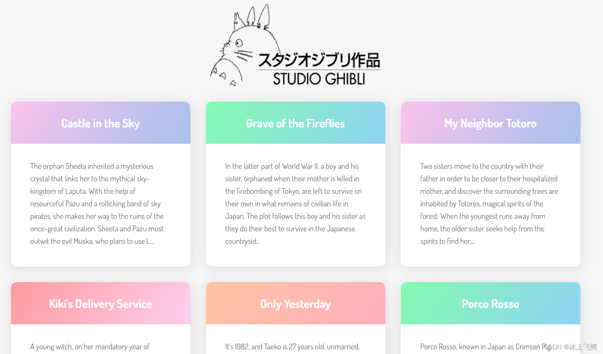

# 前言

## 译者述

1、原文来自 [Tania Rascia](https://www.taniarascia.com/) 个人网站上的一篇文章：[How to Connect to an API with JavaScript](https://www.taniarascia.com/how-to-connect-to-an-api-with-javascript/)。

2、这是一篇较易的入门介绍文章，发布于 2017 年 12 月 7 日。

3、翻译中会尽量遵照原意，也会加入译者的技术注释，以及选择更符合汉语文法的译句。

---

## 作者述

众所周知啊，使用 JavaScript 的大部分工作都是调用 API 。作为一个菜鸡，你可能被告知：多用用 API 就能知道用法了。如果你看到 API 的文档，但仍举手无措，那么这篇文章正好适合你。

我们将使用纯粹的 javaScript 编写一个非常简单的 web app，它从 API 中检索信息并在页面上展示。不需要服务端、依赖、构建工具或者其他复杂的内容。

- [在线示例](https://taniarascia.github.io/sandbox/ghibli/)
- [GitHub 源码](https://github.com/taniarascia/sandbox/tree/master/ghibli)

## 预备知识

- 基本了解 [HTML 和 CSS](https://www.internetingishard.com/html-and-css/)
- 基本了解 [JS 语法和数据类型](https://www.sitepoint.com/beginners-guide-javascript-variables-and-datatypes/)
- 基本了解 [JSON 和 JS 对象](https://www.taniarascia.com/how-to-use-json-data-with-php-or-javascript/) 工作原理（这篇链接的文章有完全的介绍）

其他知识下文会提及。

## 本文目标

我们将从头开始编写[这个](https://taniarascia.github.io/sandbox/ghibli/)链接到[吉卜力工作室 API ](https://ghibliapi.herokuapp.com/)的应用，检索数据并在网站前端展示。这并不意味着需要用到 APIs 或 REST 的大量资源——只需要最少可用的数据来构建应用即可。我们将会学到：

- 什么是 API 。
- 学会使用 JavaScript 发出 HTTP GET 请求。
- 学会使用 JavaScript 创建一个用于展示的 HTML 元素。

表现的效果如图所示：


下面就开始了。

# 快速浏览

API 全称为 Application Program Interface，可以定义为：各种软件组件之间的一组通信方法。换句话说，一个 API 允许一个软件和另一个软件通信。

我们将特别关注 Web API，它能允许 Web 服务器与第三方软件交互。在这种情况下，Web 服务器使用 HTTP 请求与包含 JSON 数据的公开可用 URL 端点通信。如果现在对此感到困惑，那么读完本文就会明白了。

你可能很熟悉 CRUD app 的概念，它代表 Create、Read、Update、Delete（创建、读取、更新、删除）。任何编程语言都可以用各种方法来实现 CRUD app。一个 Web API 使用的 HTTP 请求对应着 CRUD 的动词。
Action| HTTP Method |Description
:--|:--|:--
Create|POST|Creates a new resource
Read|GET|Retrieves a resource
Update|PUT/PATCH|Updates an existing resource
Delete|DELETE|Deletes a resource

> 假如你听说过 REST 和 REST 风格 API，它其实只是指一组遵循特定的架构风格的标准。大多数 web 应用都是这样，或者以符合 REST 标准为目标。总而言之，有很多术语、缩写、概念需要理解：HTTP、API、REST，所以感到困惑和受挫是正常的，特别是当 API 文档默认你已经知道这些知识的时候。

# 配置

我们的目标是什么？得到所有吉卜力工作室电影的数据，然后在网格中展示标题和描述信息。这里有个背景知识，吉卜力工作室是一家日本动画工作室，制作了几部电影，例如《千与千寻》——我的朋友克雷格启发我用它作为例子。

我们将从在新目录中创建 index.html 文件开始。项目最后只会包含 index.html 、 style.css 和 scripts.js 。这个 HTML 结构只是链接到 CSS 和 JavaScript 文件，加载字体、包含一个 id="root" 的 div 元素。它是完整的，不用再更改。我们将使用 JavaScript 添加所有要出现的内容。

```html
<!DOCTYPE html>
<html lang="en">
  <head>
    <meta charset="utf-8" />
    <meta name="viewport" content="width=device-width, initial-scale=1.0" />

    <title>Ghibli App</title>

    <link
      href="https://fonts.googleapis.com/css?family=Dosis:400,700"
      rel="stylesheet"
    />
    <link href="style.css" rel="stylesheet" />
  </head>

  <body>
    <div id="root"></div>
    <script src="scripts.js"></script>
  </body>
</html>
```

由于本文关注的是 APIs 和 JavaScript 的概念，所以我不会解释 CSS 的工作原理。我们将新建一个 style.css 来创建网格。为了简洁处理，我只在下面列出了最相关的 CSS 结构，但你可以在[这里复制完整的 CSS 代码](https://raw.githubusercontent.com/taniarascia/sandbox/master/ghibli/style.css)。

```css
#root {
  max-width: 1200px;
  margin: 0 auto;
}

.container {
  display: flex;
  flex-wrap: wrap;
}

.card {
  margin: 1rem;
  border: 1px solid gray;
}

@media screen and (min-width: 600px) {
  .card {
    flex: 1 1 calc(50% - 2rem);
  }
}

@media screen and (min-width: 900px) {
  .card {
    flex: 1 1 calc(33% - 2rem);
  }
}
```

现在我们已经配置了 HTML 和 CSS，然后你可以创建 scripts.js，我们将从那一步继续。

# 连接 API

先来看看[吉卜力工作室 API 文档](https://ghibliapi.herokuapp.com/)，他可以帮助开发人员了解怎样使用 HTTP 请求进行资源交互，这对我们来说是非常有帮助的。由于 API 可以通过许多不同的方法访问—— JavaScript, PHP, Ruby, Python 等等 —— 大多数 API 的文档往往不会给出如何连接的具体说明。

从文档中得知，我们可以通过 curl 和常规 REST 调用发出请求，只是目前可能还不理解怎么操作。

## 获得 API 端点

首先，让我们转到[电影部分](https://ghibliapi.herokuapp.com/#tag/Films)。在右边你能看到 GET /films，它会展示 API 端点的 url，[https://ghibliapi.herokuapp.com/films](https://ghibliapi.herokuapp.com/films)。点击该链接将显示一个 JSON 格式的对象数组。

> 如果你的浏览器上没有用于查看 JSON 文件的扩展，那么现在就添加一个，例如 [JSON View](https://chrome.google.com/webstore/category/extensions?hl=en)。这将使读取 JSON 变得非常非常容易。请记住，如果你从未使用过 JSON，先阅读[这篇必备的文章](https://www.taniarascia.com/how-to-use-json-data-with-php-or-javascript/)。

## 通过 HTTP 请求检索数据

在数据放到网站前端之前，先打开一个 API 连接。我们使用 XMLHttpRequest 对象，它可以打开文件、创建 HTTP 请求。

创建一个 request 并分配一个 XMLHttpRequest 对象给它。然后用 open() 方法打开一个新的连接，其中的参数需要指定请求类型为 GET，以及设置 API 端的 URL。请求完成后，我们可以访问 onload 函数中的数据。做完这些后，就可以发送请求了。

```js
// 创建一个 request 并分配一个 XMLHttpRequest 对象给它
var request = new XMLHttpRequest();

// 用 open() 方法打开一个新的连接，其中的参数需要指定请求类型为 GET，以及设置 API 端的 URL
request.open("GET", "https://ghibliapi.herokuapp.com/films", true);

request.onload = function () {
  // 访问 onload 函数中的数据
};

// 发送请求
request.send();
```

此外，也可以使用 fetch API 和 async/await 来实现。

```js
function getData() {
  const response = await fetch('https://ghibliapi.herokuapp.com/films')
  const data = await response.json()
}
```

## 处理 JSON 响应

现在我们接收到了从 HTTP 请求返回的响应，然后就可以处理它了。但是，响应是 JSON 格式的，我们需要将 JSON 转换为 JavaScript 对象才能使用。

使用 JSON.parse() 来序列化响应，然后创建 data 变量 —— JavaScript 数组对象，包含全部 JSON。再使用 forEach() 打印出全部的电影标题，验证处理操作的正确性。

```js
// 使用 JSON.parse() 来序列化响应
var data = JSON.parse(this.response);

data.forEach((movie) => {
  // 打印出全部的电影标题
  console.log(movie.title);
});
```

查看控制台，可以看到 20 条电影数据，这说明成功了。

还有一件事：缺少一些错误处理的方法。如果使用了错误的 URL，或者资源本身有问题，导致没有显示任何内容，该怎么办？当发出 HTTP 请求时，返回响应中会带有 [HTTP 状态码](https://developer.mozilla.org/en-US/docs/Web/HTTP/Status)。“404”是最常见的响应，表示资源未找到，“200 OK” 是表示请求成功。

让我们将代码包装在 if 语句中，对 [200,399) 范围内的任何响应进行处理，并在请求失败时打印错误。你可以把 URL 弄乱测试看看。

```js
// 开始访问 JSON 数据
var data = JSON.parse(this.response);

if (request.status >= 200 && request.status < 400) {
  data.forEach((movie) => {
    console.log(movie.title);
  });
} else {
  console.log("error");
}
```

下面是到目前为止的全部代码，scripts.js 文件。

```js
var request = new XMLHttpRequest();

request.open("GET", "https://ghibliapi.herokuapp.com/films", true);
request.onload = function () {
  // Begin accessing JSON data here
  var data = JSON.parse(this.response);

  if (request.status >= 200 && request.status < 400) {
    data.forEach((movie) => {
      console.log(movie.title);
    });
  } else {
    console.log("error");
  }
};

request.send();
```

我们已经成功地使用 GET HTTP 请求来检索(或使用) API 端点，该 API 端点由 JSON 格式的数据组成。但是，我们仍然停留在控制台上——想要在网站的前端显示这些数据，需要通过修改 DOM 来实现。

# 展示数据

为了在网站前端展示信息，我们将使用 DOM，它实际上是一种 API，允许 JavaScript 与 HTML 通信。如果你没有用过 DOM，我为 DigitalOcean 写了[《用 JavaScript 理解和修改 DOM 》](https://www.digitalocean.com/community/tutorials/introduction-to-the-dom)，阐明了 DOM 是什么以及 DOM 与 HTML 源代码的区别。

> (译者补充：DigitalOcean 是一家成立于 2012 年的总部设置在纽约的云主机商家。)

最后，我们的页面将包含一个 logo 和多个卡片——每张卡片是一部电影，有一个标题和一个段落，包含了电影名称和简介。下面是它的样子，只加载了必要的 CSS:

还记得吗？我们的 index.html 现在只有一个 root div —— < div id="root" / >，用 getElementById() 来访问它。我们现在可以简单地删除之前编写的所有代码，稍后将重新添加这些代码。

```js
const app = document.getElementById("root");
```

如果你不是 100%确定 getElementById() 做了什么，在上面的代码中打印 app: console.log(app)，有助于理解过程中发生的事情。网站首要的是 logo，这是一个 img 元素。我们将使用 createElement() 创建图像元素。

```js
const logo = document.createElement("img");
```

一个空的 img 没什么用，所以我们用 src 属性设置图片。

```js
logo.src = "logo.png";
```

我们将创建另一个 div 元素并将其 class 属性设置为 container。

```js
const container = document.createElement("div");
container.setAttribute("class", "container");
```

现在我们有了一个 img 和一个 div，我们只需要把它们放在网站上。我们将使用 appendChild() 方法将 logo img 和容器 div 附加到 app root。

```js
app.appendChild(logo);
app.appendChild(container);
```

下面是完整的代码：

```js
const app = document.getElementById("root");

const logo = document.createElement("img");
logo.src = "logo.png";

const container = document.createElement("div");
container.setAttribute("class", "container");

app.appendChild(logo);
app.appendChild(container);
```

保存后，在网站的前端，你会看到以下内容。

```html
<div id="root">
  
  <div class="container"></div>
</div>
```

这是 Elements 中显示的，而不是在 HTML 源代码中存在——正如我链接的 DOM 文章中所解释的那样。
现在我们要把之前的代码粘贴回去。最后要根据之前控制台打印出来的东西创建卡片元素。
虽然粘贴全部代码，但是我们只关注 forEach() 中的内容。

```js
data.forEach((movie) => {
  console.log(movie.title);
  console.log(movie.description);
});
```

我们使用 textContent 将 API 返回数据中的文本设置到 HTML 元素中。为了保持卡片元素宽度一致，我们使用 substring() 来限制 p 元素中的段落长度。

```js
data.forEach((movie) => {
  // Create a div with a card class
  const card = document.createElement("div");
  card.setAttribute("class", "card");

  // Create an h1 and set the text content to the film's title
  const h1 = document.createElement("h1");
  h1.textContent = movie.title;

  // Create a p and set the text content to the film's description
  const p = document.createElement("p");
  movie.description = movie.description.substring(0, 300); // Limit to 300 chars
  p.textContent = `${movie.description}...`; // End with an ellipses

  // Append the cards to the container element
  container.appendChild(card);

  // Each card will contain an h1 and a p
  card.appendChild(h1);
  card.appendChild(p);
});
```

同理，前端 error 打印部分也将被替换为 marquee 元素！（我这样做只是为了好玩和演示，不要在任何实际应用中使用 marquee，也不要把我的话当真。）

```js
const errorMessage = document.createElement("marquee");
errorMessage.textContent = `Gah, it's not working!`;
app.appendChild(errorMessage);
```

我们做完了!下面是最终的 scripts.js 代码。

```js
const app = document.getElementById("root");

const logo = document.createElement("img");
logo.src = "logo.png";

const container = document.createElement("div");
container.setAttribute("class", "container");

app.appendChild(logo);
app.appendChild(container);

var request = new XMLHttpRequest();
request.open("GET", "https://ghibliapi.herokuapp.com/films", true);
request.onload = function () {
  // Begin accessing JSON data here
  var data = JSON.parse(this.response);
  if (request.status >= 200 && request.status < 400) {
    data.forEach((movie) => {
      const card = document.createElement("div");
      card.setAttribute("class", "card");

      const h1 = document.createElement("h1");
      h1.textContent = movie.title;

      const p = document.createElement("p");
      movie.description = movie.description.substring(0, 300);
      p.textContent = `${movie.description}...`;

      container.appendChild(card);
      card.appendChild(h1);
      card.appendChild(p);
    });
  } else {
    const errorMessage = document.createElement("marquee");
    errorMessage.textContent = `Gah, it's not working!`;
    app.appendChild(errorMessage);
  }
};

request.send();
```

之后使用完整的 CSS 样式，这里是最终产品的样子。

同样，这里有链接可以查看在线 app 和源代码。

- [查看在线实例](https://taniarascia.github.io/sandbox/ghibli/)
- [源代码](https://github.com/taniarascia/sandbox/tree/master/ghibli)

# 总结

恭喜，你使用纯 JavaScript 通过 HTTP 请求连接到 API。希望你能够更好地理解什么是 API 端点，浏览器如何通过请求和响应与第三方 API 数据通信，如何将 JSON 解析为 JavaScript 能够理解的数组和对象，以及如何只用 JavaScript 构建前端。

我们做到了这一切，而不用担心 Node.js、npm、Webpack、React、Angular、构建工具、jQuery、Axios 和其他流行的开发术语、依赖项和框架，这些东西可能会让你对最简单的形式下发生的事情感到困惑。

我希望这篇文章对你有用，也欢迎分享。
