# 一、基础理论

## （一）基本概念

1、Natural Language(**自然语言**)
2、Artificial Language(**人工语言**)
3、Natural Language Processing(**自然语言处理**)：
从应用系统实现和语言工程的角度开展语言信息处理方法的研究。
4、专门针对中文的语言信息技术研究称为**中文信息处理**。
5、Computation linguistic(**计算语言学**)：
侧重于计算方法和语言学理论方面的研究。
6、BioNLP(Biomedical NLP,**生物医学文本挖掘**)

## （二）NLP 的行业应用

1、Spell and Grammar Checking
其一：Checking spelling and grammar.
其二：Suggesting alternatives(替代选择) for the errors.

2、Word Prediction
Predicting the next word that is highly probable to be typed(输入) by the user.

3、Information Retrieval(检索)
Finding relevant information to the user’s query.

4、Text Categorization(分类)
Assigning(分配) one (or more) pre-defined category to a text.

5、Summarization(摘要)
Generating(生成) a short summary from one or more documents, sometimes based on a given query.

6.Question answering

7.Information Extraction(提取)
Extracting important concepts(概念) from texts and assigning them to slot(位置) in a certain template(模板); named-entity recognition.

8.Machine Translation
Translating a text from one language to another.

9.Sentiment Analysis

10.Speech recognition
Recognizing a spoken language and transforming it into a text.

11.Speech synthesis( synthesis)

12.Spoken dialog(对话框) systems

## （三）NLP 基础技术/研究内容

1、层次划分
2、Part-of-speech(词性) tagging
3、Syntatic Parsing(解析)
4、Dependency(依赖) Parsing
5、Named-entity recognition
6、Word sense disambiguation(消歧)
7、Semantic(语义) role labeling

## （四）NLP 的语言学知识

NLP 结合了现代语音学/音系学、词法学、句法学、语义学、语用学的知识。

**词法学(Morphology)**
研究词(word) 由有意义的基本单位－词素(morphemes) 的构成问题。

**句法学(Syntax)**
研究句子结构成分之间的相互关系和组成句子序列的规则。

**语义学(Semantics)**
研究如何从一个语句中词的意义，以及这些词在该语句中句法结构中的作用来推导出该语句的意义。

**语用学(Pragmatics)**
研究通过语言达到目标，以及上下文对语义理解所产生的影响。

## （五）NLP 的困难和挑战

**歧义现象**

1、词法歧义：词素组合成词产生歧义
词素：词根、前缀、后缀、词尾
2、词法歧义(词性歧义)
3、句法歧义(结构歧义)
词(或短语)的组合导致的歧义
4、句法歧义(结构歧义)
5、语义歧义
6、语用层面(Discourse analysis) 和语境、上下文有关

**未知语言现象**
1、新词、人名、地名、术语等
2、旧词新意
3、新用法新句型

## （六）NLP 研究方法

~~一般技术线路~~
1、基于规则的方法
~~实际技术路线~~
2、基于统计的方法

# 二、NDarrays

优点：速度快！

## （一）numpy 语句

**numpy.array()**
直接对应运算，例如哈达吗积。
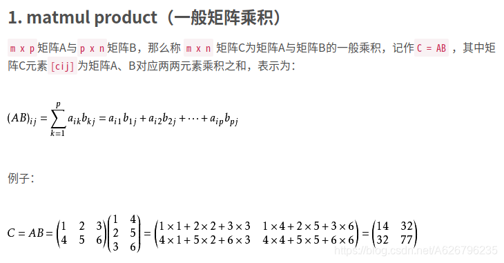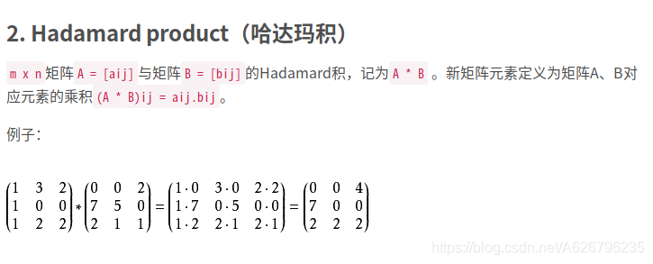**numpy.dot()**
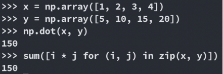
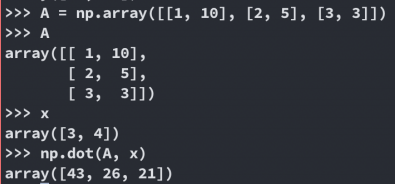
**np.matmul()**
(暂时没发现有什么用)
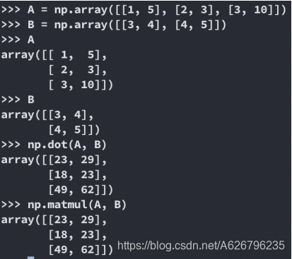

## （二）Broadcasting

**一般规则**
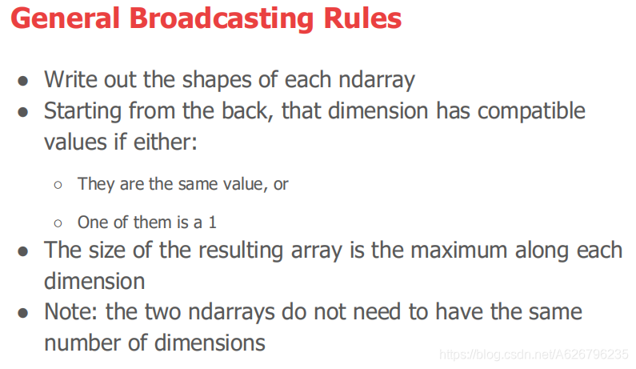数组+数字
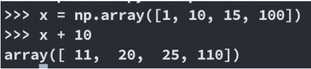
二维数组+一维数组

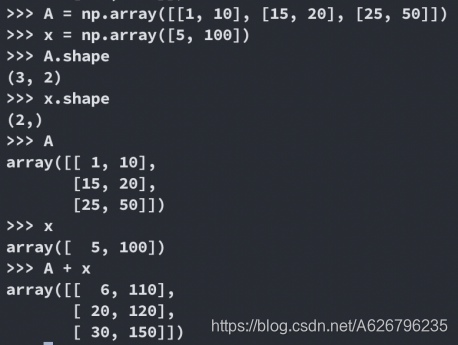

## （三）Mathematical Functions

维度合并
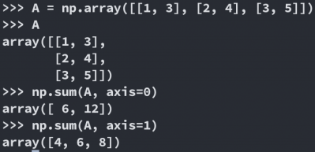

## （四）最常用法合集

**scipy.linalg.inv**
Inverse of matrix (numpy as equivalent)
矩阵的逆(与 numpy 等价)

**scipy.linalg.ei**
Get eigen value (Read documentation on eigh and numpy equivalent)
获取特征值(阅读等效 eigh 和 numpy 的文档)

**scipy.spatial.distance**
Compute pairwise distance
计算两两距离

**np.matmul**
Matrix multiply
矩阵相乘

**np.zeros**
Create a matrix filled with zeros (Read on np.ones)
创建一个满是 0 的矩阵(读 np.ones)

**np.arange**
Start, stop, step size (Read on np.linspace)
启动、停止、步长(在 np.linspace 上阅读)

**np.identity**
Create an identity matrix
创建一个单位矩阵

**np.vstack**
Vertically stack 2 arrays (Read on np.hstack)
垂直堆栈 2 个数组(在 np.hstack 上读取)

**array.shape**
Get shape of numpy array
获取 numpy 数组的形状

**array.dtype**
Check data type of array (for precision, for weird behavior)
检查数组的数据类型(为了精确，为了古怪的行为)

**type(stuff)**
Get type of a variable
获取变量的类型

**import pdb; pdb.set_trace()**
Set a breakpoint (https://docs.python.org/3/library/pdb.html)
设置一个断点

**print(f’My name is {name}’)**
Easy way to construct a message
构造消息的简单方法
f = "韩梅梅"
print(f'My name is {f}')

~~Python scripting in the terminal is great for this!~~

# 三、隐马尔科夫模型

## （一）Markov 模型

存在一类重要的随机过程
一个系统有 N 个 状态 S1, S2,…, SN，随着**时间**的推移，该系统从某一**状态**转移到另一状态。

如果用 𝑞𝑡 表示系统在时间 t 的**状态变量**，那么，t 时刻的**状态取值**为 𝑆𝑗(1 ≤ 𝑗 ≤ 𝑁)的概率取决于前 t-1 个时刻 (1, 2, …, t-1) 的状态，该概率为：
𝑝(𝑞𝑡 = 𝑆𝑗|𝑞𝑡−1 = 𝑆𝑖, 𝑞𝑡−2 = 𝑆𝑘, …)

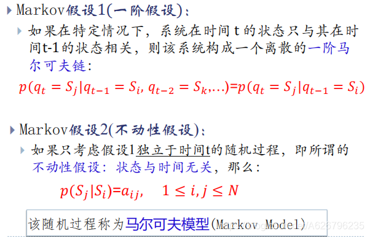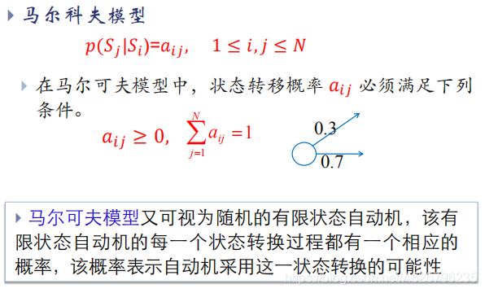根据 makov 模型(满足两个假设)
状态序列 S1, …, ST 的概率(乘法公式)：
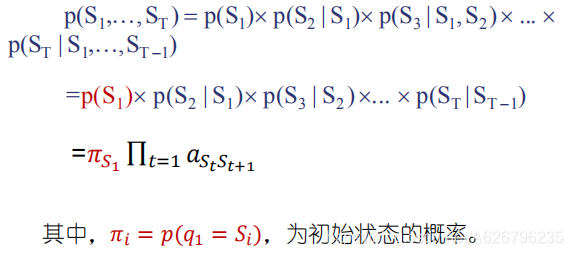这样就可以判断某个序列出现的概率了。

## （二）隐马尔科夫模型

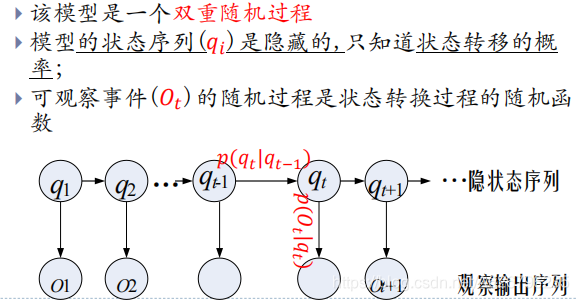**HMM 三(五)要素**
在一个岛上，这里没有天气预报(隐藏状态)，只有一片片的海藻(观察状态)。
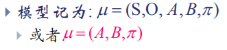S：隐藏状态集合。
O：观察状态集合。
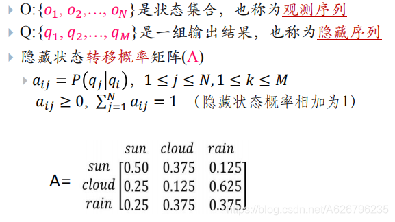
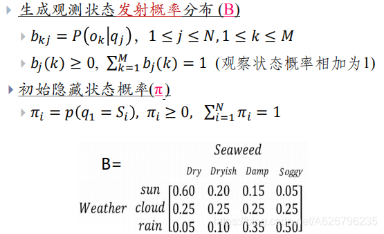

## （三）HMM 的三个问题和相应算法

1、评估：
根据已知的 HMM 找出一个观察序列的概率 。
解决：前向算法，后向算法。

2、解码：
根据观察序列 O 找到最可能的隐藏序列 Q。
解决：Viterbi 算法。

3、参数估计/学习：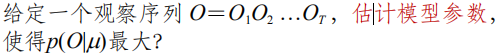
解决：Baum-Welch 算法。

# 四、词法分析(Lexical)-分词&PoS

## （一）词法分析概述

**词**是自然语言中能够独立运用的最小单位， 是自然语言处理的基本单位。
**自动词法分析**就是利用计算机对自然语言的形态(morphology) 进行分析，判断词的结构和类别等。
**词性或称词类(Part-of-Speech, PoS**)是词汇最重要的特性，是连接词汇到句法的桥梁。

**句法研究**的是句子的结构，以词为单位。
**词法研究**的是词的结构，以词素为单位。

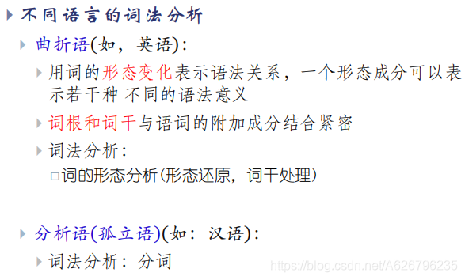

## （二）英语词法分析

1.单词识别 2.形态还原
a.规律变化词还原
b.不规则词形态还原
c.数字形态还原
d.合成词的形态还原

## （三）汉语分词

**问题**： 1.规范性问题 2.分词歧义问题
1）交集型歧义：词的交叉组合产生 2) 组合型歧义：覆盖歧义，多义歧义 3) 混合型歧义 3.未登录词的识别

**方法**： 1.基于词典（字符串匹配）的分词方法
1）最大匹配
正向最大匹配算法 (Forward MM, FMM)
逆向最大匹配算法 (Backward MM, BMM)
双向最大匹配算法 (Bi-directional MM)
2）最小匹配 2.基于统计的方法
LM, HMM, CRF 3.基于规则
需要领域专家来定义规则。

## （四）词性标注

**词性标注**
词性(part-of-speech, POS)标注(tagging)
主要任务是消除词性兼类歧义。
**词性兼类**
在任何一种自然语言中，词性兼类问题都普遍存在。
