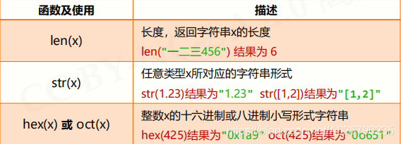
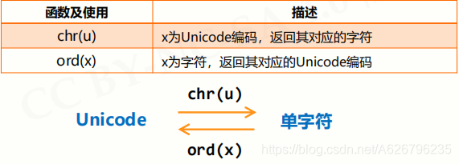
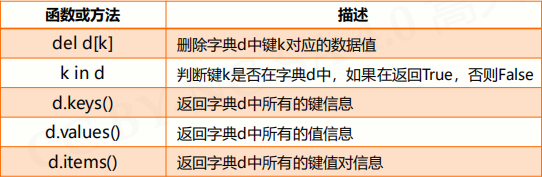
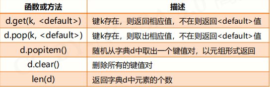
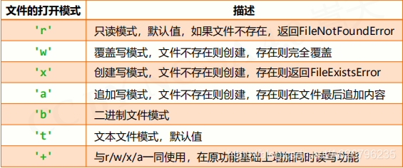

# 前言随笔

2019/5/29/20:25 1.做垃圾邮件分类，老师推荐语言是 Python, 因为书写简单。我们就决定先找资料学会 Python 基本语法，然后学习相关库使用，这里结合学习算法思想，最后综合起来，贯通知识。 2.预期最后效果，小组每人都能独立完成分类器设计与实现。三人分别用三种模型训练，比较效果，有能力改进最好。 3.学习步骤，一，Python 基本语法学习。学习资料目前有：中国大学 mooc《Python 语言程序设计》北京理工大学。

2019/7/6
经过昨天的努力，找到了路径去完成，我原计划明天出结果来着，老师要求今天就出结果，啊，想想就好累。

2022/7/28
当时做完之后好累的，然后文章就没有更新了。
关于数据集、算法、模型和评价报告，资料都保留了的，以后有机会做个机器学习的入门教程吧。
本文标题也从“综合实训--垃圾邮件分类”改为“Python 基本语法”了。

# Python 语言学习笔记

## Python 基础认识

==编译==：
将源代码一次性转换成目标代码的过程；
一次性翻译，之后不再需要源代码（类似英文翻译）。
==解释==：
将源代码逐条转换成目标代码同时逐条运行的过程；
每次程序运行时随翻译随执行（类似实时的同声传译）。

执行编译过程的程序叫作==编译器==。
执行解释过程的程序叫作==解释器==。

==静态语言==：使用编译执行的编程语言
C/C++语言、Java 语言
优势：编译器一次性生成目标代码，优化更充分，程序运行速度更快。
==脚本语言==：使用解释执行的编程语言
_Python 语言_、JavaScript 语言、PHP 语言
优势：执行程序时需要源代码，维护更灵活；源代码可以跨多个操作系统平台运行。

Python 的两种编程方式
==交互式==：对每个输入语句即时运行结果，适合语法练习
==文件式==：批量执行一组语句并运行结果，编程的主要方式

## Python 语法元素概述

**程序的格式框架**
==缩进==
类似 C 语言中的{}作用，表示一个代码块。
人为约定（或规定）缩进格式，一般为一个 Tab。
==注释==
单行注释：以#开头，其后内容为注释。
多行注释：以'''(三个单引号)开头和结尾。
**命名与保留字**
变量采用标识符(名字) 来表示，关联标识符的过程叫==命名==。
命名规则与 C 语言类似，但是不用定义，直接用。
==保留字==：类似 C 语言中的关键字。
（红色表示更有深度）

**数据类型**
数据类型：字符串、整数、浮点数、列表。
**语句与函数**
赋值语句 分支语句 函数
**Python 程序的输入输出**
==输入函数 input()==使用格式：<变量> = input(<提示信息字符串>)
==输出函数 print()==：以字符形式向控制台输出结果的函数。
==评估函数 eval()==：去掉参数最外侧引号并执行余下语句的函数。

## Python 数值数据类型

**整数类型** 1.可正可负，没有取值范围限制；
2.pow(x,y)函数：计算 x^y^，想算多大算多大。

**浮点数类型** 1.浮点数间运算存在不确定尾数，不是 bug； 2.取值范围数量级约-10307 至 10308，精度数量级 10-16。 3.科学计数法 <a\>e<b\> 表示 a\*10^b^
4.round(x, d)：对 x 四舍五入，d 是小数截取位数。

**复数类型**
……

**数值运算操作符**

增强操作符及使用
用 x op= y 来代替 x = x op y ；可以少写一个 x 。

**数值运算函数**
==abs(x)==
绝对值，x 的绝对值；
==divmod(x,y)==
商余，(x//y, x%y)，同时输出商和余数；
==pow(x, y[, z])==
幂余，(x\*\*y)%z，[..]表示参数 z 可省略
==round(x[, d])==
四舍五入，d 是保留小数位数，默认值为 0；
==max(x1,x2, … ,xn)==
最大值，返回 x1,x2, … ,xn 中的最大值，n 不限
==min(x1,x2, … ,xn)==
最大值，返回 x1,x2, … ,xn 中的最小值，n 不限
==int(x)==
将 x 变成整数，舍弃小数部分
==float(x)==
将 x 变成浮点数，增加小数部分
==complex(x)==
将 x 变成复数，增加虚数部分

**关系**
三种类型存在一种逐渐"扩展"或"变宽"的关系：
整数 ---> 浮点数 ---> 复数

## Python 字符串数据类型

==字符串==
由 0 个或多个字符组成的有序字符序列。

**字符串表示方法**：
由一对单引号或双引号表示，仅表示单行字符串；
由一对三单引号或三双引号表示，可表示多行字符串。

**字符串序号**
正向递增序号
0，1，2，3，，，N
反向递减序号 -（N+1），，，-4，-3，-2，-1

**字符串使用**
索引：返回字符串中单个字符 <字符串>[M]
切片：返回字符串中一段字符子串 <字符串>[M: N]
高级：
<字符串>[M: N]，M 缺失表示至开头，N 缺失表示至结尾；
<字符串>[M: N: K]，根据步长 K 对字符串切片。

**字符串的特殊字符**
转义符 \

**字符串操作符**

**字符串处理函数**


**字符串处理方法**

**字符串类型的格式化**
<模板字符串>.format(<逗号分隔的参数>)

槽的概念：（镶嵌对应内容）

更精确的控制：


## Python 控制结构

==顺序结构==

==分支结构==

- 单分支结构
  if <条件> : <语句块>
- 二分支结构
  一般形式
  if <条件> : <语句块 1>
  else :<语句块 2>
  紧凑形式
  <表达式 1> if <条件> else <表达式 2>
- 多分支结构
  if <条件 1> : <语句块 1>
  elif <条件 2> : <语句块 2>
  ……
  else :<语句块 N>
- 条件判断及组合
  条件判断
  小于，小于等于，大于等于，大于，等于，不等于。
  条件组合
  逻辑与，逻辑或，逻辑非。and,or,not.
- 程序的异常处理

try :<语句块 1>
except : <语句块 2>

try :<语句块 1>
except <异常类型> : <语句块 2>
（只响应对应类型异常）

try :
<语句块 1>
except :
<语句块 2>
else :
<语句块 3>
finally :
<语句块 4>
（ finally 对应语句块 4 一定执行）
（else 对应语句块 3 在不发生异常时执行）

==循环结构==

- 遍历循环

for <循环变量> in <遍历结构> : <语句块>
（每次循环，所获得元素放入循环变量，并执行一次语句块）

for i in range(N) : <语句块>
（遍历由 range()函数产生的数字序列，产生循环）

for i in range(M,N,K) : <语句块>
（M，N 是截取始尾，K 是截取步长。）

应用：
计数循环(N 次)
计数循环(特定次)
字符串遍历循环
列表遍历循环
文件遍历循环
等等

- 无限循环
  while <条件> : <语句块>

- 循环控制保留字
  ==break==跳出并结束当前整个循环，执行循环后的语句
  ==continue==结束当次循环，继续执行后续次数循环
- 循环的高级用法
  ==循环与 else==
  当循环没有被 break 语句退出时，执行 else 语句块
  else 语句块作为"正常"完成循环的奖励
  这里 else 的用法与异常处理中 else 用法相似

## Python 函数使用

- 函数的理解与==定义==

def <函数名>(<参数(0 个或多个)>) :
<函数体>
return <返回值>
（函数定义时，所指定的参数是一种占位符）

- 函数的==参数传递==

def <函数名>() : <函数体>
return <返回值>
（函数可以有参数，也可以没有，但必须保留括号）

def <函数名>(<非可选参数>, <可选参数>) : <函数体>
return <返回值>
（函数定义时可以为某些参数指定默认值，构成可选参数）

def <函数名>(<参数>, \*b ) : <函数体>
return <返回值>
（函数定义时可以设计可变数量参数，既不确定参数总数量）

def fact(n, m) :
fact( 10,5 )
fact( m=5,n=10 )
（函数调用时，参数可以按照位置或名称方式传递）

- 函数的==返回值==

函数可以有返回值，也可以没有，可以有 return，也可以没有；
return 可以传递 0 个返回值，也可以传递任意多个返回值。（元组类型。）

- 局部变量和全局变量
  可以使用 global 保留字在函数内部使用全局变量；
  局部变量为组合数据类型且未创建，等同于全局变量；

- ==lambda 函数==
  <函数名> = lambda <参数>: <表达式>
  lambda 函数是一种匿名函数，即没有名字的函数；
  使用 lambda 保留字定义，函数名是返回结果；
  lambda 函数用于定义简单的、能够在一行内表示的函数。

## Python 组合数据类型

**集合类型及操作**

- 集合类型定义
  集合用大括号 {} 表示，元素间用逗号分隔
  建立集合类型用 {} 或 set()
  建立空集合类型，必须使用 set()
- 集合操作符
  
- 集合处理方法
  
  
- 集合类型应用场景
  包含关系比较
  数据去重：集合类型所有元素无重复

**序列类型及操作**

- 序列类型定义

序列是具有先后关系的一组元素
序列是一维元素向量，==元素类型可以不同==
类似数学元素序列： s0, s1, … , sn-1
元素间由序号引导，通过下标访问序列的特定元素

- 序列处理函数及方法
  
  

- 元组类型及操作

元组是一种序列类型，一旦创建就不能被修改
使用小括号 () 或 tuple() 创建，元素间用逗号 , 分隔
可以使用或不使用小括号
def func(): return 1,2

- 列表类型及操作

列表是一种序列类型，创建后可以随意被修改
使用方括号 [] 或 list() 创建，元素间用逗号 , 分隔
列表中各元素类型可以不同，无长度限制


- 序列类型应用场景
  数据表示：元组 和 列表

## Python 字典类型

- 字典类型定义

==映射==是一种键(索引)和值(数据)的对应
==键值对==：键是数据索引的扩展
字典是键值对的集合，键值对之间无序

采用大括号{}和 dict()创建，键值对用冒号: 表示
<字典变量> = {<键 1>:<值 1>, … , <键 n>:<值 n>}
<值> = <字典变量>[<键>]
<字典变量>[<键>] = <值>
[ ] 用来向字典变量中索引或增加元素

- 字典处理函数及方法
  
- 字典类型应用场景
  统计数据出现的次数，数据是键，次数是值。

## Python 文件使用

**文件的类型**
文件是数据的抽象和集合
文件展现形态：文本文件和二进制文件

==文本文件==
由单一特定编码组成的文件，如 UTF-8 编码
由于存在编码，也被看成是存储着的长字符串
适用于例如：.txt 文件、.py 文件等

==二进制文件==
直接由比特 0 和 1 组成，没有统一字符编码
一般存在二进制 0 和 1 的组织结构，即文件格式
适用于例如：.png 文件、.avi 文件等

**文件的打开和关闭**
文件处理的步骤: 打开-操作-关闭

<变量名> = open(<文件名>, <打开模式>)
<变量名>.close()

<变量名> ：文件句柄
<文件名> ：文件路径和名称（源文件同目录可省路径）
<打开模式> ：文本 or 二进制，读 or 写

**文件内容的读取**

```python
<f>.read(size=-1)
#读入全部内容，如果给出参数，读入前size长度
>>>s = f.read(2)

<f>.readline(size=-1)
#读入一行内容，如果给出参数，读入该行前size长度
>>>s = f.readline()

<f>.readlines(hint=-1)
#读入文件所有行，以每行为元素形成列表,如果给出参数，读入前hint行
>>>s = f.readlines()
```

**数据的文件写入**

```python
<f>.write(s)
#向文件写入一个字符串或字节流
>>>f.write("中国是一个伟大的国家!")

<f>.writelines(lines)
#将一个元素全为字符串的列表写入文件
>>>ls = ["中国", "法国", "美国"]
>>>f.writelines(ls)
#中国法国美国

<f>.seek(offset)
#改变当前文件操作指针的位置，offset含义如下：
#0 – 文件开头； 1 – 当前位置； 2 – 文件结尾
```

## 涉及到的一些第三方库

==jieba 库==
原理：

- 利用一个中文词库，确定中文字符之间的关联概率
- 中文字符间概率大的组成词组，形成分词结果
- 除了分词，用户还可以添加自定义的词组

jieba 分词的三种模式
精确模式、全模式、搜索引擎模式

- 精确模式：把文本精确的切分开，不存在冗余单词
- 全模式：把文本中所有可能的词语都扫描出来，有冗余
- 搜索引擎模式：在精确模式基础上，对长词再次切分

常用函数

```python
jieba.lcut(s)
#精确模式，返回一个列表类型的分词结果
>>>jieba.lcut("中国是一个伟大的国家")
['中国', '是', '一个', '伟大', '的', '国家']

jieba.lcut(s,cut_all=True)
#全模式，返回一个列表类型的分词结果，存在冗余
>>>jieba.lcut("中国是一个伟大的国家",cut_all=True)
['中国', '国是', '一个', '伟大', '的', '国家']

jieba.lcut_for_search(s)
#搜索引擎模式，返回一个列表类型的分词结果，存在冗余
>>>jieba.lcut_for_search(“中华人民共和国是伟大的")
['中华', '华人', '人民', '共和', '共和国', '中华人民共和国', '是', '伟大', '的']

jieba.add_word(w)
#向分词词典增加新词w
>>>jieba.add_word("蟒蛇语言")
```

# 基于 NB 算法的中文垃圾邮件分类

# 模型评估

混淆矩阵：
T/F(True/False)表示预测是否正确，P/N(Positive/Negative)表示 预测的 label 而不是实际的 label。
