# 前言

对了，事情的经过大概是这样的：

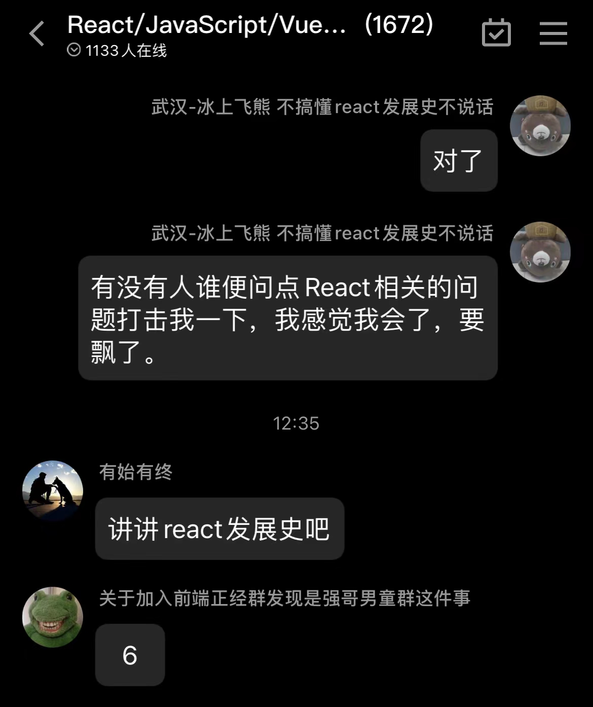

所以，为了能够继续 ~~水群~~ 助人为乐，需要整理一下 React 的发展史。

下面从年份版本、背景故事、特性需求来讲讲 React 是怎么走到今天的。

# React 编年史

最完整的历史，当然是在[源代码](https://github.com/facebook/react/)中查看提交记录，这里也有文档说明各个[释放版本](https://github.com/facebook/react/releases)的更新内容。

下面整理一个表格，列出年份和版本：

```
| 版本号                        | 版本更新时间   |
| ---------------------------- | ------------ |
| v0.3.0                       | Jul 03, 2013 |
| v0.3.3                       | Jul 03, 2013 |
| v0.4.0                       | Jul 20, 2013 |
| v0.4.1                       | Jul 30, 2013 |
| v0.5.0                       | Oct 20, 2013 |
| v0.5.1                       | Oct 30, 2013 |
| v0.4.2                       | Dec 20, 2013 |
| v0.5.2                       | Dec 20, 2013 |
| v0.8.0                       | Dec 20, 2013 |
| v0.9.0-rc1                   | Apr 19, 2015 |
| v0.9.0                       | Mar 05, 2014 |
| v0.10.0-rc1                  | Apr 19, 2015 |
| v0.10.0                      | Nov 21, 2014 |
| v0.11.0-rc1                  | Apr 19, 2015 |
| v0.11.0                      | Nov 21, 2014 |
| v0.11.1                      | Nov 21, 2014 |
| v0.11.2                      | Nov 21, 2014 |
| v0.12.0-rc1                  | Apr 19, 2015 |
| v0.12.0                      | Nov 21, 2014 |
| v0.12.1                      | Nov 21, 2014 |
| v0.12.2                      | Jan 06, 2015 |
| v0.13.0-rc1                  | Apr 19, 2015 |
| v0.13.0-rc2                  | Apr 19, 2015 |
| v0.13.0                      | Apr 19, 2015 |
| v0.13.1                      | Apr 19, 2015 |
| v0.13.2                      | Apr 19, 2015 |
| v0.13.3                      | Jun 18, 2015 |
| v0.14.0                      | Oct 09, 2015 |
| v0.14.1                      | Oct 29, 2015 |
| v0.14.2                      | Nov 03, 2015 |
| v0.14.3                      | Nov 25, 2015 |
| v0.14.4                      | Jan 07, 2016 |
| v0.14.5                      | Jan 07, 2016 |
| v0.14.6                      | Jan 07, 2016 |
| v0.14.7                      | Jan 29, 2016 |
| v0.14.8                      | Mar 30, 2016 |
| v15.0.0                      | Apr 09, 2016 |
| v15.0.1                      | Apr 09, 2016 |
| v15.0.2                      | Apr 30, 2016 |
| v15.1.0                      | May 21, 2016 |
| v15.2.0                      | Jul 02, 2016 |
| v15.2.1                      | Jul 09, 2016 |
| v15.3.0                      | Jul 30, 2016 |
| v15.3.1                      | Aug 20, 2016 |
| v15.3.2                      | Sep 20, 2016 |
| v15.4.0                      | Nov 16, 2016 |
| v15.4.1                      | Nov 23, 2016 |
| v15.4.2                      | Jan 07, 2017 |
| v15.5.0                      | Apr 08, 2017 |
| v15.5.1                      | May 02, 2017 |
| v15.5.2                      | May 02, 2017 |
| v15.5.3                      | May 02, 2017 |
| v15.5.4                      | May 02, 2017 |
| v15.6.0                      | Jun 14, 2017 |
| v15.6.1                      | Jun 15, 2017 |
| v15.6.2                      | Nov 15, 2017 |
| v16.0.0                      | Sep 27, 2017 |
| v16.1.0                      | Nov 09, 2017 |
| v16.1.1                      | Nov 14, 2017 |
| v16.2.0                      | Nov 29, 2017 |
| v16.3.0                      | Mar 30, 2018 |
| v16.3.1                      | Apr 04, 2018 |
| v16.3.2                      | Apr 16, 2018 |
| v16.4.0                      | May 24, 2018 |
| v16.4.1                      | Jun 14, 2018 |
| v16.4.2                      | Aug 02, 2018 |
| v16.5.0                      | Sep 07, 2018 |
| v16.5.1                      | Sep 14, 2018 |
| v16.5.2                      | Sep 19, 2018 |
| v16.6.0                      | Oct 24, 2018 |
| v16.6.1                      | Nov 07, 2018 |
| v16.6.3                      | Nov 14, 2018 |
| v16.7.0                      | Dec 20, 2018 |
| v16.8.0                      | Feb 06, 2019 |
| v16.8.1                      | Feb 09, 2019 |
| v16.8.2                      | Feb 15, 2019 |
| v16.8.3                      | Feb 22, 2019 |
| v16.8.4                      | Mar 06, 2019 |
| v16.8.5                      | Mar 23, 2019 |
| v16.8.6                      | Mar 28, 2019 |
| v16.9.0-alpha.0              | Apr 04, 2019 |
| v16.9.0-rc.0                 | Aug 06, 2019 |
| 16.9.0 (August 8, 2019)      | Aug 09, 2019 |
| 16.10.0 (September 27, 2019) | Sep 28, 2019 |
| 16.10.1 (September 28, 2019) | Sep 29, 2019 |
| 16.10.2 (October 3, 2019)    | Oct 04, 2019 |
| 16.11.0 (October 22, 2019)   | Oct 23, 2019 |
| 16.12.0 (November 14, 2019)  | Nov 15, 2019 |
| 16.13.0 (February 26, 2020)  | Feb 27, 2020 |
| 16.13.1 (March 19, 2020)     | Mar 20, 2020 |
| 0.14.10 (October 14, 2020)   | Oct 15, 2020 |
| 15.7.0 (October 14, 2020)    | Oct 15, 2020 |
| 16.14.0 (October 14, 2020)   | Oct 15, 2020 |
| 17.0.0 (October 20, 2020)    | Oct 21, 2020 |
| 17.0.1 (October 22, 2020)    | Mar 23, 2021 |
| 17.0.2 (March 22, 2021)      | Mar 23, 2021 |
| 18.0.0 (March 29, 2022)      | Mar 30, 2022 |
| 18.1.0 (April 26, 2022)      | Apr 27, 2022 |
| 18.2.0 (June 14, 2022)       | Jun 15, 2022 |
```

其中，某些版本需要特别注意，下文会指出。

## 背景故事

> 推荐两个视频，其一：[《The Story of React》](https://www.youtube.com/watch?v=Wm_xI7KntDs)，从宏观上描述了前端技术的发展变化过程，包括 React 的出现。（我觉得值得另写一篇 blog 了，或者补充在这里。）

> 其二：[《React 出现的历史背景及特性介绍》](https://www.youtube.com/watch?v=J-2buiB1uGQ)，大致介绍了 React 的出现解决的问题。

React 起源于 Facebook 的内部项目，于 2013 年 5 月开源，之后持续发展。

那么发生了什么事情呢？Facebook 干了啥？

### 问题的产生

一个小问题：为什么简单的功能也总是出现 BUG？即使 Facebook 的工程师也常遇到。

例如：显示未读消息。


当 BUG 被解决之后，一般人就认为结束了，但是 Facebook 的工程师会思考更多。

问题出现的根源是什么？两个原因：

- 传统 UI 操作关注太多细节。
- 应用程序状态分散在各处，难以追踪和维护。

### 第一个问题：传统 DOM API 关注了太多细节。

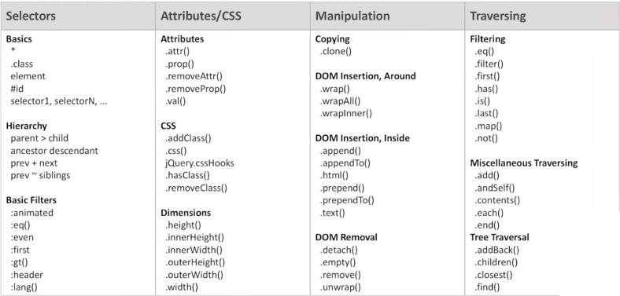

解决思路：React 始终整体“刷新”页面，无需关心细节。

```js
/** 情景：原始数据新增时 */
{text:'message1'}，
{text:'message2'}，
------------------
{text:'message3'}，
```

```js
/** 局部刷新 */
<ul>
  <li>message1</li>
  <li>message2</li>
</ul>
-------------------
// Append:
<li>message2</li>
```

```js
/** React 整体刷新 */
// 第一步：
{text:'message1'}，
{text:'message2'}，
{text:'message3'}，
// 第二步：
<ul>
  <li>message1</li>
  <li>message2</li>
  <li>message3</li>
</ul>
```

状态变化时， React 自动刷新，于是就不需要关心细节实现了，而只需要关心状态和最终 UI 。

### 第二个问题：数据模型如何解决？

传统的 MVC 模型，view 层和 model 层关系复杂。当应用程序变大之后，就难以扩展和维护了。

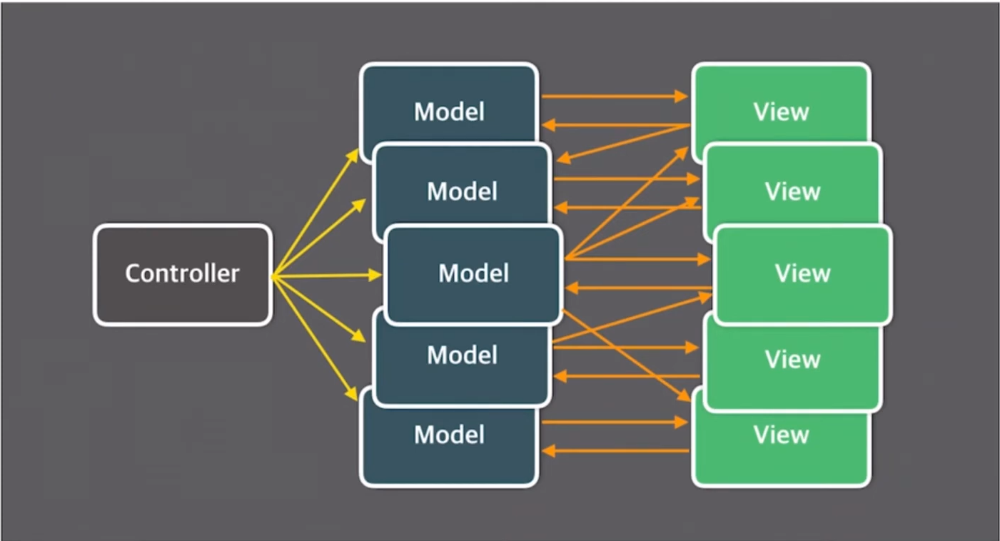

解决思路：Flux 架构——单线数据流，只关心状态。

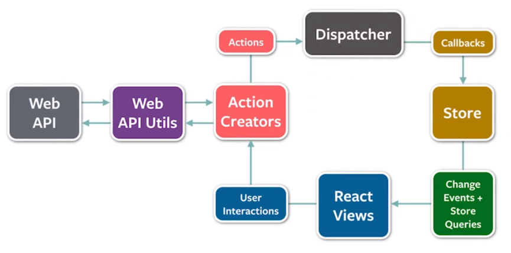

基于 Flux 出现的衍生项目：Redux、MobX ，都是优秀的状态管理框架。

## 著名版本

### React 14

当时 React 的版本号是 0.14.X，被称为 “React 14” 。

在 React 0.14 前，浏览器端实现对 jsx 的编译依赖 jsxtransformer.js 。

在 React 0.14 后，这个依赖的库改为 browser.js 。

同时，页面 script 标签的 type 也由 text/jsx 改为 text/babel 。

### React 15

Facebook 将 React 的版本号从 0.14 直接跳到 15 ，希望借此提升这个迅猛发展的项目的认可度。

React 15 架构可以分为两层：

- Reconciler（协调器）—— 负责找出变化的组件。
- Renderer（渲染器）—— 负责将变化的组件渲染到页面上。

特点：React 15 的更新流程是同步执行的，一旦开始更新直到页面渲染前都不能中断。

### React 16

React 16 架构可以分为三层：

- Scheduler（调度器）—— 负责调度任务的优先级，高优任务优先进入 Reconciler 。
- Reconciler（协调器）—— 负责找出需要更新的组件。
- Renderer（渲染器）—— 负责将需要更新的组件渲染到页面上。

新特性：

- Fiber：将原本的同步更新过程碎片化，避免主线程的长时间阻塞，使应用的渲染更加流畅。
- Hooks：解决状态逻辑复用问题——妙极了！（永远的神！）

### React 17

作为一个过渡版本，承上启下，作为渐进式框架的首版本，在后续的 18、19 等版本中会进行渐进升级而不是强制进行硬切换。

特点：启发式更新算法。

React16 的 expirationTimes 模型只能区分是否 >=expirationTimes 决定节点是否更新。

React17 的 lanes 模型可以选定一个更新区间，并且动态的向区间中增减优先级，可以处理更细粒度的更新。

### React 18

React 18 中的重大更改仅限于几个简单的 API 更改，以及对 React 中多个行为的稳定性和一致性的一些改进，比较重要的一点是，不再支持 IE 浏览器。

新特性：

- 客户端渲染 API：带有 createRoot() 的 root API，替换现有的 render() 函数，提供更好的人体工程学并启用新的并发渲染特性。
- 自动批处理：任何情况下都可以合并渲染，如果仍然希望 setState 之后立即重新渲染，只需要使用 flushSync 包裹，或者 async/awit 。
- 并发渲染器：允许并发渲染，即同时在后台准备多个版本的 UI，这意味着更好的性能和更平滑的状态转换。它提供了三个 API：startTransition()、useDeferredValue()、useTransition()。
- 服务端渲染：Suspense 可以运行在服务器端，Server Rendering 的性能不再受制于性能最差的组件。

# 前端技术发展史——React 的故事

对于没有经历过技术衍变（出生较晚或入行较晚）的人来说，入门时，摆在眼前的就是大量的新技术和新名词。

这常常使人感到疑惑：这玩意儿怎么冒出来的？

虽然只要学会运用最新的工具，就足以胜任工作了，但是笔者认为了解历史衍变是非常有必要的：

- 温故知新：新技术能取代旧技术，必然有其优点。相对的，那些旧技术的出现，也是因为比更早的技术有优势。
- 推陈出新：技术发展的规律是可以通过历史观察的，那么未来的新技术发展方向也是可以预测的。

下面让我们一起来看看，那过去的故事。

## 排名现状

先看看关于前端框架的一些统计数据。(数据来源：[stateofjs](https://2020.stateofjs.com/zh-Hans/technologies/front-end-frameworks/))

1、2022 年前端框架用户调查

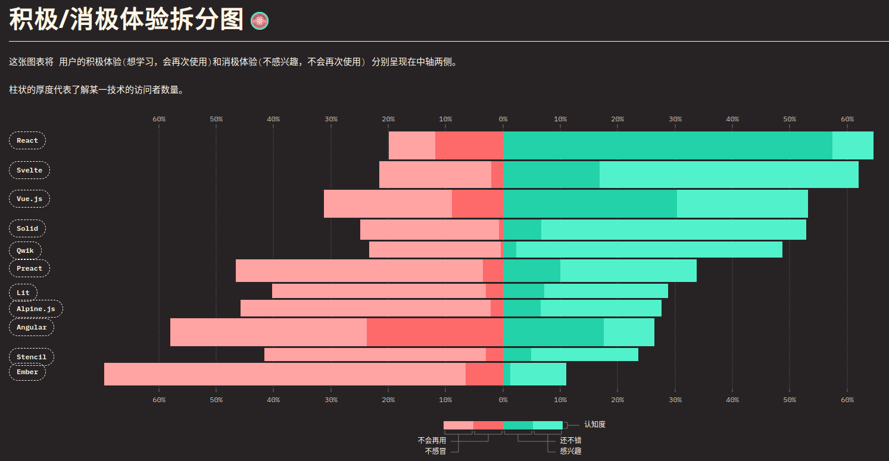

2、近几年前端框架的满意度、关注度、 使用率、和认知率的排行。

不包含认知率低于 10％ 的技术。每个百分比定义如下：

- 满意率：会再次使用 / (会再次使用 + 不会再次使用)
- 关注率：想学习 / (想学习 + 不感兴趣)
- 使用率：(将再次使用 + 将不再使用) / 总计
- 认知率：(总计 - 从未听说过) / 总计

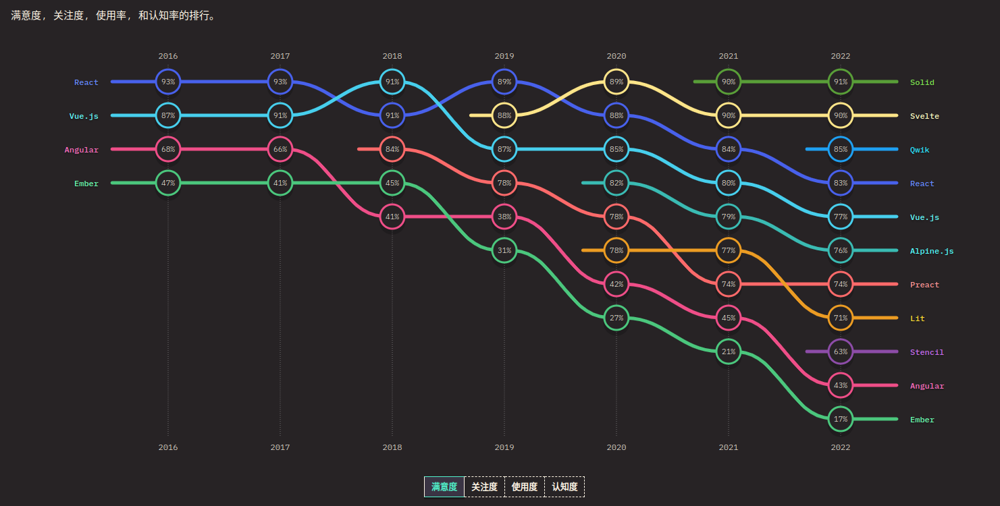
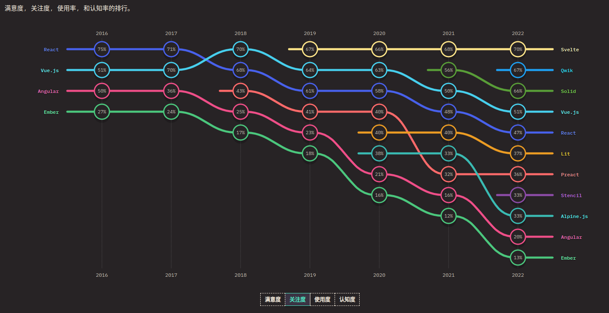
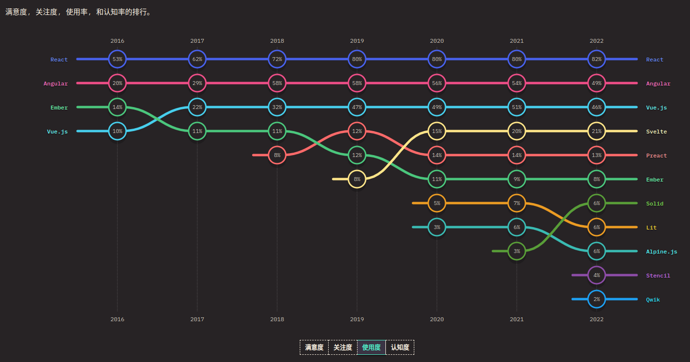
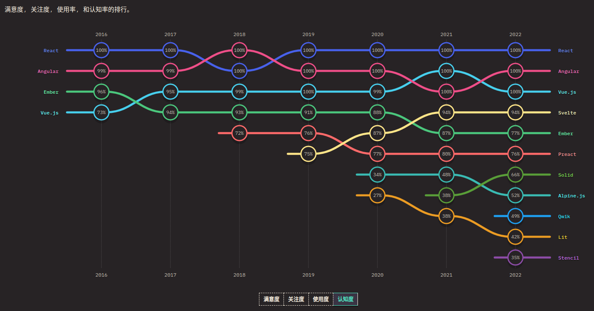

## 设计思想的变化

React 的诞生不是一蹴而就的，在更早之前存在着一些非常优秀的 JS 框架或库。

在设计思想的不断革新中，React 作为其中一环，出现了。

当热，React 之后也有更新的技术出现。(不断流的思想源泉，真是一件美事啊！)

### React 之前

2011 年到 2013 年， jQuery、Backbone、Angular 占领了社区讨论空间。

而 jQuery 则是当之无愧的“天下第一”，是最流行的构建 web 网站的选择。

jQuery 便于操作真实 DOM 树，能够在任意 node 改变另一个 node 的状态。

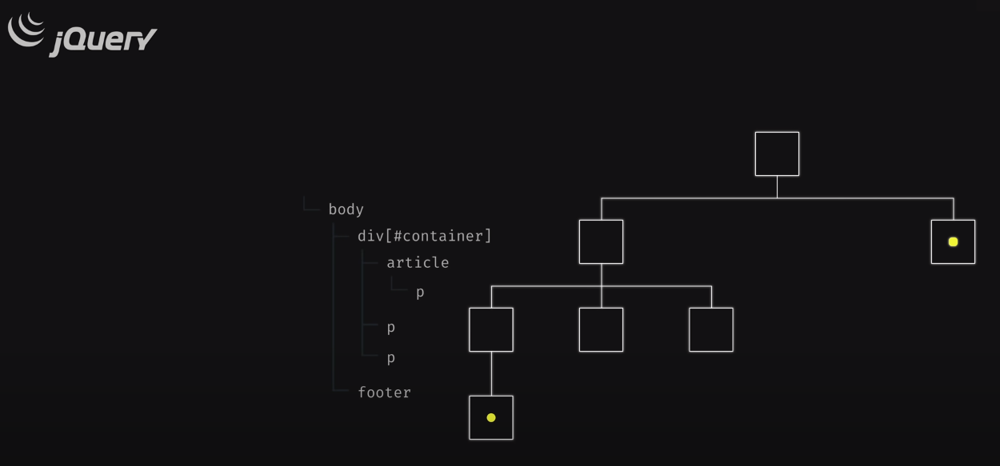

> John Resig (jQuery 创始人) 在 2011 年 6 月接受采访时被问到：
> 对于 jQuery 你最初的目标是什么？<br/><br/>
> John 回答到：“......我想在 Firefox 开发我的 App，然后它也能在 IE 上运行......我想专注于改自己的 BUG，而不想处理浏览器的差异问题......我写了一点简洁的 API 来支持我写代码......嗯哼......”

但是后来发现 jQuery 最大的祝福也是它最大的诅咒：

它的是依赖共享可变状态的，更新 DOM 状态的简单方法，通常会导致难以预测和追踪的代码出现。

比如，多个 node 都去改变某一个 node 时，那么这段代码就难以维护了。

于是，backbone 闪亮登场!

> backbone 引入了 MVC 模式，它是第一个流行的用于 web 构建的 JavaScript 框架。<br/><br/>
> backbone 允许将应用程序状态和 dom 分离，只要 model 改变，所有关心该 model 的 view 将重新呈现。

当然， MVC 的问题同样严重。

接下来登场的，就是大名鼎鼎的 Angular ！(看图片就有一种随性的感觉了——注意右下脚)

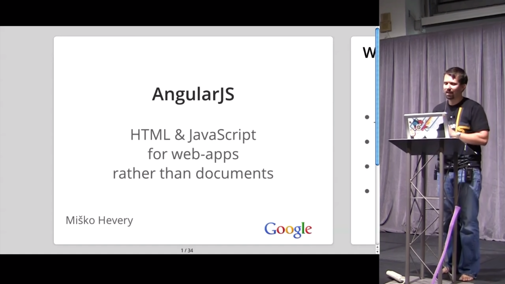

Angular 是用于构建 web app 的一体式框架，号称可以做任何事情，包括双向数据绑定、数据过滤器、路由控制器、依赖注入模板等。

> 在 2011 年，一个纯粹的前端工程师是稀有物种，因为大多做前端工作的还是悲催的后端工程师。<br/><br/>
> 所以说，Angular 的强大是对于后端工程师来说的。

看看这个“双向数据绑定”，写法简单明了。

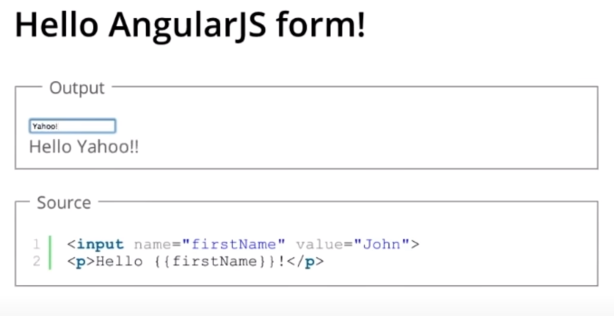

但是 Angular 最大的问题也在于“双向数据绑定”（model 改变时 view 改变，view 改变时 model 改变）。

> 在实践中，自己手动操作隐式状态改变时，由于双向数据绑定的存在，会导致代码逻辑复杂、难以维护。也会导致新能问题，因为 Angular 要不算扫描代码来寻找状态变化。

### React 的出现

前文提到的 jQuery、Backbone、Angular，还有没提到的 canjs、stapes.js、BATMAN.js、Knockout.js、soma.js、Spine.js、Chaplin、Knockback.js 等等，都是基于模型的修改和视图的修改来完成功能的，需要开发人员保证模型和视图的同步。

那么有新的解决思路吗？答案是 React 。

> 2013 年 7 月，React 团队的工程师经理 Tom Ochino 在 React 介绍会上说道：
> <br/><br/>我们发现构建视图的最简单的方法是：完全避免突变（直接 dom 操作修改内容），在需要数据变化的时候，直接摧毁视图，再重新渲染一个新的。对开发者来说，这会简单很多，因为只需要关心数据状态的变化。

React 的核心创新在于，使视图成为处理应用程序状态的函数，开发者只需要关心状态的更改，而由 React 来处理其余部分（视图更新等）。

> “......没有更多明确的 dom 操作；一切都是申明性的。”—— Pete Hunt (React Core Team, Sep 2013)

使用过 React 的人也能感觉到，组件的使用就像搭积木一样：看起来像积木，用起来像积木，那他就是 React 。

### React 之后

技术在发展，React 并非完美无缺。

更新的技术：Next.js, Remix 出现了。

感兴趣可以自行了解。

# 总结

由于 React 的易用性（吸引新人），以及各种第三方组件带来的强大生态圈（留住老人），目前 React 的地位是难以撼动的。

每个版本都有它的优缺点，新版本不断优化或解决旧版本的问题，这让人对未来感到非常期待！
