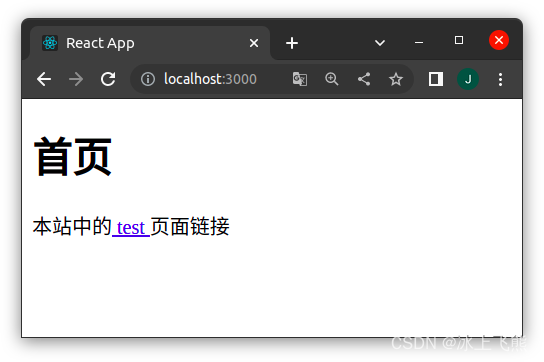

# 前言

## 译者述

1、原文来自[Tania Rascia](https://www.taniarascia.com/)个人网站上的一篇文章：[Using React Router for a Single Page Application](https://www.taniarascia.com/using-react-router-spa/)。

2、这是一篇较易的入门介绍文章，发布于 2019 年 4 月 25 日。

3、翻译中会尽量遵照原意，也会加入译者的技术注释，以及选择更符合汉语文法的译句。

---

## 作者述

React 没有内置的路由器，但是我们很容易通过 react-router-dom 库实现路由。**路由**是指 web 应用怎样定位资源路径。（如果你知道路由是什么，可以跳过这一段。）

举例：对 Tania 的个人网站，如果访问 [taniarascia.com](https://www.taniarascia.com/) 那么会到达首页，如果访问 [taniarascia.com/me](https://www.taniarascia.com/me) 那么会重定向到个人简介。如果再访问 [taniarascia.com/categories/java-script](https://www.taniarascia.com/categories/java-script) 或者 [taniarascia.com/categories/front-end](https://www.taniarascia.com/categories/front-end) 那么会出现文章列表。这些文章的路由就像这样：

- / 根目录
- /:page-id 文章
- /categories/:category_id 类别

实际上没有 categorie 文件夹，也没有 java-script.html 或者 front-end.html 这样的文件。这里只有一个模板，而路由器知道怎么选择合适的文章。当获取到模板，它就可以从 URL 中提取相关信息，从而知道要显示的内容——例如，java-script 或 front-end 相关的文章。

Tania 的个人网站正好也是单页应用(Single Page Application (SPA))——只有一个页面，每次点击新页面链接会加载额外的 JSON 数据，但是不会重新请求页面资源，比如请求 index.html 或者 about-me.html。

我将向你展示如何使用 react-router-dom 在 React 中设置一个简单的 SPA，并通过 URL 动态获取数据。 下面是项目的全部源程序，如果你之后感到迷惑，可以查看。

- [查看项目源程序](https://github.com/taniarascia/router-example)

## 预备知识

- 阅读 [Getting Started with React](https://www.taniarascia.com/getting-started-with-react/) 或者 [Build a React App with Hooks](https://www.taniarascia.com/crud-app-in-react-with-hooks/)，如果你不知道 React 或者 React Hooks.
- 阅读 [How to Connect to an API in JavaScript](https://www.taniarascia.com/how-to-connect-to-an-api-with-javascript/)，如果你一点也不知道 API 的使用。

# 创建

创建一个新的 React App。

```bash
npx create-react-app router-example
```

我们的项目有两个依赖——路由：react-router-dom，API 调用：axios。

> (译者补充：记得 cd 先进文件，再执行安装依赖的命令。)

```bash
npm install react-router-dom axios
```

或者

```bash
yarn add react-router-dom axios
```

# 浏览器路由器

为了使用 react-router-dom，我们需要将整个 App 组件包裹在 [BrowserRouter](https://reacttraining.com/react-router/web/api/BrowserRouter) 中。这里有两种路由器：

- BrowserRouter —— 制作漂亮的 URL，例如 example.com/about 。
- HashRouter —— 使用 octothorpe（或 hashtag）制作 URL，例如 example.com/#about 。

这里我们选择使用 BrowserRouter 。

```js
// src/index.js
import React from "react";
import { render } from "react-dom";
import { BrowserRouter } from "react-router-dom";
import App from "./App";

render(
  <BrowserRouter>
    <App />
  </BrowserRouter>,
  document.querySelector("#root")
);
```

> (译者补充：结合之前下载的项目，参看并修改。)

# 路由选择

现在在 App.js 中，我们可以决定想要使用的路由并相应地引导。这次我们要使用 Route 和 Switch 。

- Switch - 将所有路由组合在一起，并确保它们从上到下的优先级关系。
- Route - 每个独立的路由。

> (译者补充：react-router-dom' 从第 6 版开始已经没有 Switch 组件了，改用 Routes 组件，详细[参考官方文档](https://reactrouter.com/en/main/components/routes)。下面的代码除了原文的写法，还有译者测试当前可用的写法。)

```js
// App.js 原文写法
import React from "react";
import { Route, Switch } from "react-router-dom";
// 一会儿要创建这两个页面
import HomePage from "./pages/HomePage";
import UserPage from "./pages/UserPage";

export default function App() {
  return (
    <Switch>
      <Route exact path="/" component={HomePage} />
      <Route path="/:id" component={UserPage} />
    </Switch>
  );
}
```

> 其他写法

```js
// App.js 新的写法
import React from "react";
import { Route, Routes } from "react-router-dom";
// 一会儿要创建这两个页面
import HomePage from "./pages/HomePage.js";
import UserPage from "./pages/UserPage";

export default function App() {
  return (
    <>
      <Routes>
        <Route path="/" element={<HomePage />}>
          <Route path=":id" element={<UserPage />} />
        </Route>
      </Routes>
    </>
  );
}
```

我们把根路由 / 匹配给 HomePage，把其他页面动态匹配给 UserPage 。对于这个简单的例子，只有一条路由，当然也可以配置更多:

```js
// 原文写法
<Switch>
  <Route exact path="/" component={HomePage} />
  <Route path="/:id" component={UserPage} />
  <Route path="/categories" component={CategoriesPage} />
  <Route path="/categories/:id" component={IndividualCategoryPage} />
</Switch>
```

> 其他写法

```js
// 新的写法
<Routes>
  <Route path="/" element={<HomePage />}>
    <Route path=":id" element={<UserPage />} />
    <Route path="categories" component={CategoriesPage}>
      <Route path=":id" element={<IndividualCategoryPage />} />
    </Route>
  </Route>
</Routes>
```

这样就能让 taniarascia.com/categories 去访问类别列表，让 taniarascia.com/categories/javascript 去访问另一种模板的页面。

# Link（链接）

为了链接到 SPA 中的页面，我们使用 Link 。如果我们使用传统的 a 标签指定路由，它将发出一个全新的请求并重新加载页面，因此我们使用 Link 来解决问题。

```js
// src/pages/HomePage.js
import React from "react";
import { Link } from "react-router-dom";

export default function HomePage() {
  return (
    <div className="container">
      <h1>首页</h1>
      <p>
        本站中的<Link to="/test"> test </Link>页面链接
      </p>
    </div>
  );
}
```

现在我们进入第一个路由，也就是加载首页的 / 根路径，然后就可以看到首页的文本和链接。


# 动态路由参数

上面的链接指向 /test ，它在路由中匹配 :id 参数。这种情况下，为了动态获取 URL 中的内容，我们使用 props 中的 match.params.id 参数。

我将使用 id 参数来调用 GitHub 接口，以获取相关数据。本例中会用到 Hooks，如果你不熟悉，请参看这篇文章：[Building a CRUD App with Hooks](https://www.taniarascia.com/crud-app-in-react-with-hooks/) 。

```js
// src/pages/UserPage.js
import React, { useState, useEffect } from "react";
import axios from "axios";

export default function UserPage(props) {
  // Setting initial state
  const initialUserState = {
    user: {},
    loading: true,
  };

  // Getter and setter for user state
  const [user, setUser] = useState(initialUserState);

  // Using useEffect to retrieve data from an API (similar to componentDidMount in a class)
  useEffect(() => {
    const getUser = async () => {
      // Pass our param (:id) to the API call
      const { data } = await axios(
        `https://api.github.com/users/${props.match.params.id}`
      );

      // Update state
      setUser(data);
    };

    // Invoke the async function
    getUser();
  }, []); // Don't forget the `[]`, which will prevent useEffect from running in an infinite loop

  // Return a table with some data from the API.
  return user.loading ? (
    <div>Loading...</div>
  ) : (
    <div className="container">
      <h1>{props.match.params.id}</h1>

      <table>
        <thead>
          <tr>
            <th>Name</th>
            <th>Location</th>
            <th>Website</th>
            <th>Followers</th>
          </tr>
        </thead>
        <tbody>
          <tr>
            <td>{user.name}</td>
            <td>{user.location}</td>
            <td>
              <a href={user.blog}>{user.blog}</a>
            </td>
            <td>{user.followers}</td>
          </tr>
        </tbody>
      </table>
    </div>
  );
}
```

> （译者补充：这里的结构有变化，暂时不能运行，只做参考，以后有空再改写为符合新版本的代码。）

# 总结

如果你感到迷惑，可以看看源代码整体结构。

- [查看源代码](https://github.com/taniarascia/router-example)

另外，请注意：如果你想在 GitHub 上使用这个页面，只知道从 you.github.io/repo/:id 导向 /:id 是不够的。如果你想把主机放到在 GitHub 上，并且遇到了问题，那么这篇文章能够帮助到你：[hosting your single page app on GitHub Pages](https://itnext.io/so-you-want-to-host-your-single-age-react-app-on-github-pages-a826ab01e48) 。

> （译者补充：翻译不合理之处，欢迎指正。）
