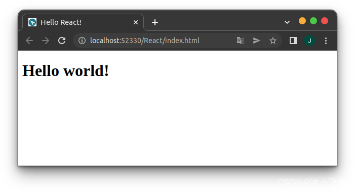
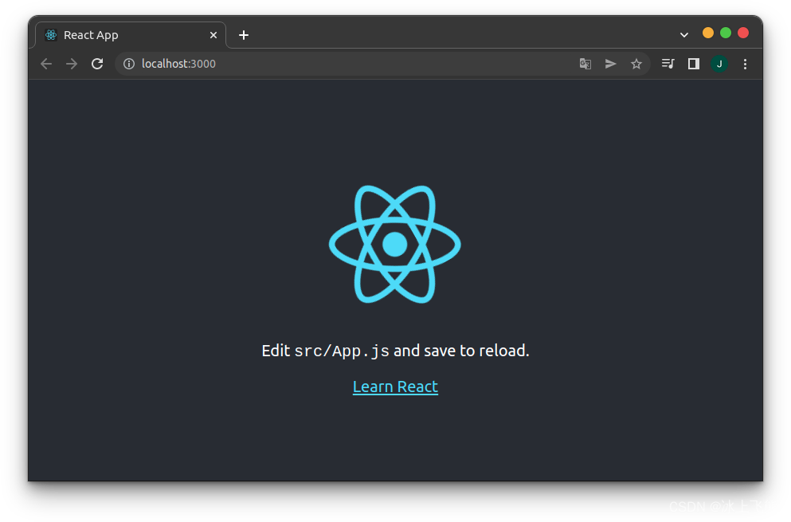
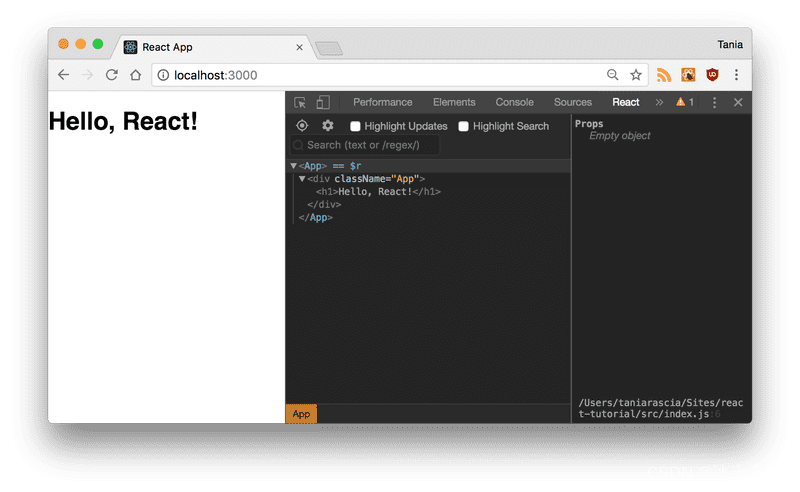
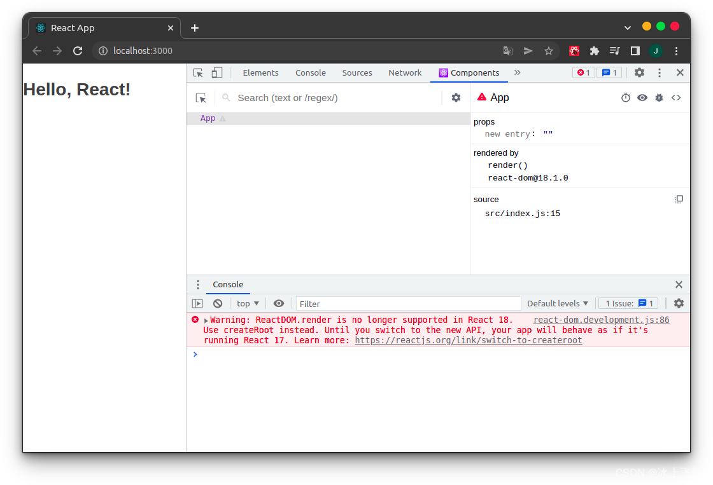
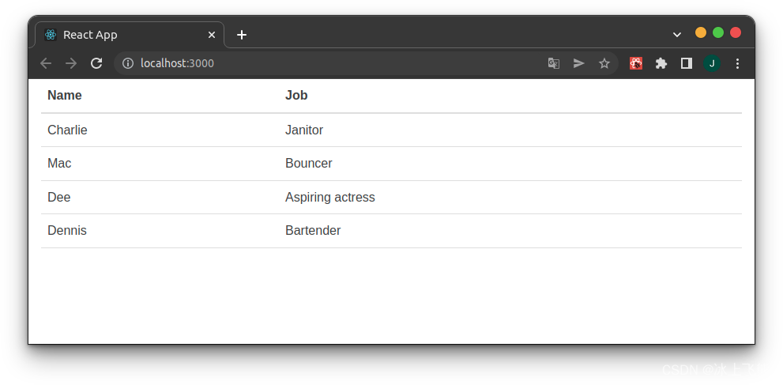
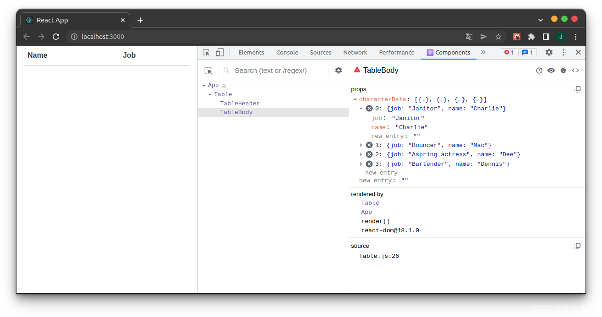
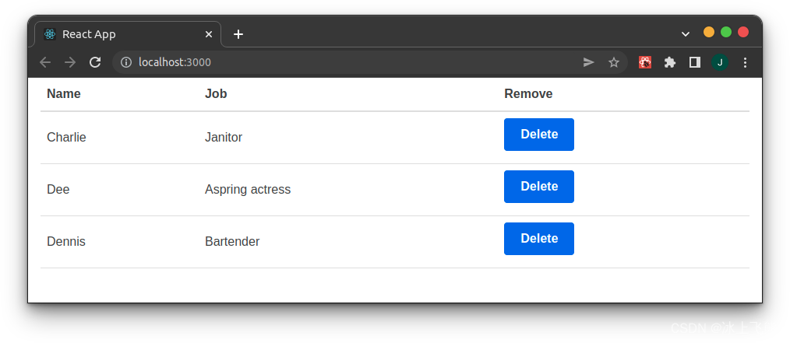
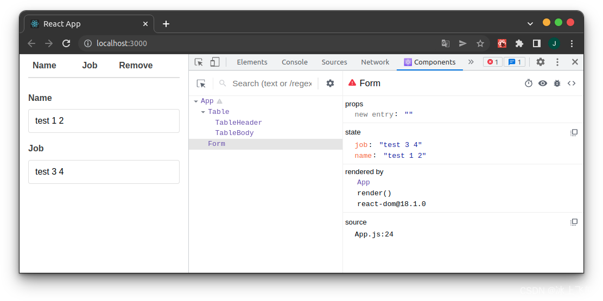
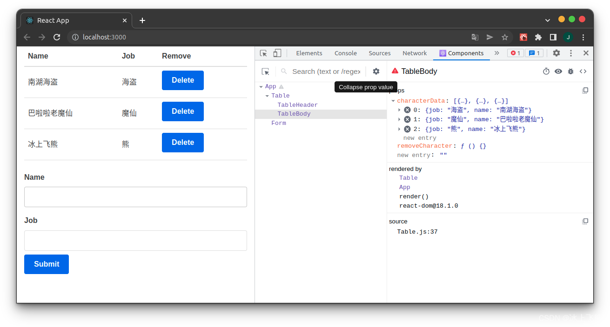
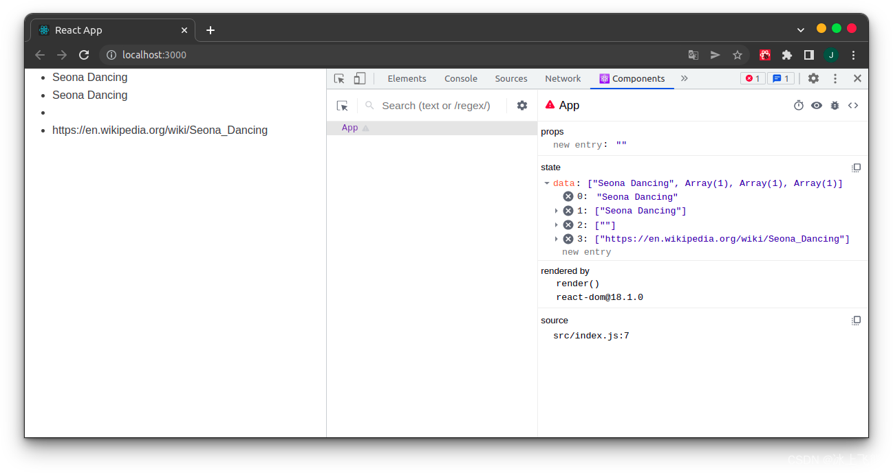

# 前言

## 译者述

1、原文来自 [Tania Rascia](https://www.taniarascia.com/) 个人网站上的一篇文章：[React Tutorial: An Overview and Walkthrough](https://www.taniarascia.com/getting-started-with-react/)。

2、这篇文章受到 [React 官网](https://react.docschina.org/docs/getting-started.html) 的推荐，是一篇较易的入门介绍文章，发布于 2018 年 8 月 20 日。

3、翻译中会尽量遵照原意，也会加入译者的技术注释，以及选择更符合汉语文法的译句。

---

## 作者述

我刚开始学习 JavaScript 的时候就听说 React 了，但只看了一眼，就觉得惊讶无比。因为我看见它把 HTML 代码和 JavaScript 代码混合在一起，而这不正是我们一直以来需要尽量去避免的吗？所以说，React 到底有什么了不起的地方呢？

一直以来，我专注于学习原生 JS（[vanilla JavaScript](https://blog.csdn.net/HANZY72/article/details/121734116)），并且在职业环境中使用 jQuery 。在经过数次失败挫折之后，我终于成功入门 React ，然后就明白了为什么我会更愿意使用 React ，而不是原生 JS 或者 jQuery 。

下面，我将尽量精简我所学会的知识，汇成一个优质简介，分享给大家。

## 预备知识

在学习使用 React 之前，你应当知道下面列举的知识。如果你之前从未使用过 JavaScript 或者 DOM 操作，额，我个人建议提前熟悉它们。

**需要的知识**：

- 熟悉基本的 HTML 和 CSS
- 知道基本的 JavaScript 和编程
- 基本理解 DOM
- 熟悉 ES6 语法及其特性
- 了解 Node.js 和 npm 全局安装

## 本文目标

- 学习 React 的重要概念和相关术语，例如 **Babel, Webpack, JSX, components, props, state, lifecycle 。**
- 创建一个简单地 React 应用，并演示上面的相关概念。

下面是实例应用的源代码和网页实际效果。

- [GitHub 源代码](https://github.com/taniarascia/react-tutorial)
- [网页 Demo](https://taniarascia.github.io/react-tutorial/)

# 什么是 React ？

- React 是一个 JavaScript 库，也是最受欢迎的库之一，他在 GitHub 上拥有超过十万的收藏！
- React 不是一个框架（与“固执己见”的 Angular 大为不同）。
- React 是 Facebook 创建的一个开源项目。
- React 被用于在前端构建用户界面(UI)。
- React 是 MVC 应用程序中的视图层(MVC: Model View Controller)。

事实上，React 最重要的一点就是，你可以创建组件(components) —— 类似于自定义的、可复用的 HTML 元素，然后借此高效地实现 UI。另一方面，React 通过 state 和 props 大大地简化了数据的存储和处理过程。

我们将在下文讨论这些内容，以及更多其他相关知识。那么，让我们开始吧！

# Setup and Installation

有多种使用 React 的方法，这里我将展示其中的两种，以便于你理解到 React 的工作原理。

## 静态 HTML 文件

这是第一种方法，不过它是一种不受欢迎的写法，而且之后的内容重点也不是它。但是，它可以让你很容易地熟悉和理解 React ——即使你从未使用过 JS 库，比如 jQuery。甚至可以说，如果你一点也不熟悉 Webpack、Babel、Node.js，那么这将是最简单的入门方法。

我们先要创建一个 index.html 文件，然后在 head 元素中加载三个 [CDN](https://zhuanlan.zhihu.com/p/51842336) ：React、React DOM、Babel。之后要写个 div 元素，设置其 id 为 root，最后创建一个 script 标签用来写你自己的代码。

```html
<!DOCTYPE html>
<html>
  <head>
    <meta charset="utf-8" />

    <title>Hello React!</title>

    <script src="https://unpkg.com/react@^16/umd/react.production.min.js"></script>
    <script src="https://unpkg.com/react-dom@16.13.0/umd/react-dom.production.min.js"></script>
    <script src="https://unpkg.com/babel-standalone@6.26.0/babel.js"></script>
  </head>

  <body>
    <div id="root"></div>

    <script type="text/babel">
      // React code will go here
    </script>
  </body>
</html>
```

在撰写本文时，我正在加载这些库的最新稳定版本。

> (译者补充：作者写文时，2018 年 React 是 16 版本，现在 2022 年是 18 版本。对于版本差异，读者暂时不必关心，React
> 核心思想是不变的。)

[React](https://reactjs.org/docs/react-api.html) - React 顶层 API
[React DOM](https://reactjs.org/docs/react-dom.html) - 提供了一些 DOM 方法
[Babel](https://babeljs.io/) - 一种 JavaScript 编译器，它能让 ES6+ 代码在旧浏览器上运行。

我们的程序入口是 id 为 root 的 div 元素，这是按照规范约定的命名。同时，你也要注意到 test/babel 这种类型，这是使用 Babel 必须的写法。

现在，让我们编写第一个 React 代码块。它将使用 ES6 的类来创建 React 组件，命名为 APP。

```js
class App extends React.Component {
  //...
}
```

现在，我们添加 [render() 方法](https://reactjs.org/docs/react-component.html#render)，这是类组件中惟一强制要求实现的方法，它将用于渲染 DOM 节点。

```js
class App extends React.Component {
  render() {
      return (
          //...
      );
  }
}
```

在 return 中，我们将放入一个好像 HTML 元素的东西。注意，这里并不是返回的字符串，所以不用引号来包裹元素。这种写法就被称为 JSX，后续我们将学习更多的相关知识。

> （译者补充：传统 JS 代码，是基于字符串拼接来生成 HTML 代码，相当于一直在做字符串处理。JSX 中，直接在 JS
> 代码中插入有意义的 HTML 元素，这样的写法理解起来更直观。）

```js
class App extends React.Component {
  render() {
    return <h1>Hello world!</h1>;
  }
}
```

最后，我们使用 ReactDOM.render() 方法，将我们创建的 App 类渲染到 HTML 的 root div 中。

```js
ReactDOM.render(<App />, document.getElementById("root"));
```

下面是 index.html 的完整代码。

```html
<!DOCTYPE html>
<html>
  <head>
    <meta charset="utf-8" />

    <title>Hello React!</title>

    <script src="https://unpkg.com/react@16/umd/react.development.js"></script>
    <script src="https://unpkg.com/react-dom@16/umd/react-dom.development.js"></script>
    <script src="https://unpkg.com/babel-standalone@6.26.0/babel.js"></script>
  </head>

  <body>
    <div id="root"></div>

    <script type="text/babel">
      class App extends React.Component {
        render() {
          return <h1>Hello world!</h1>;
        }
      }

      ReactDOM.render(<App />, document.getElementById("root"));
    </script>
  </body>
</html>
```

现在在浏览器中浏览 index.html，你将看到我们创建的 h1 标签被渲染到了 DOM 中。



妙啊！

现在你完成这个代码，就能发现 React 入门并不是一样难以做到的事。它只是加载了一些 JS 库到我们的 HTML 中嘛。

> （译者补充：可能有人觉得上面的代码很奇怪：在 HTML 代码里面放 JS 代码，再在 JS 代码里面放 HTML 代码，那为什么不直接写个
> HTML 代码呢？想必聪明的你已经体会到了，当然是为了兼顾灵活性和可读性。到最后，一般的程序开发，就能像搭积木一样简单。）

到此为止的内容，都是为了简单演示。从下面开始，我们将使用另一种方法：Create React App。

## Create React APP

上面使用的方法——将 JavaScript 库加载到静态 HTML 页面并动态渲染 React 和 Babel，效率不高且难以维护。

幸运的是， Facebook 做了一个好东西：[Create React APP](https://github.com/facebook/create-react-app)，它是一个预先配置完善的 React app 构建环境。它构建了一个热更新的开发环境服务器；通过 Webpack 来自动编译 React、JSX、ES6 代码；自动增加 CSS 文件的前缀；使用 ESLint 来测试代码和警告其中的问题。

> （译者补充：这里可以简单理解为，有一个程序，自动帮你配置了各种依赖，减少了手动配置的麻烦。）

在你的终端运行以下命令，将会在当前目录下生成一个新的文件夹 react-tutorial，其中就是项目内容。

```bash
$ npx create-react-app react-tutorial
```

等待完成之后，进去到新的文件夹中，开始启动项目。

```bash
$ cd react-tutorial && npm start
```

一会儿之后，你的浏览器就会弹出新窗口，现实如下页面。



> Create React App is very good for getting started for beginners as well as large-scale enterprise applications, but it's not perfect for every workflow. You can also create your own Webpack setup for React.

> (译)Create React App 非常适合初学者的入门，以及大型企业应用程序的开始，但它并不适合每个工作情况。 所以，你还可以为 React 自定义 Webpack 设置。

观察项目结构，你可以看到 /public 目录和 /src 目录，还有常规的 node_modules、.gitignore、README.md、package.json。

在 /public 中，最重要的文件是 index.html，它和前文中提到的静态 index.html 文件很像，都是一个 root div。不过这次，没有在文件中加载任何的依赖库和 script 标签。

在 /src 中，将会包含全部的 React 代码。

为了观察 React 代码的自动化编译与更新，在 /src/App.js 文件中找到这句话:

```js
Edit <code>src/App.js</code> and save to reload.
```

然后随便写点字替换它，再然后保存文件，你就能看到 localhost:3000 中刷新了。

> （译者补充，React 16 中的这句话是：To get started, edit `src/App.js` and save to reload. 而在 React 18 中，这句话是：Edit <code>src/App.js</code> and save to reload.）

现在，让我们删除 /src 目录下的全部文件，因为我们将要创建自定义的模板——非常简洁，只有 index.css 和 index.js 文件。

对于 index.css 文件，我就直接复制粘贴来自 [Primitive CSS](https://taniarascia.github.io/primitive/css/main.css) 的内容。当然，如果你想，也可以使用 Bootstrap 或者别的什么 CSS 框架，或者干脆什么都不写。我只是觉得这个更容易使用。

对于 index.js 文件，我们导入 React、ReactDOM，以及 CSS 文件。

```js
import React from "react";
import ReactDOM from "react-dom";
import "./index.css";
```

让我们再来创建 App 组件。之前，我们只是写了一个 h1 标签，现在添加一个 div 元素包裹 h1 标签，并设置 div className=“App”。值得注意的是，我们使用 clssName 代替了 claa。这是一个小提醒，说明这里的代码本质上是 JavaScript，而不是单纯的 HTML。

```js
class App extends React.Component {
  render() {
    return (
      <div className="App">
        <h1>Hello, React!</h1>
      </div>
    );
  }
}
```

最后，像之前一样，我们渲染 App 组件到 root div 中。

```js
ReactDOM.render(<App />, document.getElementById("root"));
```

这里是 index.js 的完整代码。这次我们直接导入了 Component，所以就不需要再写 React.Component 了。

```js
import React, { Component } from "react";
import ReactDOM from "react-dom";
import "./index.css";

class App extends Component {
  render() {
    return (
      <div className="App">
        <h1>Hello, React!</h1>
      </div>
    );
  }
}

ReactDOM.render(<App />, document.getElementById("root"));
```

在 localhost:3000 网页上，你就能看到"Hello, React!" 了。就像之前一样，我们实现了一个简单的 React app。

## React Developer Tools

有一个浏览器扩展，叫做 React Developer Tools，它能让你更轻松地使用 React。下载 [React DevTools for Chrome](https://chrome.google.com/webstore/detail/react-developer-tools/fmkadmapgofadopljbjfkapdkoienihi) ，或者在其他你更喜欢的浏览器里面下载。

安装之后，打开浏览器开发工具 F12，你能在 tab 列中看到 React。点击一下，你就能够在编写组件时进行检查。你也可以在 Elements 中查看实际的 DOM 输出。现在看起来用处不大，但是当 app 变得越来越复杂的时候，它就越来越有必要去使用了。




> (译者补充：React Developer Tools 版本可能出现了大的变化，安装插件后，在 F12 的 tab 列中，没有 React ，而是 Component 以及 Profiler。所以这里图片有两张，一张是原文原图，一张是译者测试的图片。
> 另外需要注意的是， React 18 中 render 用法发生改变，旧的写法会引发警告。)

此时此刻，我们已经拥有了真正开始使用 React 所需的全部工具和设置。

# JSX: JavaScript + XML

如你所见，我们在 React 代码中编写的好像是 HTML，但它并不是正经的 HTML，而是 JSX，即 JavaScript XML。

使用 JSX，我们可以编写类似 HTML 的内容，还可以创建和使用自定义的类 XML 便签。下面是 JSX 变量赋值语句。

```js
const heading = <h1 className="site-heading">Hello, React</h1>;
```

编写 React 代码并不一定要使用 JSX。引擎底层的实现，是通过 createElement 方法来创建标签、属性、子组件的，之后渲染它们。下面的代码具有相同的输出结果。

```js
const heading = React.createElement(
  "h1",
  { className: "site-heading" },
  "Hello, React!"
);
```

事实上，JSX 更像 JavaScript 而不是 HTML，这里有一些编写代码时候需要注意的关键性差异：

- 在 CSS 类名指定时，className 被用来替换 class ，因为在 JavaScript 中 class 是关键字。
- 在 JSX 中的属性和方法采用小驼峰命名法，比如 onclick 变为 onClick。
- 自闭合标签必须使用斜杠结尾，例如 < img />

JavaScript 代码自然也能被嵌入 JSX 中，使用花括号{}就能嵌入变量、函数、属性。

```js
const name = "Tania";
const heading = <h1>Hello, {name}</h1>;
```

JSX 创建和添加元素（大部分）比原生 JS 更容易理解和使用，这也是人们喜欢他的理由之一。

# 组件 (Components)

目前为止，我们只创建了一个组件：APP。几乎所有 React 组件可以分为两种：类组件（class components）和简单组件（simple components）。

大多数 React app 都包含了很多小组件，并且他们都会在 App 组件中被加载。小组件们拥有它们自己的文件，下面让我们一起来升级改造我们的项目吧。

jiang index.js 中的 App，如下所示：

```js
import React from "react";
import ReactDOM from "react-dom";
import App from "./App";
import "./index.css";

ReactDOM.render(<App />, document.getElementById("root"));
```

接着新建一个文件 App.js，将组件放到这里：

```js
import React, { Component } from "react";

class App extends Component {
  render() {
    return (
      <div className="App">
        <h1>Hello, React!</h1>
      </div>
    );
  }
}

export default App;
```

我们导出 App 组件，然后在 index.js 中加载。将组件分离到其他文件里面，这并不是强制性的，但是如果你不这样做，一个应用程序就会变得非常臃肿且难以维护。

## 类组件（class components）

现在创建另一个组件，计划是做个表格组件。现新建一个 Table.js 文件，然后把下面的代码贴上去。

```js
import React, { Component } from "react";

class Table extends Component {
  render() {
    return (
      <table>
        <thead>
          <tr>
            <th>Name</th>
            <th>Job</th>
          </tr>
        </thead>
        <tbody>
          <tr>
            <td>Charlie</td>
            <td>Janitor</td>
          </tr>
          <tr>
            <td>Mac</td>
            <td>Bouncer</td>
          </tr>
          <tr>
            <td>Dee</td>
            <td>Aspiring actress</td>
          </tr>
          <tr>
            <td>Dennis</td>
            <td>Bartender</td>
          </tr>
        </tbody>
      </table>
    );
  }
}

export default Table;
```

这就是我们创建的自定义类组件，它用大写字母开始，以区别于一般的 html 元素。回到 App.js 中，我们加载 Table 到里面。第一步是引入 Table ：

```js
import Table from "./Table";
```

然后是在 App 的 render() 方法中加载它，就是之前写 “Hello, React!” 的地方。当然，也可以把 className 改为 container。

```js
import React, { Component } from "react";
import Table from "./Table";

class App extends Component {
  render() {
    return (
      <div className="container">
        <Table />
      </div>
    );
  }
}

export default App;
```

最后回到运行环境中，在浏览器中就可以看到 Table 被加载了出来。



现在，我们已经见识了自定义类组件是什么东西了。我们可以多次复用这个组件，但是，因为里面的数据是写死的，所以其实也没什么用。

## 简单组件（simple components）

另一种 React 组件就是简单组件，其本质是一个函数，所以这种组件不需要使用关键字 class。现在让我们改造 Table，在里面做两个简单组件：一个表格标题、一个表格内容。

我们使用 ES6 的箭头函数来创建这些简单组件。首先，是表格标题。

```js
const TableHeader = () => {
  return (
    <thead>
      <tr>
        <th>Name</th>
        <th>Job</th>
      </tr>
    </thead>
  );
};
```

然后是表格内容。

```js
const TableBody = () => {
  return (
    <tbody>
      <tr>
        <td>Charlie</td>
        <td>Janitor</td>
      </tr>
      <tr>
        <td>Mac</td>
        <td>Bouncer</td>
      </tr>
      <tr>
        <td>Dee</td>
        <td>Aspiring actress</td>
      </tr>
      <tr>
        <td>Dennis</td>
        <td>Bartender</td>
      </tr>
    </tbody>
  );
};
```

现在我们的 Table 如下所示。注意，TableHeader 和 TableBody 组件在同一个文件中，都是被 Table 类组件使用的。

```js
const TableHeader = () => { ... }
const TableBody = () => { ... }

class Table extends Component {
  render() {
    return (
      <table>
        <TableHeader />
        <TableBody />
      </table>
    )
  }
}
```

最后结果应该和之前一样。注意观察，组件是可以被嵌套在其他组件中的，并且简单组件和类组件可以混合使用。

> A class component must include render(), and the return can only return one parent element.

> (译) 一个类组件必须包含 render() 方法，并且 return 返回的最外层父元素只能有一个。

> (译者补充：React 18 版本有较大变化，不用 render() 方法)

最后总结一下类组件和函数组件的区别。

```js
/** Simple Component */
const SimpleComponent = () => {
  return <div>Example</div>;
};
```

```js
/** Class Component */
class ClassComponent extends Component {
  render() {
    return <div>Example</div>;
  }
}
```

注意，如果 return 只有一行，就可以不用括号。

# Props

现在，我们有了一个漂亮的 Table 组件，但是它的数据是硬编码的。React 的一大优化就是数据的处理，通过属性 props 和状态 state 来实现。接下来，我们将重点关注 props 中的数据处理。

首先，将 TableBody 中的数据移除。

```js
/** src/Table.js */
const TableBody = () => {
  return <tbody />;
};
```

然后把数据都放到一个数组对象里面，就像自定义了一个 JSON 格式参数的 API。这个数组对象需要放在 render() 方法里面。

```js
/** src/App.js */
class App extends Component {
  render() {
    const characters = [
      {
        name: "Charlie",
        job: "Janitor",
      },
      {
        name: "Mac",
        job: "Bouncer",
      },
      {
        name: "Dee",
        job: "Aspring actress",
      },
      {
        name: "Dennis",
        job: "Bartender",
      },
    ];

    return (
      <div className="container">
        <Table />
      </div>
    );
  }
}
```

现在，我们通过 Table 组件的元素特性将数据传到 Table 组件里面，这种传数据的用法类似 HTML5 中的 data-\* 属性。

这个元素特性的命名是任意的，只要不与关键字重复即可，所以这里使用自定义的 characterData。

传递的数据是一个变量 characters，所以需要用花括号包裹起来——其本质上是作为一个 JavaScript 表达式存在的。

```js
/** src/App.js */
return (
  <div className="container">
    <Table characterData={characters} />
  </div>
);
```

现在数据已经从外面开始传入 Table，那么就需要从里面接收数据。

```js
/** src/Table.js */
class Table extends Component {
  render() {
    const { characterData } = this.props;

    return (
      <table>
        <TableHeader />
        <TableBody characterData={characterData} />
      </table>
    );
  }
}
```

这时打开 React 开发工具检查 Table 组件，你就能在其 props 中看到数组数据。这些数据是被存储在虚拟 DOM(virtual DOM) 中，这时一种快速同步数据到实体 DOM 方法。



此时数据还没有放到实际的 DOM 中。在 Table 中，我们可以通过 this.props 访问全部的属性。当然，这里只用到一个属性：characterData，所以我们使用 this.props.characterData 来取得那个数据。

我将使用 ES6 的结构方式来创建一个变量，用于包含 this.props.characterData 。

```js
const { characterData } = this.props;
```

因为 Table 组件包含两个更小的简单组件，所以需要再次通过 props 将数据传递到 TableBody 中。

```js
/** src/Table.js */
class Table extends Component {
  render() {
    const { characterData } = this.props;

    return (
      <table>
        <TableHeader />
        <TableBody characterData={characterData} />
      </table>
    );
  }
}
```

现在，在 TableBody 中没有参数，并且它也只返回了一个标签。

```js
/** src/Table.js */
const TableBody = () => {
  return <tbody />;
};
```

我们将通过函数参数来传递 props，然后通过数组映射来返回构造

我们将 props 作为函数参数传递，并通过[数组映射](https://developer.mozilla.org/en-US/docs/Web/JavaScript/Reference/Global_Objects/Array/map)以返回数组中每个对象的表行。该映射将包含在 rows 变量中，我们将其作为表达式返回。

> （译者补充：如果不知道 map 语法，建议先点击“数组映射”链接看看。这里相当于简化了一个循环拼接 HTML 元素的过程。）

```js
/** src/Table.js */
const TableBody = (props) => {
  const rows = props.characterData.map((row, index) => {
    return (
      <tr key={index}>
        <td>{row.name}</td>
        <td>{row.job}</td>
      </tr>
    );
  });

  return <tbody>{rows}</tbody>;
};
```

现在去查看 app 的前端运行效果，就能看到数据加载了。

值得注意的是，我在每个表行中都加了 key。你也应该在生成 React 的列表时使用 [keys](https://reactjs.org/docs/lists-and-keys.html#keys)，以便于区分每个列表条目。当我们想要操作列表条目时，key 就是必要的了。

在 React 组件中传递存在的数据，props 是一种高效的方式，然而组件不能修改只可读的 props。在下个章节，我们将学习使用状态(state) 来进一步控制 React 中的数据处理。

# State

现在，我们已经将数据存储在一个数组变量中，并通过 props 传参。这样很容易使用，但是试想一种场景：如果我们想要删除数组中的条目呢？通过 props 我们得到了一个单向数据流；而通过 state 我们可以更新组件内部的私有数据。

你可以将 state 想象成这数据：能够被保存和修改，但是又不存入数据库。举个例子，在购物车中添加或删除物品，还没有进行结算提交。

> (译者补充：简单理解为一种临时变量。)

为了说明入门，我们现创建一个 state 对象。

```js
class App extends Component {
  state = {};
}
```

这个对象中要包含所有你想要存储的变量，这里就是 characters。

```js
class App extends Component {
  state = {
    characters: [],
  };
}
```

移动实际的数据对象到 state.characters 中。

```js
class App extends Component {
  state = {
    characters: [
      {
        name: "Charlie",
        // the rest of the data
      },
    ],
  };
}
```

这样数据就被包含在 state 中。因为我们想能够移除表格中的数据，所以在 App 中创建一个 removeCharacter 方法。

在 removeCharacter 中，为了取得相关数据，我们依然使用结构的方式，获得 this.state.characters。为了更新 state，我们使用 this.setState()，它是一种操作 state 的内置方法。最后基于传入的索引参数[过滤数组](https://developer.mozilla.org/en-US/docs/Web/JavaScript/Reference/Global_Objects/Array/filter)，获取并返回一个新的数组。

> You must use this.setState() to modify an array. Simply applying a new value to this.state.property will not work.

> （译）你必须使用 this.setState() 来修改数组。简单地为 this.state.property 赋新值是无效的。

> （译者补充：简单来说：通过内置方法来改值，不能直接写等号赋值。）

```js
/** src/App.js */
removeCharacter = (index) => {
  const { characters } = this.state;

  this.setState({
    characters: characters.filter((character, i) => {
      return i !== index;
    }),
  });
};
```

filter 方法不会改变原来的数组，而是返回一个新的数组，它是 JavaScript 中修改数组的首选方法。上面这个特定的方法中，检测比较 index 和数组中的所有索引，然后返回了所有符合条件的索引。

现在，我们需要通过组件传递函数，然后在每行的后面渲染一个按钮，点击它可以调用这个函数。这里将 removeCharacter 作为 prop 传递到 Table 中。

```js
/** src/App.js */
render() {
  const { characters } = this.state

  return (
    <div className="container">
      <Table characterData={characters} removeCharacter={this.removeCharacter} />
    </div>
  )
}
```

因为还需要将参数从 Table 传递到 TableBody 中，所以再来一次通过 prop 传值，和前文一样。

另外，在我们的项目中，只有 App 和 Form 两个组件拥有自己的 state，所以 Table 类组件最好转为简单组件。

```js
/** src/Table.js */
const Table = (props) => {
  const { characterData, removeCharacter } = props;

  return (
    <table>
      <TableHeader />
      <TableBody
        characterData={characterData}
        removeCharacter={removeCharacter}
      />
    </table>
  );
};
```

下面就是 removeCharacter() 方法中我们定义的索引的来源。在 TableBody 组件中，我们传递 key/index 参数，所以 filter 函数知道那个条目是需要移除的。我们创建一个按钮 onClick 来传递这个参数。

```js
/** src/Table.js */
<tr key={index}>
  <td>{row.name}</td>
  <td>{row.job}</td>
  <td>
    <button onClick={() => props.removeCharacter(index)}>Delete</button>
  </td>
</tr>
```

> The onClick function must pass through a function that returns the removeCharacter() method, otherwise it will try to run automatically.

> （意译）onClick 函数必须传入一个函数作为参数，且这个函数是返回的 removeCharacter() 方法，否则，如果直接传入 removeCharacter() 方法给 onClick，则会自动执行一次。
> 观察下面两行代码的区别
>
> ```js
> <button onClick={() => props.removeCharacter(index)}>Delete</button>
> <button onClick={props.removeCharacter(index)}>Delete</button>
> ```
>
> 后者在项目运行之后，会自动执行一次；前者只有在点击按钮的时候才会执行。

妙极了，现在我们有了 delete 按钮，然后就可以修改 state 来删除数据了。



删除 Mac. 试试。

现在你应该理解 state 的初始化和修改了吧。

# 表单数据提交

现在我们将数据存储在了 state 中，并且可以移除其中的任意条目。然而，如果我们想要添加新的条目呢？在一个实际的项目中，大概率是从一个空的 state 开始，然后往里面添加数据，例如任务手账或者购物车。

首先，移除 state.characters 中的硬编码数据，然后通过表单来更新数据。

```js
class App extends Component {
  state = {
    characters: [],
  };
}
```

然后在新文件 From.js 中创建一个 Form 组件。

我们将 Form 的初始值设置为空属性对象 initialState，并将其配给 this.state。

```js
import React, { Component } from "react";

class Form extends Component {
  initialState = {
    name: "",
    job: "",
  };

  state = this.initialState;
}
```

> Previously, it was necessary to include a constructor() on React class components, but it's not required anymore.

> （译）以前在 React 类组件中，必须包含 constructor() 方法，但是现在不用了。

> （译者补充：这个可能是版本不一样，但是构造函数还是挺有用的）

我们这个表单的目标是，每当一个表单中的字段发生变化时，能够更新 Form 的 state，然后在提交时，所有数据都要传到 App state 中并更新 Table。

首先，创建一个函数，一旦发生了输入改变，它就会执行。这个事件被传递，然后通过设置 Form state 来获得输入的 name(key) 和 value。

```js
/** src/Form.js */
handleChange = (event) => {
  const { name, value } = event.target;

  this.setState({
    [name]: value,
  });
};
```

在提交表单之前，需要完成下面的事情。在 render 中，获取 state 中的两个属性，并将他们作为 value 分配给对应的表单 key。将 handleChange() 作为 input 的 onChange，最后导出 Form 组件。

```js
render() {
  const { name, job } = this.state;

  return (
    <form>
      <label htmlFor="name">Name</label>
      <input
        type="text"
        name="name"
        id="name"
        value={name}
        onChange={this.handleChange} />
      <label htmlFor="job">Job</label>
      <input
        type="text"
        name="job"
        id="job"
        value={job}
        onChange={this.handleChange} />
    </form>
  );
}

export default Form;
```

在 App.js 中，我们可以在 表格的下方渲染表单。

```js
import Form from "./Form";
```

```js
return (
  <div className="container">
    <Table characterData={characters} removeCharacter={this.removeCharacter} />
    <Form />
  </div>
);
```

观察前端运行效果，会发现此时还没有提交按钮。更新表单字段，你会发现本地的 From 也被更新。



好极了！最后一步就是提交表单，然后更新父组件状态。我们在 App 组件中创建一个 handleSubmit() 方法，用来更新 App 的 state，数据来自原有的 this.state.characters 以及新添加 character 参数，这里用到了 ES6 [扩展运算符](https://developer.mozilla.org/en-US/docs/Web/JavaScript/Reference/Operators/Spread_syntax)。

```js
handleSubmit = (character) => {
  this.setState({ characters: [...this.state.characters, character] });
};
```

然后确保把这个函数参数传递到了 Form 中。

```js
<Form handleSubmit={this.handleSubmit} />
```

在 Form 组件中，创建一个 submitForm() 方法，由它来调用 handleSubmit() 并传参，实参就是 Form 中的 state ，形参就是前面定义的 character。 之后，它会重置 state 为初始值，相当于表单重置。

```js
submitForm = () => {
  this.props.handleSubmit(this.state);
  this.setState(this.initialState);
};
```

最后，我们添加一个表单提交按钮。注意，这里使用 onClick 而不是 onSubmit，因为我们并不使用标准的提交函数。这个点击事件会调用自定义的 submitForm 函数。

```js
<input type="button" value="Submit" onClick={this.submitForm} />
```

大功告成！这样 app 就已经完成啦，我们可以创建和删除表格中的数据。因为 Table 和 TableBody 已经获取到了数据，所以会直接展示出来。



如果你不知所措，没有跟上，可以查看[Github 中的源代码](https://github.com/taniarascia/react-tutorial)。

> （译者补充：强烈建议初学者，一步一步修改到最终版，而不是直接使用最后的代码运行。）

# Pulling in API Data

> （译者补充：这一节看不懂，不用纠结，可以略过。）

React 有一个很常见的用法，就是从 API 中提取数据。如果你不熟悉 API 的概念或者不知道怎么链接 API，我推荐你阅读这篇文章：[How to Connect to an API with JavaScript](https://www.taniarascia.com/how-to-connect-to-an-api-with-javascript/)，它会让你知道什么是 API 以及怎样用原生 JavaScript 调用它。

> （译者补充：关于 API，网上随便找几篇文章对照着看，简单了解下就行了。）

做个小测试，我们新建一个 Api.js 文件，然后创建一个新的 App。[Wikipedia API](https://en.wikipedia.org/w/api.php) 是一个公共接口，我们可以用来测试。这里有个 [URL](https://en.wikipedia.org/w/api.php?action=opensearch&search=Seona+Dancing&format=json&origin=*) 可以用来做测试，直接点击这个链接，看看效果，如果用 [JSONView](https://chrome.google.com/webstore/detail/jsonvue/chklaanhfefbnpoihckbnefhakgolnmc) 插件可以好看一点。

> （译者补充：维基百科是不能直接打开的，嗯。）

我们计划使用 JavaScript 内置的 [Fetch](https://www.taniarascia.com/how-to-use-the-javascript-fetch-api-to-get-json-data/) 方法从 URL 终端获取数据并展示。通过改变 index.js 中的 App 引入路径 （例如：import App from './Api'），你可以在我们之前创建的 app 和这个测试的 app 之间切换。

我不会逐行解释这段代码，因为我们前面学过了通过 state 数组创建组件、渲染和映射。这里新的知识点是 componentDidMount()，它是 React 生命周期里面的方法，而生命周期是指 React 中的某些特定方法的执行顺序。挂载（Mount）是指某个条目被插入到 DOM。

当我们获取 API 的数据时，我们会选择使用 componentDidMount，因为我们想要确保组件在获取数据之前就被渲染出来。下文中，你将看到如何从 Wikipedia API 中引入数据，并将其显示在页面上。

```js
/** src/Api.js */
import React, { Component } from "react";

class App extends Component {
  state = {
    data: [],
  };

  // Code is invoked after the component is mounted/inserted into the DOM tree.
  componentDidMount() {
    const url =
      "https://en.wikipedia.org/w/api.php?action=opensearch&search=Seona+Dancing&format=json&origin=*";

    fetch(url)
      .then((result) => result.json())
      .then((result) => {
        this.setState({
          data: result,
        });
      });
  }

  render() {
    const { data } = this.state;

    const result = data.map((entry, index) => {
      return <li key={index}>{entry}</li>;
    });

    return <ul>{result}</ul>;
  }
}

export default App;
```

在本地环境中运行，你就能看到 API 的数据被展示在了 DOM 中。



还有其他生命周期方法，但对它们的介绍超出了本文的范围。 您可以[在此处阅读有关 React 组件的更多信息](https://reactjs.org/docs/react-component.html)。

# 构建和部署 React 应用

> (译者补充：如果这一节看不懂，不必纠结，略过即可。这些内容，重要但不急迫，需要各种基础知识和经验，才能更好地理解这一部分内容。)

到目前为止，我们所做的一切都是在开发环境中进行的：编译、热加载、实时更新。 在实际生产中，我们将希望加载的是最后的静态文件，也就是不需要源代码来编译。 这个可以通过构建和部署来实现。

现在，如果你想要编译所有的 React 代码，然后把它放到根目录的某个地方，你需要运行这个命令：

```bash
npm run build
```

这会创建一个 build 文件夹来存放你的 app，其中的内容可以放到任何地方，然后就完成了！

我们还可以更进一步，用 npm 将它部署到某处。我们计划创建一个 GitHub 网页，所以你需要[熟悉 Git ](https://www.taniarascia.com/getting-started-with-git/)，然后将你的代码上传到 GitHub 中。

确保你已经退出本地运行环境，也就是代码没在运行。首先，在 package.json 中添加 homepage 字段，这个 URL 是我们想让这个 app 运行的地址。

```js
/** package.json */
"homepage": "https://taniarascia.github.io/react-tutorial",
```

然后添加这两行到 package.json 的属性 scripts 中。

```js
"scripts": {
  // ...
  "predeploy": "npm run build",
  "deploy": "gh-pages -d build"
}
```

在项目中，添加 gh-pages 包来到开发依赖中。

```bash
npm install --save-dev gh-pages
```

我们创建 build 静态文件，它能完成全部的编译。

```bash
npm run build
```

最后部署到 gh-pages 。

```bash
npm run deploy
```

完成！在 [https://taniarascia.github.io/react-tutoria](https://taniarascia.github.io/react-tutoria) 中就能查看 app 了。

# 总结

本文应该很好地介绍了 React、简单组件、类组件、state、props、使用表单数据、从 API 中提取数据、部署应用程序。关于 React 的学习和使用，还有很多很多内容，但我希望你现在已经有一定信心，继续研究和运用 React 。

- [查看 GitHub 源代码](https://github.com/taniarascia/react-tutorial)
- [查看项目运行](https://taniarascia.github.io/react-tutorial/)

如果有任何不清楚的地方，或者想在这篇文章或后续文章中看到什么，请告诉我。

> （译者补充：翻译不合理之处，欢迎指正。）
