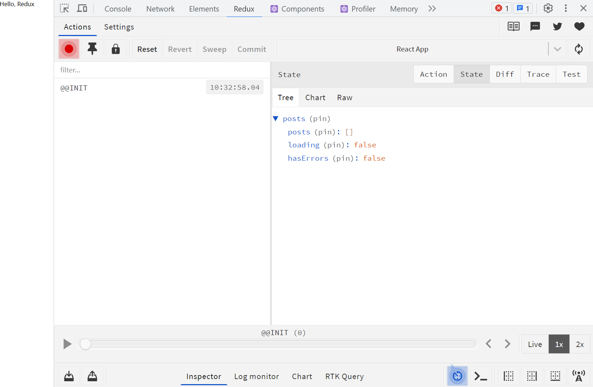
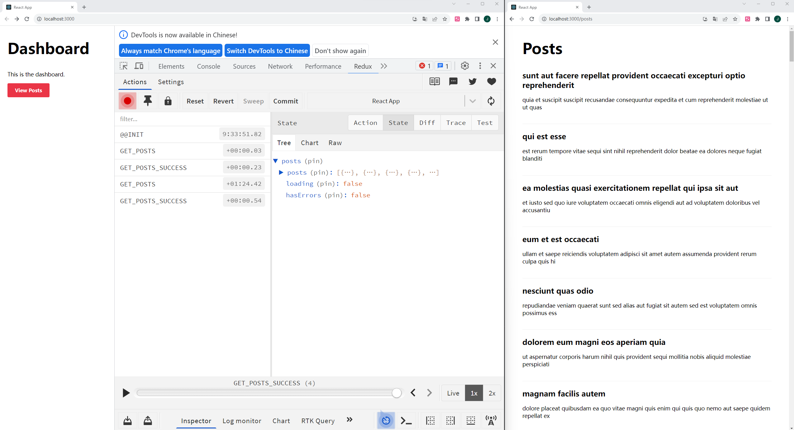

# 前言

## 译者述

1、原文来自 [Tania Rascia](https://www.taniarascia.com/) 个人网站上的一篇文章：[Redux Tutorial: An Overview and Walkthrough](https://www.taniarascia.com/redux-react-guide/)。

2、这是一篇较易的入门介绍文章, 发布于 2020 年 3 月 9 日。

3、翻译中会尽量遵照原意, 也会加入译者的技术注释, 以及选择更符合汉语文法的译句。

---

# 正文

## 作者述

你有使用 [React](https://reactjs.org/) 的经验吗?你是否听说过 Redux, 但是因为它看起来很复杂且没有合适的入门指南而推迟学习？如果这是你的情况, 那么这篇文章正适合你。放下恐惧, 和我一起开始这段不算痛苦的学习旅程吧。

## 预备知识

对本文教程, 你必须已知如何使用 React, 我不会解释任何 React 方面的知识。

- 熟悉 [HTML 和 CSS](https://internetingishard.com/)
- 熟悉 [ES6 语法和特性](https://www.taniarascia.com/es6-syntax-and-feature-overview/)
- 了解 React 术语：[JSX, State(状态), Components(组件), Props, Lifecycle(生命周期)](https://www.taniarascia.com/getting-started-with-react/) 以及 [Hooks](https://www.taniarascia.com/crud-app-in-react-with-hooks)
- 了解 [React Router](https://www.taniarascia.com/using-react-router-spa/)
- 了解异步 JS 和[创建 API 调用](https://www.taniarascia.com/how-to-connect-to-an-api-with-javascript)

另外, 可以下载 Redux 开发工具：[谷歌浏览器插件](https://chrome.google.com/webstore/detail/redux-devtools/lmhkpmbekcpmknklioeibfkpmmfibljd?hl=en)或者[火狐浏览器插件](https://addons.mozilla.org/en-US/firefox/addon/reduxdevtools/)。

## 本文目标

在本文中, 我们会新建一个小的 blog app, 它会从一个 API 中获取文章和评论。我曾经通过普通版本的 Redux 和[Redux Toolkit](https://redux-toolkit.js.org/) (RTK, 官方认可的 Redux 工具集) 创建过一个相同的 app。以下是普通版和 RTK 版的源代码和演示的链接。

**React + Redux Application (Plain Redux)**

- [源代码](https://codesandbox.io/s/react-redux-application-hewdb)
- [Demo 链接](https://hewdb.csb.app/)

**React + Redux Toolkit Application**

- [源代码](https://codesandbox.io/s/react-redux-toolkit-application-cbb6s)
- [Demo 链接](https://cbb6s.csb.app/)

> 注意: 此 app 是通过 “[JSON 占位符 API](https://jsonplaceholder.typicode.com/)” 从真正的 API 中获取数据的的。由于 CodeSandbox 上的速率限制，API 可能会显得很慢，但这与 Redux app 本身无关。当然，还可以直接在本地克隆数据。

我们将学到：

- 什么是 Redux 以及为什么使用它

- Redux 的术语：actions, reducers, store, dispatch, connect, 和 container

- 用 [Redux Thunk](https://github.com/reduxjs/redux-thunk) 发起异步 API 请求

- 学会使用 React 和 Redux 制作轻巧、真实的 app

- 学会使用 Redux 工具简化 Redux app 的开发

# 什么是 Redux

Redux 是一个 JS app 的状态管理器。使用 React, 可以在组件级别管理状态, 并通过 props 传递状态。而使用 Redux, 整个 app 的状态都会在一个不可变对象中管理。对 Redux 状态的每次更新, 其结果是一个新的对象, 它复制了原对象中的部分状态, 并添加了改动状态。

Redux 的初创人是 [Dan Abramov](https://overreacted.io/) 和 [Andrew Clark](https://github.com/acdlite)。

# 为什么使用 Redux

- 便于管理全局状态 —— 访问或更新任何 Redux 连接组件的状态的任意部分。

- 便于追踪状态更改(通过 Redux 开发工具) —— 任何 action 或状态改变都可以被轻松追踪。实际上，每次更改，app 的全部状态都会被记录，这意味着我们可以轻松的进行 time-travel debugging, 以便于在更改历史之间切换。

Redux 的缺点在于它有很多初始模板( initial boilerplate )需要设置和维护(特别是单纯使用 Redux 而没有使用 Redux 工具的时候)。因此，对一个简单的 app 而言，或许[不需要使用 Redux](https://medium.com/@dan_abramov/you-might-not-need-redux-be46360cf367), 而只需要简单使用 [Context API](https://www.taniarascia.com/using-context-api-in-react/) 即可管理好全局状态。

根据我的个人经验，之前是只使用 Context 建立 app, 后来将所有内容转换为 Redux 以便于维护和组织。

> (译者补充：这个状态追踪很像 git 的历史记录)

# 术语

我通常不喜欢单列出术语及其定义列表，但是 Redux 中有些概念就是很陌生的。所以我将在这部分简单描述一下其定义，便于在后文中使用。虽然读者也可以跳过这部分内容，但我认为最好先阅读所有的定义，以便了解它们并在脑海中形成一个概念。

- Actions
- Reducers
- Store
- Dispatch
- Connect

我将使用经典的 todo app (待办事项) 来举例说明。

> (译者补充：这几个术语单词就不翻译了，读写时都使用英文原文，以免造成误解。)

## Actions

一个 action 从 app 将数据发送到 Redux store。一个 action 通常是一个对象，它有两个属性：type 和 payload(可选)。type 通常是一个大写的字符串，描述了 action (动作/事件)。payload 是可能被传输的附加数据。

```js
// Action Type
const DELETE_TODO = "posts/deleteTodo";
```

```js
// Action
{
  type: DELETE_TODO,
  payload: id,
}
```

## Action creators

一个 action creator 是一个函数，他返回一个 action 。

## Reducers

一个 reducer 是一个函数，有两个入参：state 和 action 。

一个 reducer 是不可变的，它的返回值是整个 state 的复制版本。

一个 reducer 通常由一个 switch 语句组成，该语句遍历所有可能的 action type 。

```js
// Reducer
const initialState = {
  todos: [
    { id: 1, text: "Eat" },
    { id: 2, text: "Sleep" },
  ],
  loading: false,
  hasErrors: false,
};

function todoReducer(state = initialState, action) {
  switch (action.type) {
    case DELETE_TODO:
      return {
        ...state,
        todos: state.todos.filter((todo) => todo.id !== action.payload),
      };
    default:
      return state;
  }
}
```

> (译者补充：通过不同的 action 触发特定功能的运行，于是 state 的更新逻辑可以不对外暴露，在业务逻辑中，只需要调用 action 即可。而 action 一般是多个子 action 的集合，通过 type 指定具体的值，这样便于以后增加新的 action。)

## Store

Redux app 的 state 是存在于 store 中的，而 store 是由 reducer 初始化得到的。当和 React 一起使用时，用 Provider 标签包裹 app, 然后在 Provider 内部的任何东西就都可以访问 Redux 了。

```js
// Store
import { createStore } from "redux";
import { Provider } from "react-redux";
import reducer from "./reducers";

const store = createStore(reducer);

render(
  <Provider store={store}>
    <App />
  </Provider>,
  document.getElementById("root")
);
```

## Dispatch

dispatch 是一个函数，在 store 对象中。dispatch 接受一个对象参数：该对象用于更新 Redux state 。通常，此对象是调用 action creator 得到的结果。

```js
const Component = ({ dispatch }) => {
  useEffect(() => {
    dispatch(deleteTodo());
  }, [dispatch]);
};
```

## Connect

connect 是一个函数，它是连接 React 到 Redux 的一种典经方法，连接的组件有时被称为容器。

好了，这差不多涵盖了 Redux 的主要项。在没有任何上下文的情况下阅读术语可能会让人不知所措，所以让我们开始吧。

# 快速开始

为了简单，我们使用 create-react-app 来设置环境。

```bash
npx create-react-app redux-tutorial
cd redux-tutorial
```

Redux 需要一些依赖：

- [Redux](https://github.com/reduxjs/redux) ———— 核心库
- [React Redux](https://github.com/reduxjs/react-redux) ———— 绑定 React 和 Redux
- [Redux Thunk](https://github.com/reduxjs/redux-thunk) ———— Redux 异步中间件
- [Redux DevTools Extension](https://github.com/reduxjs/redux-devtools-extension) ———— 连接 Redux app 和 Redux DevTools

你可以使用 yarn add 或者 npm i 安装这些依赖，我自己也会使用 react-router-dom 这个额外的依赖。

> (译者补充：在不同 OS 中，读者注意下命令的变化。)

> (由于本文原文是 2020 年写的，有些写法在新版本中可能不兼容，需要时切换到旧版本即可，或者直接使用译者的 packge.json 配置：)
>
> ```js
> "dependencies": {
>    "@testing-library/jest-dom": "^5.16.5",
>    "@testing-library/react": "^13.4.0",
>    "@testing-library/user-event": "^13.5.0",
>    "react": "^18.2.0",
>    "react-dom": "^18.2.0",
>    "react-redux": "^8.0.5",
>    "react-router-dom": "^5.0.0", // 这一个要注意，后文中的写法，不兼容 6 及以上版本
>    "react-scripts": "5.0.1",
>    "redux": "^4.2.1",
>    "redux-devtools-extension": "^2.13.9",
>    "redux-thunk": "^2.4.2",
>    "web-vitals": "^2.1.4"
>  },
> ```

```bash
npm i \
redux \
react-redux \
redux-thunk \
redux-devtools-extension \
react-router-dom
```

下一步，删除所有模板文件。我们将从头开始添加我们需要的所有东西。

```bash
cd src && rm * # 进入 src 文件，然后删除里面的所有文件
```

下一步，创建四个目录: Redux 中的 reducers 和 actions，还有 React 中的页面目录 pages 和组件目录 components 。

```bash
mkdir actions components pages reducers
```

下一步，把 index.js, App.js 和 index.css 重建回来。

```bash
touch index.js index.css App.js
```

现在我们的工程目录树如下所示：

```
└── src/
    ├── actions/
    ├── components/
    ├── pages/
    ├── reducers/
    ├── App.js
    ├── index.css
    └── index.js
```

对于 index.css 文件，只需复制[这个网站](https://gist.githubusercontent.com/taniarascia/b0ca2e2c165390f8678e1346514e143d/raw/bed873301fd1c71261a05ec02ca152d908f49463/index.css)的内容。我只打算讨论功能而不是样式，所以我只写了一些非常基本的样式，以确保网站看起来不太糟糕。

现在我们有了足够的模板文件，让我们开始吧。

# 设置 Redux Store

当我第一次学习 Redux 时，感到非常茫然，因为我看到的每个 app 的 index.js 设置都有点不同。在观察了很多最新的 app 并对它们的共性进行分析之后，我能够很好地识别 Redux app 中真正需要包含的内容，或者人们为了与众不同而别出心裁的操作。

网上有很多教程展示了“如何使用 todo 设置一个非常基本的 Redux 存储”，但我认为这些教程对于了解“如何进行生产级设置”没有多大帮助，所以我将从一开始就使用完整项（你需要的所有东西）来设置它。尽管 Redux 非常灵活多变，但还是会有一些固定不变化的方面。

在 index.js 中，我们会引入一些东西：

- **createStore**：创建 store 以维护 Redux 状态
- **applyMiddleware**：能够使用中间件，这里中间件指 thunk
- **Provider**：将整个应用程序封装在 Redux 中
- **thunk**：一个中间件，允许我们在 Redux 中进行异步操作
- **composeWithDevTools**：将应用程序连接到 Redux DevTools 的代码

```js
// index.js
import React from "react";
import { render } from "react-dom";
import { createStore, applyMiddleware } from "redux";
import { Provider } from "react-redux";
import thunk from "redux-thunk";
import { composeWithDevTools } from "redux-devtools-extension";

import App from "./App";
import rootReducer from "./reducers";

import "./index.css";

const store = createStore(
  rootReducer,
  composeWithDevTools(applyMiddleware(thunk))
);

render(
  <Provider store={store}>
    <App />
  </Provider>,
  document.getElementById("root")
);
```

> (译者补充：在 index.js 中的 Provider 写法，和 React 中提供的 useContext 写法相似)

在 App.js 中添加一个组件。我们稍后会修改它，但我们现在只想让应用程序启动并运行。

```js
// App.js

import React from "react";

const App = () => {
  return <div>Hello, Redux</div>;
};

export default App;
```

## 引入 reducers

最后一件事是引入 reducers —— reducer 是一个决定 Redux 状态变化的函数，它是一个纯函数，返回更新后的状态的复制。

Redux 的一个简洁特性是，我们可以有许多 reducer，并使用 combineReducers 将它们组合成一个给 store 使用的根 reducer。这使我们能够轻松地组织代码，同时仍然将所有内容放在一个根状态树中。

由于这个应用程序会类似一个博客，所以它会有一个文章列表，我们把列表放在 postsReducer 中。有了这个 combineReducers 方法，我们就可以引入任何我们想要的东西 —— commentsReducer 、authReducer 等。

在 reducers/index.js 中，创建一个文件来组合所有的 reducers。

```js
// reducers/index.js

import { combineReducers } from "redux";

import postsReducer from "./postsReducer";

const rootReducer = combineReducers({
  posts: postsReducer,
});

export default rootReducer;
```

最后，我们将创建 postsReducer，它有一个初始状态。就像你对普通 React 组件的期望一样，我们将有一个 loading 和 hasErrors 状态，以及一个 posts 数组，文章列表将保存在 posts 里。在 switch 中，还没有设置 action，而只有一个返回整个 state 的 default case。

```js
// reducers/postsReducer.js

export const initialState = {
  posts: [],
  loading: false,
  hasErrors: false,
};

export default function postsReducer(state = initialState, action) {
  switch (action.type) {
    default:
      return state;
  }
}
```

现在我们至少有了足够的配置，应用程序能够加载而不会崩溃了。

## Redux 插件

加载完应用程序并设置好 Redux Provider 后，我们可以看一下 Redux DevTools。下载插件后，它将成为开发人员工具(F12)中的一个 tab。单击 State，能观察到到目前为止应用程序的整个状态。



这里内容比较少看不太明显，但当你获得了很多 reducers 和 actions 时， Redux DevTools 就会显得很神奇。它可以跟踪应用程序的所有更改，与普通 React 相比，它使调试变得轻而易举。

# 设置 Redux Actions

现在我们有一个 reducer，但我们没有任何 actions。这时 reducer 只会返回状态，但没办法修改状态。actions 是我们与 Redux 存储进行通信的方式。对于这个博客 app，我们将从 API 获取文章数据，然后把它们置于 Redux 状态中。

由于获取文章是一个异步操作，因此需要使用 Redux thunk。幸运的是，使用 thunk，我们只需要在 store 中设置 thunk （我们已经这样做了），而不必做任何特殊处理。

创建一个 postsActions.js 文件。首先，我们将 action type 定义为常量 —— 这不是强制要求的，但这是一种常见的约定，便于导出 action 和防止拼写错误。我们想做三件事：

- getPosts - 开始告诉 Redux 我们将从 API 获取帖子
- getPostsSuccess - 在成功的 API 调用时将帖子传递给 Redux
- getPostsFailure - 通知 Redux 在调用期间遇到错误，API 调用失败

```js
// actions/postsActions.js
// 创建 Redux action types
export const GET_POSTS = "GET_POSTS";
export const GET_POSTS_SUCCESS = "GET_POSTS_SUCCESS";
export const GET_POSTS_FAILURE = "GET_POSTS_FAILURE";
```

然后创建 action creators —— 返回 action 的函数。该 action 由 type 和 payload 组成（payload 是可选字段，它包含了数据）。

```js
// actions/postsActions.js
// 创建 Redux action creators ，它返回一个 action
export const getPosts = () => ({
  type: GET_POSTS,
});

export const getPostsSuccess = (posts) => ({
  type: GET_POSTS_SUCCESS,
  payload: posts,
});

export const getPostsFailure = () => ({
  type: GET_POSTS_FAILURE,
});
```

最后，创建将上述所有三个 action 组合在一起的异步 thunk action。调用时，它将 dispatch(调度) 初始的 action (即 getPosts())以通知 Redux 准备 API 调用，然后在 try/catch 中执行所有必要的操作以获取数据，最后 dispatch 成功或失败的 action。

```js
// actions/postsActions.js
// Combine them all in an asynchronous thunk
export function fetchPosts() {
  return async (dispatch) => {
    dispatch(getPosts());

    try {
      const response = await fetch(
        "https://jsonplaceholder.typicode.com/posts"
      );
      const data = await response.json();

      dispatch(getPostsSuccess(data));
    } catch (error) {
      dispatch(getPostsFailure());
    }
  };
}
```

太好了，我们现在都完成了创建 actions！剩下要做的就是告诉 reducer 如何处理每个 action 的状态。

## 响应 actions

回到我们的 postsReducers，其中有一个 switch，它还没有发挥作用呢。

```js
// reducers/postsReducer.js
export default function postsReducer(state = initialState, action) {
  switch (action.type) {
    default:
      return state;
  }
}
```

现在我们有了 actions，我们可以从 postsActions 页面引入它们。

```js
// Import all actions
import * as actions from "../actions/postsActions";
```

对于每个 action，我们将创建一个对应的 case ，它返回整个 state 以及我们对它所做的任何更改。例如 GET_POSTS ，我们要做的就是告诉应用程序将 loading 设置为 true， 因为我们马上要进行 API 调用。

```js
case actions.GET_POSTS:
  return { ...state, loading: true }
```

- GET_POSTS - 开始加载
- GET_POSTS_SUCCESS - 应用程序没有错误，应该停止加载
- GET_POSTS_FAILURE - 应用程序有错误，应该停止加载

下面是整个 reducer：

```js
// reducers/postsReducer.js
import * as actions from "../actions/postsActions";

export const initialState = {
  posts: [],
  loading: false,
  hasErrors: false,
};

export default function postsReducer(state = initialState, action) {
  switch (action.type) {
    case actions.GET_POSTS:
      return { ...state, loading: true };
    case actions.GET_POSTS_SUCCESS:
      return { posts: action.payload, loading: false, hasErrors: false };
    case actions.GET_POSTS_FAILURE:
      return { ...state, loading: false, hasErrors: true };
    default:
      return state;
  }
}
```

现在我们的 actions 和 reducers 已经准备就绪，所以剩下要做的就是将所有内容连接到 React 应用程序。

# 将 Redux 连接到 React 组件

由于我创建的 demo 使用 React Router 来提供一些路由，比如（仪表板）首页、文章列表页、单文章页面等。我现在将引入 React Router。此 demo 中，我将只引入首页和文章列表页。

> (译者补充：注意 react-router-dom 版本，Switch 在 6 及以上版本无效，所以最好使用 5 版本。当然，你也可以自己修改代码，使用新版的 Routers 写法。)

```js
import React from "react";
import {
  BrowserRouter as Router,
  Switch,
  Route,
  Redirect,
} from "react-router-dom";

import DashboardPage from "./pages/DashboardPage";
import PostsPage from "./pages/PostsPage";

const App = () => {
  return (
    <Router>
      <Switch>
        <Route exact path="/" component={DashboardPage} />
        <Route exact path="/posts" component={PostsPage} />
        <Redirect to="/" />
      </Switch>
    </Router>
  );
};

export default App;
```

我们可以创建首页 —— 常规的 React 组件。

```js
// pages/DashboardPage.js
import React from "react";
import { Link } from "react-router-dom";

const DashboardPage = () => (
  <section>
    <h1>Dashboard</h1>
    <p>This is the dashboard.</p>

    <Link to="/posts" className="button">
      View Posts
    </Link>
  </section>
);

export default DashboardPage;
```

对于每个文章，让我们创建一个 Post 组件来显示文章的标题和文本摘录。在 components 子目录中创建 Post.js 。

```js
// components/Post.js
import React from "react";

export const Post = ({ post }) => (
  <article className="post-excerpt">
    <h2>{post.title}</h2>
    <p>{post.body.substring(0, 100)}</p>
  </article>
);
```

> 未连接到 Redux 的组件仍然很重要且实用，特别是在较小的、可重用的领域，例如此处的 Post 组件。

现在，有趣的部分出现在文章页面 —— 将 Redux 引入 React。为此，我们将使用 react-redux 中的 connect。首先，我们将为页面创建一个常规组件：

```js
// pages/PostsPage.js
import React from "react";

const PostsPage = () => {
  return (
    <section>
      <h1>Posts</h1>
    </section>
  );
};

export default PostsPage;
```

然后，我们将引入 connect —— 它是一个高阶函数，可以把 Redux store 连接到 React 组件。这个顾名思义的函数将从 Redux store 中获取任何 state，并将其传递给 React 组件的 props。对 connect 的参数 mapStateToProps，就是引入的 postsReducer 中的 loading 、 posts 和 hasErrors 。

> (译者补充:
>
> 1、高阶函数：简单理解为，生成函数的函数。
>
> 2、注意 connect 的写法。connect(mapStateToProps) 的 return 是一个新的函数，它的参数是 PostsPage。
>
> 3、数据从哪里来的？还记得 Provider 的 store 属性吗？下面 mapStateToProps 中的参数 state 就是指数据流上游中的 store 中的 state。)

```js
// pages/PostsPage.js
import React from "react";
import { connect } from "react-redux";

// Redux state is now in the props of the component
const PostsPage = ({ loading, posts, hasErrors }) => {
  return (
    <section>
      <h1>Posts</h1>
    </section>
  );
};

// Map Redux state to React component props
const mapStateToProps = (state) => ({
  loading: state.posts.loading,
  posts: state.posts.posts,
  hasErrors: state.posts.hasErrors,
});
// Connect Redux to React
export default connect(mapStateToProps)(PostsPage);
```

> 由于此组件使用来自同一 reducer 的状态，因此我们也可以简写为 state => state.posts 。但是，使用更长的写法也是有意义的：如果需要将多个 reducers 引入同一个组件中，可以明确其内容。

最后，我们将从 actions 中引入异步 fetchPosts ，它将“获取所有文章的整个生命周期”（译者注：就是 fetch 从开始到成功或失败的全过程）合并为一个 action。使用 Reat 的 useEffecct，在组件挂载时调用 dispatch(fetchPosts()) 来更新文章。在已连接的组件上，dispatch 将自动可用。

```js
// pages/PostsPage.js
import React, { useEffect } from "react";
import { connect } from "react-redux";

// Bring in the asynchronous fetchPosts action
import { fetchPosts } from "../actions/postsActions";

const PostsPage = ({ dispatch, loading, posts, hasErrors }) => {
  useEffect(() => {
    dispatch(fetchPosts());
  }, [dispatch]);

  return (
    <section>
      <h1>Posts</h1>
    </section>
  );
};

const mapStateToProps = (state) => ({
  loading: state.posts.loading,
  posts: state.posts.posts,
  hasErrors: state.posts.hasErrors,
});

export default connect(mapStateToProps)(PostsPage);
```

此时剩下要做的就是显示页面的所有三种可能状态：无论是正在加载、出现错误还是从 API 成功检索文章。

```js
// pages/PostsPage.js
import React, { useEffect } from "react";
import { connect } from "react-redux";

import { fetchPosts } from "../actions/postsActions";
import { Post } from "../components/Post";

const PostsPage = ({ dispatch, loading, posts, hasErrors }) => {
  useEffect(() => {
    dispatch(fetchPosts());
  }, [dispatch]);

  // Show loading, error, or success state
  const renderPosts = () => {
    if (loading) return <p>Loading posts...</p>;
    if (hasErrors) return <p>Unable to display posts.</p>;
    return posts.map((post) => <Post key={post.id} post={post} />);
  };

  return (
    <section>
      <h1>Posts</h1>
      {renderPosts()}
    </section>
  );
};

const mapStateToProps = (state) => ({
  loading: state.posts.loading,
  posts: state.posts.posts,
  hasErrors: state.posts.hasErrors,
});

export default connect(mapStateToProps)(PostsPage);
```

以上就是全部的内容啦 - 我们现在有一个已连接的组件，并将数据从 API 引入我们的 Redux store。使用 Redux DevTools，我们可以看到每个 action 的记录，以及每个状态更改后的变化。



# 结束语

使用纯 Redux 创建 app 的教程到此结束。如果查看 demo 的[源代码](https://codesandbox.io/s/react-redux-application-hewdb)，你会发现添加了很多内容 —— 单个文章以及评论的 reducer 和 actions。

我建议你逐步完善你的 project，以便它能和 demo app 对得上。后文没有新的概念需要学习，只是更灵活的运用技巧。你将创建两个甚至更多的 reducers 和 actions，并了解如何将两个 state 传入一个单文章页面组件中，该组件包含文章数据以及该文章的评论数据。

# Redux 工具包

我还想介绍一件事 —— Redux 工具包。Redux Toolkit (RTK)是一种更新、更简单的官方使用 Redux 的方式。你可能会注意到 Redux 有很多用于设置的模板文件，并且需要比普通 React 更多的文件夹和文件。现在已经出现了一些模式试图轻量化配置，例如 [Redux ducks 模式](https://github.com/erikras/ducks-modular-redux)。但其实我们可以进一步简化它。

查看 [Redux Toolkit demo app](https://codesandbox.io/s/react-redux-toolkit-application-cbb6s) 的源代码，这与我们刚刚使用 Redux 创建的 app 相同，但使用的是 RTK。它要简单得多，所有相同功能的代码行数都大大减少。

使用 RTK 只需要一个依赖项，@reduxjs/toolkit。

```bash
npm i @reduxjs/toolkit
```

并且不再需要您安装 redux-thunk 或 redux-devtools-extension 依赖项。

## Redux 工具包的优势

使用 RTK 的主要优点有：

- 更易于设置（更少的依赖）
- 减少模板代码（一个 slice vs. 多文件的 actions and reducers）
- 明智的默认值（ 内置 Redux Thunk 和 Redux DevTools）
- 更小粒度的 state 更新，这意味着不再需要在每个 reducer 中都 return { ...state } 。

> (译者补充：第四个优点的原文不太好翻译，这里贴一下原文：
>
> - The ability to use [direct state mutation](https://redux-toolkit.js.org/api/createreducer#direct-state-mutation), since RTK uses [immer](https://github.com/immerjs/immer) under the hood. This means you no longer need to return { ...state } with every reducer.
>
> )

## Store

由于 Redux Toolkit 已经内置了很多功能，比如 Redux DevTools 和 Redux Thunk，所以我们不再需要将它们放入 index.js 文件中。现在我们只需要 configureStore ，而不是 createStore 了。

```js
// index.js
import React from "react";
import { render } from "react-dom";
import { configureStore } from "@reduxjs/toolkit";
import { Provider } from "react-redux";

import App from "./App";
import rootReducer from "./slices";

import "./index.css";

const store = configureStore({ reducer: rootReducer });

render(
  <Provider store={store}>
    <App />
  </Provider>,
  document.getElementById("root")
);
```

## Slices

RTK 不是将 “reducers、actions 和所有文件” 作为单独的文件处理并单独创建所有 action types，而是为我们提供了 slices 的概念。slices 自动生成 reducers、action types 和 action creators。因此，您只需创建一个文件夹 - slices 。

initialState 看起来是一样的。

```js
// slices/posts.js
import { createSlice } from "@reduxjs/toolkit";

export const initialState = {
  loading: false,
  hasErrors: false,
  posts: [],
};
```

slices 中 reducers 的名称也将相同 —— getPosts 、 getPostsSuccess 和 getPostsFailure 。我们将进行所有相同的更改，但请注意，我们不再返回整个 state —— 我们只是改变状态。它在 hood 下仍然是不可变的，但这种方法对某些人来说可能更容易、更快捷。如果愿意，你仍然可以将整个 state 作为对象返回。

> 译者补充：这里 hood 的理解，和前文第四个优点一样，取查看更多资料吧。

```js
// slices/posts.js
// A slice for posts with our three reducers
const postsSlice = createSlice({
  name: "posts",
  initialState,
  reducers: {
    getPosts: (state) => {
      state.loading = true;
    },
    getPostsSuccess: (state, { payload }) => {
      state.posts = payload;
      state.loading = false;
      state.hasErrors = false;
    },
    getPostsFailure: (state) => {
      state.loading = false;
      state.hasErrors = true;
    },
  },
});
```

生成的 actions 是相同的，我们只是不必再单独写出它们。从同一个文件中，我们可以导出所有 actions、reducer、异步 thunk 和一个新东西 —— selector。我们将使用 selector 来访问 React 组件中的任何状态，而不是使用 connect 。

```js
// slices/posts.js
// Three actions generated from the slice
export const { getPosts, getPostsSuccess, getPostsFailure } =
  postsSlice.actions;

// A selector
export const postsSelector = (state) => state.posts;

// The reducer
export default postsSlice.reducer;

// Asynchronous thunk action
export function fetchPosts() {
  return async (dispatch) => {
    dispatch(getPosts());

    try {
      const response = await fetch(
        "https://jsonplaceholder.typicode.com/posts"
      );
      const data = await response.json();

      dispatch(getPostsSuccess(data));
    } catch (error) {
      dispatch(getPostsFailure());
    }
  };
}
```

> 译者补充:为了最低运行，还需要加上这个文件。完整代码地址在前文查看，可能需要重新 npm start 一下。
>
> ```js
> // slices/index.js
> import { combineReducers } from "redux";
>
> import postsReducer from "./posts";
>
> const rootReducer = combineReducers({
>   posts: postsReducer,
> });
>
> export default rootReducer;
> ```

## 在 React 组件中选择 Redux 状态

正如我们刚刚了解到的，传统的方法是与 connect() 函数一起使用 mapStateToProps ，这在代码库中仍然很常见，因此值得了解这种写法。你仍然可以在 RTK 中使用此方法，但较新的 React Hooks 写法是使用 react-redux 提供的 useDispatch 和 useSelector ，这种方法需要的代码较少。

正如下面的 PostsPage.js 文件中所示，Redux 状态不再连接到组件的 props 上，而是由我们在 slice 中导出的 selector(选择器)提供。

```js
// pages/PostsPage.js
import React, { useEffect } from "react";
import { useDispatch, useSelector } from "react-redux";

import { fetchPosts, postsSelector } from "../slices/posts";

import { Post } from "../components/Post";

const PostsPage = () => {
  const dispatch = useDispatch();
  const { posts, loading, hasErrors } = useSelector(postsSelector);

  useEffect(() => {
    dispatch(fetchPosts());
  }, [dispatch]);

  const renderPosts = () => {
    if (loading) return <p>Loading posts...</p>;
    if (hasErrors) return <p>Unable to display posts.</p>;

    return posts.map((post) => <Post key={post.id} post={post} excerpt />);
  };

  return (
    <section>
      <h1>Posts</h1>
      {renderPosts()}
    </section>
  );
};

export default PostsPage;
```

现在我们有和以前一样的应用程序，从 Redux Toolkit 进行了一些更新，并且需要维护的代码少了很多。

# 总结

我们成功了！如果你跟我一起读完了整个教程，你现在应该对 Redux 有一个不错的体会，无论是旧式写法还是使用 Redux Toolkit 来简化代码。

总而言之，Redux 允许我们轻松地在 React 应用程序中管理全局状态。我们可以从任何地方访问和更新状态，并使用 Redux Devtools 轻松调试应用程序的整个状态。

你可以将应用程序的大部分状态放在 Redux 中，但应用程序的某些区域（例如正在更新的表单）保持 React 组件状态本身仍然有意义。

希望你喜欢这篇文章！将两个完整的 demo 放在一起并在这里运行整个事情需要做很多工作，这篇文章很长，但希望这是你学习所有初级和中级 Redux 概念的一站式商店。

> (译者补充：原文这里是捐款和订阅链接，感兴趣的读者可用前文地址自行访问。)

请让我知道你的想法，如果对你有所帮助，请分享这篇文章，并且随时欢迎捐款！
