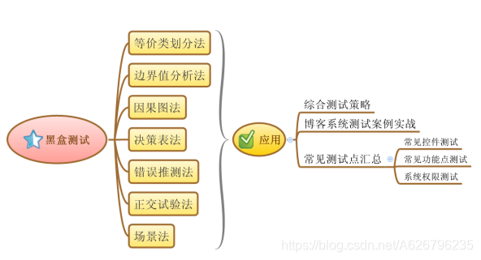
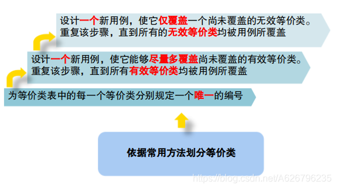
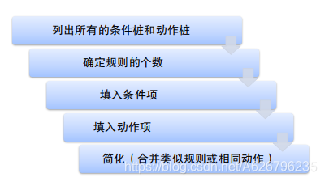

# 一、概述引论

## （一）缺陷

### 1、缺陷定义

缺陷：最终产品同用户的期望不一致。
1、功能错误
2、功能遗漏
3、超出需求的部分
4、性能不符合要求

### 2、缺陷产生原因

### 3、解决办法

通过**软件测试**尽可能减少缺陷。

## （二）软件测试

### 1、软件测试定义

**传统意义上的测试定义**，是狭义的。
1979 年 Glenford J. Myers 在《软件测试艺术》（The art of software testing）书中给出的定义：
软件测试是为了发现软件缺陷而执行程序或系统的过程。

**1983 年 IEEE 的定义** ：
使用人工或自动手段运行或测定某个系统的过程，其目的在于检验它是否满足规定的需求或是弄清预期结果与实际结果之间的差别。

**软件测试也可以定义**为是“**验证（Verification）**”和“**有效性确认（Validation）**”活动构成的整体。
**验证**：是检验软件是否已正确地实现了产品规格书所定义的系统功能和特性。
**有效性确认**：是确认所开发的软件是否满足用户真正需求的活动。

### 2、区分缺陷、故障、失效

# 二、软件测试基础

## （一）软件测试的原则

**1.所有的测试都应追溯到用户的需求**
系统中最严重的错误是那些导致程序无法满足用户需求的错误。

**2.尽早地和不断地进行软件测试**
问题发现越早，解决问题的代价就越小。

**3.不可能完全的测试**
输入量太大
执行路径太多
软件测试最致命的缺陷就是：不能进行彻底的测试

**4 .Pareto 原则**
Pareto 原则暗示着测试发现的错误中的 80%很可能起源于程序模块中的 20%。

**5.软件缺陷的寄生虫性**
找到的软件缺陷越多，就说明软件缺陷越多。

**6.避免测试自己的程序**
程序员轻易不会承认自己写的程序有错误；
程序员的测试思路有局限性，做测试时很容易受到编程思路的影响；
程序员测试不具有典型性。

**7.设计周密的测试用例**
软件测试的本质就是针对要测试的内容确定一组测试用例。
测试用例至少应包括：
a 执行测试用例前，应满足的前提条件
b 输入
c 预期输出
设计测试用例时，应当包括合理的输入条件和不合理的输入条件。

**8.回归测试**
程序修改后必须进行回归测试，避免引入新的错误。

**9.严格执行测试计划，排除测试的随意性。**

**10.确认 BUG 的有效性**
对测试错误结果一定要有一个确认的过程。
有时候测试人员提交的 BUG 并不是真正的 BUG。

**11.妥善保存测试计划，测试用例，出错统计和最终分析报告，为维护提供方便。**

## （二）软件质量保证

### 1、质量定义

**ISO 9000** ：质量是一组固有特性符合需求的程度。
**IEEE 的定义**：
系统、部件或过程满足明确需求的程度。
系统、部件或过程满足客户或用户需要或期望的程度。
**六标准差（6σ）**：10^6^次测试中的错误次数。
**RUP 的定义**：满足或超出认定的一组需求，并使用经过认可的评测方法和标准来评估，还使用认定的流程来生产。

### 2、软件质量的定义

**ISO 14598-1999 定义**：软件特性的总和，软件满足规定或潜在用户需求的能力。
**ISO 9126-2001 定义**：软件满足用户规定或潜在用户需求的能力，要从软件在内部，外部和使用过程中的表现来衡量，包含内部质量、外部质量、和使用质量。

### 3、质量的不同层面

**符合性质量**：能够满足国家或行业标准、产品规范的要求，最初的质量观念。
**适用性质量**：让客户满意，不仅满足标准、规范的要求，而且满足客户的其他要求。
**广义质量**：不仅要让客户满意，还要让客户愉快，也就是，想在客户的前面，超出客户的希望。

##\# 4、软件质量属性（特性）的定义
定义：软件产品、过程或与质量要求有关的固有属性 。
1、软件质量是许多质量属性的综合体现，各种质量属性反映了软件质量的方方面面。
2、质量要求只有转化为有指标的质量特性，质量才可以度量。
3、通过改善软件的各种质量属性，从而提高软件的整体质量。

### 5、软件质量保证（SQA）的定义

建立一套有计划，有系统的方法，来向管理层保证拟定出的标准、步骤、实践和方法能够正确地被所有项目所采用。
1、它使软件开发过程对于管理人员来说是可见的。
1、它通过对软件产品和活动进行评审来验证软件是合乎标准的。

### 6、软件质量保证方法

**产品质量**：
工作成果产生时(马上)进行质量检查，及时找出并消除工作成果中的缺陷  
1、技术评审
2、软件测试

**过程质量**：
开发过程中有效地预防工作成果产生缺陷，将高质量内建于开发过程。  
过程规范建立
1、过程检查
2、软件过程改进

## （三）测试模型与基础

### 1、测试层次的传统观点

### 2、软件测试模型

### 3、软件测试流程

**1、测试计划**

**测试计划**是对每个产品，或是对各个开发阶段的产品开展测试的策略。
一个完整的测试计划应该包含以下几个方面：
a 对测试范围的界定；
b 风险的确定；
c 资源的规划；
d 时间表的制定；

**2、测试设计**
**测试设计**阶段要设计测试用例和测试过程，要保证测试用例完全覆盖测试需求。
测试设计阶段最重要的是如何将测试需求分解，如何设计测试用例。

**3、测试开发**

(1).准备测试环境
a 测试技术准备
b 配置软件、硬件环境
c 人员

(2).获得测试数据  
a 正常事务的测试
b 使用无效数据的测试

(3).测试脚本
所谓脚本，是完整的一系列相关终端的活动。
一般测试脚本有 5 个级别：
a 单元脚本
b 并发脚本
c 集成脚本
d 回归脚本
e 强度/性能脚本

(4).辅助测试工具
a 优秀的办公处理软件
b 错误跟踪系统
c 自动测试工具
d 软件分析工具
e 好的操作系统
f 多样化平台

**4、测试执行**

**测试执行**的过程由 4 个部分组成：
输入：要完成工作所必须的入口标准或可交付的结果。
执行过程：从输入到输出的过程或工作任务。
检查过程：确定输出是否满足标准的处理过程。
输出：推出标准或工作流程产生的可交付的结果。

**5、评估测试**

软件测试的主要评测方法包括：
(1) 覆盖评测
最常用的覆盖评测是基于需求的测试覆盖和基于代码的测试覆盖。

(2)质量评测
在测试过程中，已发现缺陷的评估提供了最佳的软件质量指标。

(3)性能评测
评估测试对象的性能时，侧重于获取与行为相关的数据，如响应时间、事务处理数、内存占用率、操作可靠性等。

# 三、软件测试方法与技术

**主流测试技术**

## （一）黑盒测试之等价类划分

### 1、技术概述

### 2、黑盒测试的目标

黒盒测试试图发现以下类型的错误：
1、功能错误或遗漏；
2、界面错误，不美观；
3、外部信息访问错误；
4、初始化和终止错误；
5、在接口上，能否正确地接受输入数据，能否产生正确地输出信息；
6、性能错误；

### 3、等价类划分 A

**等价类划分法**：
依据需求对输入的范围进行细分，然后再分出的每一个区域内选取一个有代表性的测试数据开展测试。
**有效等价类**：
符合需求说明，合理地输入数据集合。
**无效等价类**：
不符合需求说明，无意义地输入数据的集合。

**操作步骤**

### 4、等价类划分 B

单缺陷与多缺陷假设产生弱等价类与强等价类测试之分；
是否进行无效数据的处理产生健壮与一般等价类测试之分。

于是有：

1、弱一般等价类测试
测试用例设计：
选取的测试用例覆盖所有的有效等价类（只有一个缺陷）。

2、强一般等价类测试
测试用例设计：
将每个变量的有效等价类做笛卡尔积，设计测试用例覆盖笛卡尔积的每个元素。

3、弱健壮等价类测试
测试用例设计：
对有效输入，使用每个有效等价类的一个值。
对无效输入，测试用例将拥有一个无效值，并保持其余的值都是有效的。

4、强健壮等价类测试
从所有等价类的笛卡尔积的每一个元素中获得测试用例。

**“单缺陷”假设**
失效极少是由两个或多个缺陷的同时发生引起的。

### 5、等价类测试指导方针和观察

1）弱形式不如对应的强形式的测试全面。
2）如果实现语言是强类型，则没有必要使用健壮形式的测试。
3）如果错误条件非常重要，则进行健壮形式的测试。
4）强等价类测试假设变量是独立的，相应的测试用例相乘会引起冗余问题。如果存在依赖关系，则常常会生成错误测试用例。

## （二）黑盒测试之边界值测试

**功能性测试的基本观点**是：
任何程序都可以看作是将输入定义域取值映射到输出值域的函数。

### 1、边界值分析

**边界值分析(Boundary Value Analysis)**

**基本原理**：
边界值分析关注输入空间的边界，并从中标识测试用例。
错误更可能出现在输入变量的极值附近。

**基本思想**
在最小值、略高于最小值、正常值、略低于最大值和最大值处取输入变量值；表示方法为 min、min+、nom、max-、和 max。
单缺陷”假设是边界值分析的关键假设。

**获得测试用例**的方法：
使所有变量取正常值，只使一个变量取极值。

归纳基本边界值分析方法
a 通过变量的个数
b 通过变量的取值范围（类型）

**优缺点**

### 2、健壮性测试

**健壮性**是指在异常情况下，软件还能正常运行的能力。
健壮性有两层含义：
a 容错能力
b 恢复能力

**基本思想**
健壮性测试是边界值分析的一种简单扩展，除了使用五个边界值分别取值，还要采用:
一个略超过最大值(max+)的取值
一个略小于最小值(min-)的取值

健壮性测试的**主要价值**是观察异常情况的处理。
软件质量要素的衡量标准：软件的容错性；
软件容错性的度量:从非法输入中恢复。

### 3、最坏情况测试

**基本思想**
边界值测试分析采用了可靠性理论的单缺陷假设；
最坏情况测试**拒绝**这种假设，关心当多个变量取极值时会出现的情况。

对每一个变量首先进行包含最小值、略高于最小值、正常值、略低于最大值、最大值五个元素集合的测试，然后对这些集合进行笛卡尔积计算，以生成测试用例。

### 4、随机测试

**基本思想**
不是永远选取有界变量的最小值、略高于最小值、正常值、略低于最大值和最大值，而是使用随机数生成器选出测试用例值。

### 5、边界值分析应遵循的原则

1）如果输入条件规定了取值范围，或规定了值的个数，测试用例选择：范围的边界内，刚刚超出范围的边界外的值；或者说：最小值、稍高于最小值、正常值、稍低于最大值、最大值。
2）针对规约的每个输出条件使用 1）原则。
3）如果规约中提到的输入输出是个有序的集合（如顺序文件、有序表等），就应注意选取有序集中的第一个和最后一个元素作为测试用例。
4）分析软件规约，找出其它的可能边界条件。

## （三）黑盒测试之决策表法

**优势**
决策表法能把**复杂逻辑关系**和**多条件组合**情况表达得较明确。
适用：在程序中，若输入输出较多，且相互制约的条件较多。

**决策表组成**
任何一个条件组合的特定取值及其相应要执行的操作称为规则；
在判定表中贯穿条件项和动作项的一列就是一条规则；
判定表中列出多少组条件取值，即有多少条规则，即条件项和动作项有多少列。

**步骤总结**
**优缺点**.
优点：它能把复杂的问题按各种可能的情况一一列举出来，简明而易于理解，也可避免遗漏。
缺点：不能表达重复执行的动作，例如循环结构。

## （四）黑盒测试之因果图法

**概述**

**计算步骤**

应用场合：
当软件的输入条件过多时，可以考虑输入的所有排列组合情况，考虑条件之间和条件结果之间关系，防止遗漏。
局限性：
测试用例数目可能会很大，不便于维护。

## （五）白盒测试

### 1、白盒测试概念

白盒测试又叫**结构测试**，逻辑驱动测试或基于程序本身的测试。

### 2、基于控制流的测试

**控制流图：**
控制流图是退化的程序流程图，图中每个处理都退化成一个结点，流线变成连接不同结点的有向弧。
控制流图将程序流程图中结构化构件改用一般有向图的形式表示。
在控制流图中用圆“○”表示节点，一个圆代表一条或多条语句。

圈复杂度：是一种为程序逻辑复杂性提供定量测度的软件度量，将该度量用于计算程序的基本的独立路径数目。
独立路径必须包含一条在定义之前不曾用到的边。（每一条新的路径都包含了一条新边）

程序的环路复杂性即 McCabe 复杂性度量，简单的定义为控制流图的区域数。
程序环路复杂性又叫圈复杂度。

**逻辑覆盖**
**路径测试**

路径覆盖的困难：太复杂。

如果把覆盖的路径数压缩到一定限度内，例如程序中的循环体只执行零次和一次，就成为基本路径测试。

通过分析程序控制流图的环路的复杂性，导出基本路径集合，从而设计测试用例，保证这些路径至少通过一次。

### 3、循环测试

**简单循环测试**

**嵌套循环测试**

**串接循环**

**非结构循环**
不能测试，尽量重新设计给结构化的程序结构后再进行测试。

### 4、基于数据流的测试

DD 路径：决策对决策路径（Miller）。从决策语句的“出路”开始，到下一个决策语句的“入路”结束。
DD 链：有向图中一条起始和终止节点不同点路径。

## （六）单元测试

### 1、基本概念

**单元测试**：是对软件基本组成单元进行的测试。是检验程序最小单位，即检查模块有无错误，它是在编码完成后必须进行的测试工作。

地位：

### 2、主要任务

单元测试针对每个程序的模块，主要测试如下 5 方面：  
**模块接口**
对模块接口进行测试，检查进出程序单元的数据流是否正确。须在其它测试之前进行。
**局部数据结构**
测试模块内部的数据能否保持完整性，包括内部数据的内容、形式及相互关系不发生错误。
**边界条件**
采用边界值分析方法设计测试用例，重点关注程序边界处。
**独立的路径（路径测试）**
针对程序路径进行测试，尤为重要。重点关注由于计算错误、不正确的判定或不正常的控制流而产生的错误。
**错误处理（出错处理）**
重点关注模块在工作中发生错误时，出错处理设施是否有效。

### 3、执行过程

模拟一个大环境中的情况

## （七）集成测试

### 1、概述

**集成测试(Integration test)**
也叫组装测试或联合测试，是在单元测试的基础上，将所有模块按照设计要求集成为系统或子系统，并进行测试。用于验证程序和概要设计说明的一致性。

### 2、基于分解的集成

**非渐增式集成**
**定义**：
又叫大爆炸集成(Big-bang Integration)，把所有通过了单元测试的模块按设计要求，一次全部组装起来，然后进行整体测试。
**目的**：
尽可能缩短测试时间，使用最少的测试用例验证系统。
**特点**：
急于求成。
**具体方法**：
假设要对某个系统的部分功能进行测试，其功能分解如图所示：

**渐增式集成**
**定义**：
从一个模块开始，测一次添加一个模块，边组装边测试，以发现与接口相联系的问题。
**集成方式**：
1、自顶向下集成

2、自底向上集成

适用范围：
底层模块接口比较稳定的产品；
高层模块接口变更比较频繁的产品；
底层模块开发和单元测试工作完成较早的产品。

3、三明治集成

一般对软件结构的上层使用自顶向下结合的方法；
对下层使用自底向上结合的方法；

### 3、基于调用图的集成

基于调用图的集成有两种：
**成对集成**
**相邻集成**

1、**成对集成**
成对集成的**思想**就是免除桩/驱动器开发工作，使用实际代码来代替桩/驱动器。
成对集成的**方法**就是对应调用图的每一个边建立并执行一个集成测试会话。
2、**相邻集成**
相邻节点：有向图中，节点邻居包括所有直接前驱节点和直接后继节点 。
相邻集成：
可大大降低集成测试的会话数量，并可避免桩和驱动器的开发。
相邻集成本质上是三明治集成。
相邻集成具有“中爆炸”集成的缺陷：隔离困难。

#### 4、基于路径的集成

1、基本概念
MM-路径
Paul C.Jorgensen 提出，Message Method；
MM-路径是穿插出现**模块执行路径**和**消息**的序列；
给定一组单元，其 MM-路径图是一种有向图，其中节点表示**模块执行路径**，边表示**消息和单元之间的返回**。

注意：MM-路径**不是可执行路径**，描述单元之间的控制转移。
对于传统软件来说，MM-路径永远是从主程序开始，在主程序中结束。

2、MM-路径复杂度

MM-路径复杂度：
V（G）= e – n + 2p
V（G）= e – n + 2
（对于结构化过程代码，p=1）

优点：
MM-路径是功能性测试和结构性测试的一种混合。
基于路径的集成测试既适用于采用传统瀑布过程开发的软件，也适用于采用基于合成可选的生命周期模型开发的软件。
缺点：
需要更多的工作量标识 MM-路径。

## （八）系统测试

### 1、基本概念

**系统测试**：
将整个软件系统看做一个整体进行测试，包括对功能、性能等，以及将计算机硬件、某些支持软件、 数据和人员等系统元素结合起来，在实际运行环境下对软件进行测试。

### 2、测试内容

1、**功能测试**

**功能测试**主要是对产品的各功能点进行验证。根据**需求规格说明书**和**功能测试用例**，逐项测试以检查产品是否达到用户的要求。
2、**界面测试**

思考范围
风格（主色调、背景）
正确性（标志、文字、图片、弹出的提示信息）
一致性（单一页面、多个页面）
合理性（布局、工具栏图标、放大缩放时）
美观协调
等等

3、**易用性测试**
**易用性测试**：从软件的**使用合理性**和**方便性**等角度对软件系统进行检查，来发现软件不方便用户使用的地方。

**易见 Easy to discover**：单单凭观察，用户就应知道设备的状态，该设备供选择可以采取的行动。
**易学 Easy to learn**：不通过帮助文件或通过简单的帮助文件，用户就能对一个陌生的产品有清晰的认识。
**易用 Easy to use**：用户不翻阅手册就能使用软件。

4、**兼容性测试**

**软件兼容性**：
一般来说，兼容性指能同时容纳多个方面，在计算机术语上兼容是指几个硬件之间、几个软件之间或是软硬件之间的相互配合程度。
**兼容性测试**：
指测试软件在特定的硬件平台上、不同的应用软件之间、不同的操作系统平台上、不同的网络等环境中是否能很好地运行的测试。
**配置测试**：
配置测试是指验证在不同的硬件配置和软件配置下，应用程序能否正常工作。

## （九）Web 系统测试

### Web 系统的测试范围

功能测试
性能测试（负载/压力）
用户界面测试/易用性测试
安全性测试
兼容性测试
接口测试

#### 功能测试：

**页面内容测试**
内容测试用来检测 Web 应用系统提供信息：正确性、准确性、相关性
** 页面链接测试**
链接是 Web 应用系统的一个主要特征。
链接将作为一个独立的项目进行测试。
**检查内容**：
测试所有链接是否能正确链接；
测试所链接的页面是否存在；
保证 Web 应用系统上没有孤立的页面，所谓孤立页面是指没有链接指向该页面。
**表单测试**
当用户注册、登录、信息提交等，必须测试提交操作的完整性，以校验提交给服务器的信息的正确性。
** Cookies 测试、Session 测试**
Cookies 通常用来存储用户信息和用户在某个应用系统的操作。
PHP 从 4.1 开始支持 Session 管理。
**设计语言测试**
Web 设计语言版本的差异可以引起客户端或服务器端严重的问题，例如使用哪种版本的 HTML 等。
**数据库测试**
在使用了数据库的 Web 应用系统中，可能发生两种错误：
**数据一致性错误**：由于用户提交的表单信息不正确而造成的。
**输出错误**：由于网络速度或程序设计问题等引起的。

#### 安全测试

安全测试：检查系统对非法侵入的防范能力。
目的：验证安装在系统内的保护机制能否在实际中保护系统且不受非法入侵，不受非法干扰。（应对入侵、自我防护和应变）

**测试内容**
**目录**
正确设置目录。
不能通过简单的 URL 替换和推测暴露整个 Web 目录。
严格设置 Web 服务器的目录访问权限，不会显示该目录下的所有内容。
**登录**
验证用户身份，阻止非法用户登录。
**日志文件**
日志文件对保证 Web 应用系统的安全性是至关重要的。
需要测试相关信息是否写进了日志文件、是否可追踪。
在后台，要注意验证服务器日志工作正常。
**数据加密**
当使用了安全套接字时，还要测试加密是否正确，检查信息的完整性。
**脚本语言**
跨站点脚本执行过程

**SSL**
使用 SSL（Security Socket Layer）安全协议进行传送用户信息。
使用 SSL 在 HTTP 层和 TCP 层之间建立用户和服务器之间的加密通信，利用公开密钥/私有密钥的加密技术，确保所传送信息的安全性。

#### 易用性测试

**导航测试**
导航是否直观？
Web 系统的主要部分是否通过主页存取。
Web 系统的页面结构、导航、菜单、连接的风格是否一致。
Web 应用系统导航帮助要尽可能的准确。
**图形测试**
一个 Web 应用系统的图形可以包括图片、动画、边框、颜色、字体、背景、按钮等。
**内容测试**
检验 Web 提供信息的正确性；
检验 Web 提供信息的准确性；
检验 Web 提供信息的相关性。
**整体界面测试**
整体页面结构设计
界面内容测试
是否能给用户一个整体感

#### 兼容性测试

1、跨平台测试
2、浏览器测试
3、分辨率测试
4、连接速率测试
5、组合测试

#### 接口测试

1、服务器接口
2、外部接口
3、错误处理

#### 性能测试

**连接速度测试**
Web 系统的响应时间
超时的限制
**负载测试**
性能测试是通过自动化的测试工具模拟多种**正常**、**峰值**以及**异常负载**条件来对系统的**各项性能指标**进行测试。
**时间性能**：软件的一个具体事务的响应时间
**空间性能**：软件运行时所消耗的系统资源

**一般性能测试**：验证软件在正常环境和系统条件下重复使用时是否还能满足性能指标，如运行速度、响应时间、占有系统资源等，不施加任何压力。
**可靠性测试**：从验证的角度出发，检验系统的可靠性是否达到预期的目标，同时给出当前系统可能的可靠性增长情况。
**负载测试**
让被测系统在其能忍受的压力的极限范围之内连续运行，来测试系统的可靠性。

**压力测试**
概念：
压力测试是**持续不断**地给被测系统**增加压力**，直到将系统压垮为止，用来测试系统所能承受的**最大压力**。
实际破坏一个 Web 应用系统。
压力测试是测试系统的限制和故障恢复能力，也就是测试 Web 应用系统会不会**崩溃**，在什么情况下会崩溃。

关注点：
瞬间访问高峰
每个用户传送大量数据
长时间使用

内容：
**重复测试**
一遍又一遍地执行某个操作或功能。这将确定一个操作能否正常执行，并且能否继续在每次执行时都表现正常。
**并发测试**
就是在同一时间内执行多个操作。由并发引起的错误只能通过执行多个代码示例才能测出来，测试时要同时遍历多条代码路径。
**量级增加**
**随机变化**
改变数据的大小、改变时间延迟的长度、输入速度及变化.

**测试工具 LoadRunner**
性能测试工具原理：录制+回放模拟用户实际操作场景，监控并分析运行结果。

**网页性能 Firefox 插件**：Yslow，Findbug，PageSpeed
**Dynatrace 检查网页性能**
前端性能检测工具 dynaTrace 是一个运行在 IE 下的免费的性能分析工具，可以分析页面渲染时间、DOM 方法执行时间、js 的解析时间等。

## （十）自动化测试

### 1、基本概念与认识

**概念**：
通过测试工具或其他手段来部分替代手工测试，并按照测试工程师预定计划进行自动测试的活动。

**目的**：
提高测试质量；
减少测试过程中的重复劳动；
实现测试自动化；

自动化测试用于发现老缺陷；
手工测试用于发现新缺陷。

**优缺点**：
**测试自动化能**：
显著降低重复手工测试的时间
建立可靠、重复的测试，减少认为错误
增强测试质量和覆盖率
**测试自动化不能**：
完全替代手工测试和手工测试工程师
保证 100%的测试覆盖率
弥补测试实践的不足

**自动测试技术的发展**

### 2、测试工具分类

**白盒测试工具**

**黑盒测试工具**

**性能测试工具**

**用于测试管理（测试流程管理、缺陷跟踪管理、测试用例管理）的工具**

### 3、自动化测试的基本原理

**录制**
在测试者运行应用程序的时，把所有动作，包括键盘操作、鼠标点击等捕获下来，生成一个脚本文件。
**回放**
录制的脚本可以被“回放”。
**脚本修改机制**
根据测试需求，对脚本进行一些必要的修改。

### 4、适于自动化测试场景

